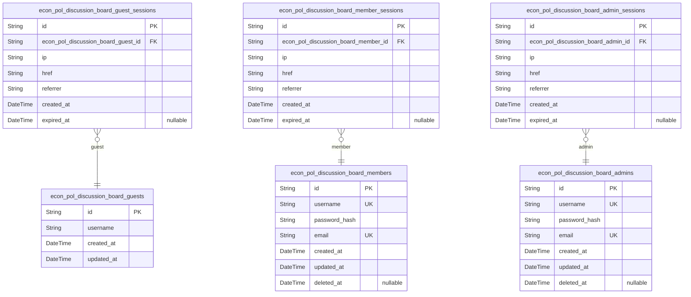
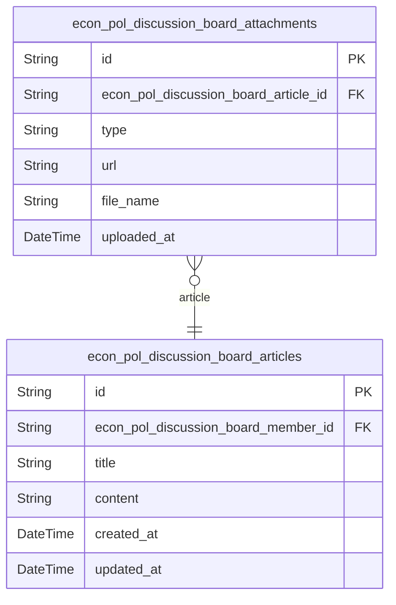
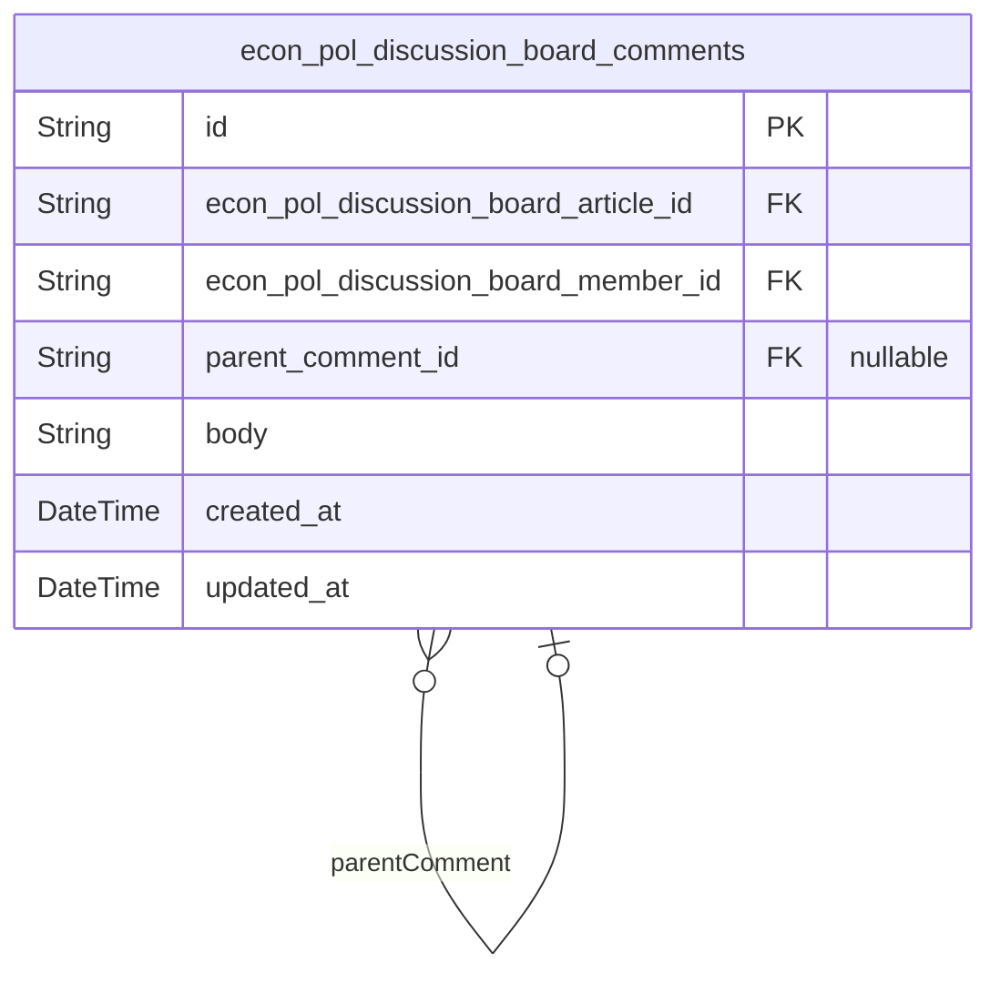

# Prisma Markdown

> Generated by [`prisma-markdown`](https://github.com/samchon/prisma-markdown)

- [Actors](#actors)
- [Articles](#articles)
- [Comments](#comments)

## Actors

```mermaid
erDiagram
"econ_pol_discussion_board_guests" {
  String id PK
  String username
  DateTime created_at
  DateTime updated_at
}
"econ_pol_discussion_board_guest_sessions" {
  String id PK
  String econ_pol_discussion_board_guest_id FK
  String ip
  String href
  String referrer
  DateTime created_at
  DateTime expired_at "nullable"
}
"econ_pol_discussion_board_members" {
  String id PK
  String username UK
  String password_hash
  String email UK
  DateTime created_at
  DateTime updated_at
  DateTime deleted_at "nullable"
}
"econ_pol_discussion_board_member_sessions" {
  String id PK
  String econ_pol_discussion_board_member_id FK
  String ip
  String href
  String referrer
  DateTime created_at
  DateTime expired_at "nullable"
}
"econ_pol_discussion_board_admins" {
  String id PK
  String username UK
  String password_hash
  String email UK
  DateTime created_at
  DateTime updated_at
  DateTime deleted_at "nullable"
}
"econ_pol_discussion_board_admin_sessions" {
  String id PK
  String econ_pol_discussion_board_admin_id FK
  String ip
  String href
  String referrer
  DateTime created_at
  DateTime expired_at "nullable"
}
"econ_pol_discussion_board_guest_sessions" }o--|| "econ_pol_discussion_board_guests" : guest
"econ_pol_discussion_board_member_sessions" }o--|| "econ_pol_discussion_board_members" : member
"econ_pol_discussion_board_admin_sessions" }o--|| "econ_pol_discussion_board_admins" : admin
```

### `econ_pol_discussion_board_guests`

Guests of the econPolDiscussionBoard system who may browse content
without authentication.

This entity represents unauthenticated visitors with minimal data stored
for tracking and basic audit purposes. Guests do not log in and have
limited access rights.

Properties as follows:

- `id`: Primary Key.
- `username`: Username chosen by the guest user for identification during visits.
- `created_at`: Timestamp when this guest record was created.
- `updated_at`: Timestamp of the last modification to the guest record.

### `econ_pol_discussion_board_guest_sessions`

Session records for guest users tracking individual browsing sessions.

Each session links to exactly one guest and records connection metadata
such as IP address, referrer, and timestamps.
Sessions enable audit of guest activity without requiring login credentials.

Properties as follows:

- `id`: Primary Key.
- `econ_pol_discussion_board_guest_id`
  > Reference to the guest who owns this session. {@link
  > econ_pol_discussion_board_guests.id}.
- `ip`: IP address of the guest during the session.
- `href`: URL accessed during the session.
- `referrer`: Referrer URL indicating the previous page.
- `created_at`: Timestamp when the session was created.
- `expired_at`: Timestamp when the session expired, if applicable.

### `econ_pol_discussion_board_members`

Members with authenticated accounts on econPolDiscussionBoard who can
post articles, comment, and upload attachments.

Holds securely hashed password and essential data to control identity and
authentication.

Properties as follows:

- `id`: Primary Key.
- `username`: Unique user name chosen by the member.
- `password_hash`: Hashed password for secure authentication.
- `email`: Email address for member communication and login identification.
- `created_at`: Account creation timestamp.
- `updated_at`: Last update timestamp for this member record.
- `deleted_at`: Soft deletion timestamp if the member account is deactivated.

### `econ_pol_discussion_board_member_sessions`

Session records for authenticated members maintaining login sessions.

Each session is linked to exactly one member and stores connection
metadata used for auditing and session management.

Properties as follows:

- `id`: Primary Key.
- `econ_pol_discussion_board_member_id`
  > Reference to the member who owns this session. {@link
  > econ_pol_discussion_board_members.id}.
- `ip`: IP address of the member during the session.
- `href`: URL accessed during the session.
- `referrer`: Referrer URL indicating the previous page.
- `created_at`: Timestamp when the session was created.
- `expired_at`: Timestamp when the session expired, if applicable.

### `econ_pol_discussion_board_admins`

Administrator accounts responsible for content moderation, user
management, and overall system maintenance.

Admins have elevated privileges and securely stored credentials to
control system access and administration.

Properties as follows:

- `id`: Primary Key.
- `username`: Unique administrator username.
- `password_hash`: Securely hashed password for admin authentication.
- `email`: Administrator email address for notifications and recovery.
- `created_at`: Timestamp when the admin account was created.
- `updated_at`: Timestamp of the last update to the admin record.
- `deleted_at`: Soft deletion timestamp if the admin account is disabled.

### `econ_pol_discussion_board_admin_sessions`

Session records for administrator accounts keeping track of login sessions.

Each session maintains a reference to its owner and stores connection
information important for security audits.

Properties as follows:

- `id`: Primary Key.
- `econ_pol_discussion_board_admin_id`
  > Reference to the admin who owns this session. {@link
  > econ_pol_discussion_board_admins.id}.
- `ip`: IP address of the admin during the session.
- `href`: URL accessed during the session.
- `referrer`: Referrer URL indicating previous page.
- `created_at`: Timestamp when the session was created.
- `expired_at`: Timestamp when the session expired, if applicable.

## Articles

```mermaid
erDiagram
"econ_pol_discussion_board_articles" {
  String id PK
  String econ_pol_discussion_board_member_id FK
  String title
  String content
  DateTime created_at
  DateTime updated_at
}
"econ_pol_discussion_board_attachments" {
  String id PK
  String econ_pol_discussion_board_article_id FK
  String type
  String url
  String file_name
  DateTime uploaded_at
}
"econ_pol_discussion_board_attachments" }o--|| "econ_pol_discussion_board_articles" : article
```

### `econ_pol_discussion_board_articles`

Articles posted by members on the econPolDiscussionBoard.

This table stores plain-text articles created by authenticated members.
Each article includes an author reference to the member who created it,
ensuring accountability and traceability. Articles are timestamped upon
creation and update to support audit trails and order listings by
recency.

Attachments are stored separately in the attachments table to avoid
nullable fields and maintain normalization. This design supports multiple
attachments per article, enriching content with images or documents.

Properties as follows:

- `id`: Primary Key.
- `econ_pol_discussion_board_member_id`
  > Reference to the member who authored the article. {@link
  > econ_pol_discussion_board_members.id}.
- `title`: Title of the article, summarizing its content.
- `content`: Plain-text content body of the article.
- `created_at`: Timestamp when the article was created.
- `updated_at`: Timestamp when the article was last updated.

### `econ_pol_discussion_board_attachments`

Attachments associated with articles on the econPolDiscussionBoard.

This table stores metadata for files and images attached to articles.
Each attachment links to a single article and includes detailed
information such as type (image or file), URL location, original
filename, and upload timestamp.

Attachments enhance articles by allowing multimedia content and document
references, supporting the core value proposition of rich content in a
focused discussion board. Attachments are non-editable and depend on
their parent article lifecycle.

Properties as follows:

- `id`: Primary Key.
- `econ_pol_discussion_board_article_id`
  > Reference to the parent article. {@link
  > econ_pol_discussion_board_articles.id}.
- `type`: Type of attachment, either 'image' or 'file'.
- `url`: URL location where the attachment file is stored.
- `file_name`: Original filename of the attachment.
- `uploaded_at`: Timestamp when the attachment was uploaded.

## Comments

```mermaid
erDiagram
"econ_pol_discussion_board_comments" {
  String id PK
  String econ_pol_discussion_board_article_id FK
  String econ_pol_discussion_board_member_id FK
  String parent_comment_id FK "nullable"
  String body
  DateTime created_at
  DateTime updated_at
}
"econ_pol_discussion_board_comments" }o--o| "econ_pol_discussion_board_comments" : parentComment
```

### `econ_pol_discussion_board_comments`

Comments posted by members on economic and political discussion board
articles.

Each comment is associated with a specific article and authored by a
registered member. Comments support nesting by allowing a parent comment
reference for up to two levels of replies.

The comments table tracks creation and update timestamps for audit and
moderation purposes. Comments are designed for minimal complexity,
enabling straightforward querying and management within the discussion
board.

Properties as follows:

- `id`: Primary Key.
- `econ_pol_discussion_board_article_id`
  > Reference to the article that this comment belongs to. {@link
  > econ_pol_discussion_board_articles.id}.
- `econ_pol_discussion_board_member_id`
  > Author of the comment, a registered member. {@link
  > econ_pol_discussion_board_members.id}.
- `parent_comment_id`
  > Optional reference to the parent comment for nested replies, allowing up
  > to two levels of nesting within the discussion board. {@link
  > econ_pol_discussion_board_comments.id}.
- `body`
  > Plain text content of the comment. Limited to 500 characters as per
  > business requirements.
- `created_at`: Timestamp when the comment was created.
- `updated_at`: Timestamp when the comment was last updated.
