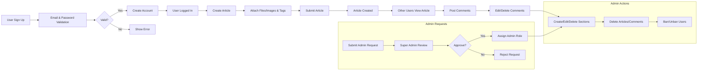

# Economic and Political Discussion Board Business Requirements Specification

## 1. Introduction and Business Context

The Economic and Political Discussion Board is an online platform dedicated to fostering discussions on economic and political topics. This system provides structured forums segmented into topical sections to promote organized, quality discourse among users with varied interests.

The system supports a broad user base comprised of registered members, administrators, and super administrators, each with distinct roles and permissions. It ensures secure user authentication, content moderation, and administrative oversight to maintain a respectful and productive environment.

Key success factors include active user participation, quality content generation, and efficient moderation capabilities.

## 2. User Account Management

### 2.1 User Registration
WHEN a user attempts to register, THE system SHALL require a unique and valid email address and a secure password.
IF the email is already registered, THEN THE system SHALL reject the registration with an informative error message.

### 2.2 User Login
WHEN a user attempts to log in with email and password, THE system SHALL validate credentials within two seconds.
IF the credentials are invalid, THEN THE system SHALL reject the login attempt and provide a clear error message.

### 2.3 Password Management
WHEN a logged-in user requests to change their password, THE system SHALL authenticate the existing password before updating it.

### 2.4 Account Deletion
WHEN a user requests account deletion, THE system SHALL delete the user profile along with ALL articles and comments authored by the user.

## 3. User Profile Management

### 3.1 Profile Attributes
EACH user profile SHALL store a display name and a free-text bio.

### 3.2 Profile Editing
WHEN a logged-in user edits their profile, THE system SHALL update the display name and bio fields accordingly.

### 3.3 Profile Viewing
WHEN a user views another user's profile, THE system SHALL display the user's display name, bio, a chronological list of articles written by that user, and a chronological list of comments authored by that user.

## 4. Sections Management

### 4.1 Section Attributes
EACH section SHALL have a unique name and a descriptive text detailing its purpose.

### 4.2 Administrative Control
ONLY administrators SHALL have the permission to create, edit, or delete sections.

### 4.3 Section Browsing
WHEN a user accesses the discussion board, THE system SHALL provide a list of all sections along with their names and descriptions for browsing.

## 5. Article Management

### 5.1 Creating Articles
WHEN a registered user creates an article, THE system SHALL require a non-empty title and content and the selection of a valid section.
THE system SHALL allow users to attach multiple files and images to their articles.
Users MAY add multiple free-text tags to categorize their articles.

### 5.2 Editing Articles
WHEN an article author requests to edit their article, THE system SHALL allow modification of the title, content, attachments, and tags.

### 5.3 Deleting Articles
WHEN an article author requests to delete their article, THE system SHALL remove the article along with all comments linked to it.
Administrators SHALL have the authority to delete any article throughout the platform.

## 6. Article Listing and Sorting

### 6.1 Article List Display
WHEN users view articles in a section, THE system SHALL display them in a paginated list showing only the article title, author, tags, comment count, and posting time.

### 6.2 Sorting Articles
WHEN sorting preferences are applied, THE system SHALL sort articles by either newest first or oldest first.

## 7. Article Viewing

WHEN a user views an article, THE system SHALL display the full article details including title, author, content text, attached files and images, tags, and the time posted.
THE system SHALL allow users to download any attached files or images.

## 8. Searching Articles

### 8.1 Search Functionality
WHEN a user performs a search query on articles by title or content, THE system SHALL return paginated results matching the query.

### 8.2 Tag Filtering
WHEN a user selects one or more tags as filters, THE system SHALL only show articles tagged with the selected tags.

## 9. Comment Management

### 9.1 Comment Creation
WHEN a registered user adds a comment to an article, THE system SHALL record the author, content, and timestamp.

### 9.2 Comment Editing and Deletion
WHEN a comment author edits or deletes their comment, THE system SHALL update or remove it accordingly.
Administrators SHALL have the ability to delete any comment.

### 9.3 Comment Display
WHEN viewing an article, THE system SHALL show all comments sorted in ascending order by posting time.
The comment system SHALL NOT allow nested replies; comments are single-level only.

## 10. Administrator System

### 10.1 Administrator Roles
The system defines two administrator grades: regular administrator and super administrator.

### 10.2 Requesting Administrator Status
WHEN a regular user submits a request to become an administrator, THE system SHALL record the request along with a reason.

### 10.3 Request Review Process
Super administrators SHALL view the list of pending admin requests and either approve or reject each.
WHEN approved, THE system SHALL grant regular administrator status to the requester.

### 10.4 Administrator Promotion and Demotion
Super administrators SHALL have the ability to promote regular administrators to super administrators and demote super administrators to regular administrators.
Super administrators SHALL NOT be able to demote themselves.

### 10.5 Administrator Capabilities
Administrators SHALL have all user permissions plus additional abilities including:
- Creating, editing, and deleting sections
- Deleting any article or comment
- Banning and unbanning users
- Viewing ban reasons and the list of banned users

## 11. Banning System

WHEN an administrator bans a user, THE system SHALL record the ban reason.
Banned users SHALL be disallowed from logging in.
Banned users' existing articles and comments SHALL remain visible on the platform.
Administrators SHALL be able to view the list of banned users and their ban reasons.

## 12. Business Rules and Validation

- User email addresses must be unique and valid.
- Article titles and content are mandatory fields.
- Section names must be unique.
- Users may only edit or delete their own articles and comments unless they have administrative privileges.
- Attachments and images are restricted by size and type as per system policy.
- Comments are limited to one level only; no nested replies.
- Banned users are prevented from authentication.

## 13. Error Handling and Performance

- IF login fails due to invalid credentials, THEN THE system SHALL respond within one second with an error message.
- Search queries and article listing SHALL perform responses within two seconds under normal load.
- The system SHALL provide progress feedback for uploads and validate file types and sizes.
- IF an account deletion request is processed, THEN THE system SHALL perform a complete deletion of user data and associated content atomically to maintain data integrity.

## 14. Non-Functional Requirements

- THE system SHALL securely manage user sessions with a validity of 30 days.
- THE system SHALL efficiently scale to support concurrent users performing browsing and posting activities.
- All user actions and administrative changes SHALL be logged for security and audit purposes.

## 15. Mermaid Diagram of System Workflow

