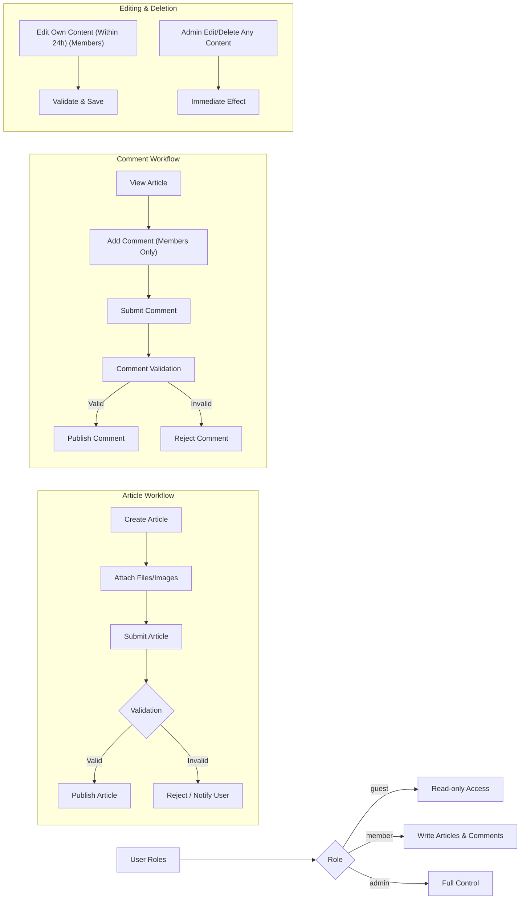

# Requirements Analysis Report for a Simple Economic/Political Discussion Board

## 1. Introduction
This report specifies the requirements for a simple discussion board dedicated to economic and political topics. Its purpose is to provide a straightforward backend solution allowing users to post articles with file attachments and engage in discussions with comments, without over-complication.

## 2. Business Model
### Purpose
The service offers a focused platform to discuss economic and political issues, supporting constructive dialogues in a minimalistic environment.

### Monetization and Growth
The initial scope excludes monetization features. User base growth is expected through organic engagement and community participation.

### Success Metrics
- Active monthly user count
- Number of articles posted
- Comment activity
- User retention rates

## 3. User Actors and Authentication
| Actor  | Description                   | Permissions                             |
|--------|-------------------------------|----------------------------------------|
| Guest  | Unauthenticated visitor        | Read-only access to articles and comments |
| Member | Registered user                | Create/edit/delete own articles and comments
| Admin  | System administrator          | Full control over all content and users |

### Authentication
- Members must register and authenticate.
- Guests have read-only browsing privileges.
- Sessions secured with industry best practices.

## 4. Article Posting and Attachments
### Creation
- Members SHALL be able to create articles with optional image and file attachments.
- Supported image formats include JPEG and PNG; file types include PDF and DOCX.
- Multiple attachments per article are supported.
### Attachment Constraints
- Attachments SHALL be validated for type and size before acceptance.
- Upload failures SHALL result in informative user notifications and action rejection.
- Articles can exist without attachments.
### Organization
- Articles SHALL support categorization or tagging for better navigation.

## 5. Commenting Feature
- Only members SHALL be able to post comments.
- Comments SHALL contain text only; attachments not allowed.
- Guests SHALL have read-only access.

## 6. Permissions and Roles
- Guests: Read-only privileges.
- Members: Can create and manage own articles and comments.
- Admins: Full content and user management including editing or deleting any content.

## 7. Editing and Deletion Policies
- Members SHALL be able to edit or delete their content within 24 hours of posting.
- Admins SHALL have unrestricted editing and deletion rights.
- Deleted content SHALL be immediately removed from public views.

## 8. Business Rules and Validation
- Content of articles and comments SHALL be non-empty.
- Attachments SHALL comply with accepted types and size limits.
- Invalid inputs SHALL result in rejection with user notification.

## 9. Error Handling and Recovery
- Unauthorized actions SHALL yield clear error messages.
- Invalid file uploads SHALL be rejected with reasons provided.
- Upload interruptions SHALL allow retry.
- System errors SHALL be logged; users receive generic error messages.

## 10. Performance Requirements
- Browsing and loading SHALL complete within 2 seconds under typical conditions.
- Upload processes SHALL provide progress feedback.
- Pagination SHALL be used for articles and comments.

## 11. Security Considerations
- User data SHALL be protected via secure authentication methods.
- Uploaded files SHALL be stored securely with access controls.
- Content SHALL be sanitized to prevent injection vulnerabilities.
- Admin actions SHALL be logged for auditing.

## 12. Diagrams

---

All functional requirements are specified in natural language, focusing on business logic without technological implementation details.