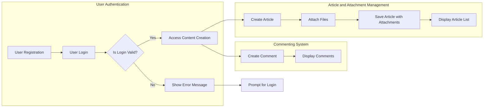

# Requirement Analysis Report for econPolDiscussionBoard

## 1. Introduction
This document presents a thorough requirements analysis for the econPolDiscussionBoard, a simple discussion board focused on economic and political topics. It enables users to post articles enriched with images and file attachments. The system is designed to be straightforward, focusing on essential features without unnecessary complexity.

## 2. Business Model
### Why This Service Exists
The econPolDiscussionBoard addresses the need for a dedicated platform where users interested in economic and political discussions can create, share, and engage with articles. It fills the gap for a minimalistic, focused forum without overwhelming features, encouraging knowledge sharing and civil discourse.

### Core Value Proposition
To provide a reliable, easy-to-use discussion platform that supports rich content through attachment of images and files, allowing users to express ideas more effectively.

### Success Criteria
- High user engagement through article posting and commenting.
- Reliable attachment handling.
- Smooth, responsive user experience.

## 3. User Actors
### Actor Definitions
- **Guest:** Unauthenticated visitors who can browse articles and view attachments but cannot create content or comment.
- **Member:** Authenticated users who can create articles, upload attachments, and comment on existing articles.
- **Admin:** System administrators with full privileges to manage users, moderate content, and maintain the system.

### Permissions Summary
| Action                      | Guest | Member | Admin |
|-----------------------------|-------|--------|-------|
| Browse articles             | ✅    | ✅     | ✅    |
| View attachments            | ✅    | ✅     | ✅    |
| Create articles             | ❌    | ✅     | ✅    |
| Upload attachments          | ❌    | ✅     | ✅    |
| Comment on articles         | ❌    | ✅     | ✅    |
| Edit or delete own content  | ❌    | ✅     | ✅    |
| Moderate and manage content | ❌    | ❌     | ✅    |
| Manage users                | ❌    | ❌     | ✅    |

## 4. Functional Requirements
### 4.1 Article Management
- WHEN a member submits a new article, THE system SHALL store the article with a timestamp, author association, and unique identifier.
- THE article content SHALL support plain text.
- THE system SHALL list articles ordered by newest first.
- WHEN a user requests articles, THE system SHALL return a paged list of articles containing metadata (author, date, title) excluding full content to optimize performance.
- THE system SHALL allow members to edit or delete their own articles within 24 hours of posting.

### 4.2 Attachment Support
- WHEN a member attaches an image or file to an article, THE system SHALL allow multiple attachments per article.
- THE system SHALL accept image files (e.g., JPEG, PNG, GIF) and common document files (e.g., PDF, DOCX).
- IF a file type is unsupported, THEN THE system SHALL reject the upload with a clear error message.
- THE maximum attachment size SHALL be 10MB per file.
- THE system SHALL store attachments securely and associate them with their respective articles.
- THE system SHALL serve image attachments inline when displaying the article content.
- THE system SHALL provide downloadable links for other file types.

### 4.3 Commenting System
- WHEN a member views an article, THE system SHALL display all comments associated with that article.
- WHEN a member posts a comment, THE system SHALL record the comment with an author, timestamp, and article reference.
- THE system SHALL allow members to edit or delete their own comments within 15 minutes of posting.
- THE system SHALL display comments in chronological order.
- THE system SHALL permit nested replies up to two levels deep.

## 5. Business Rules and Constraints
- IF a guest attempts to create or comment, THEN THE system SHALL deny access and prompt for login.
- WHEN a member deletes an article or comment, THE system SHALL remove content permanently.
- IF an attachment exceeds 10MB or unsupported type, THEN THE system SHALL reject the upload.
- THE system SHALL limit the overall number of attachments per article to 5.
- THE system SHALL prevent posting of empty articles or comments.
- THE system SHALL sanitize all text inputs to prevent injection attacks.

## 6. Authentication and Authorization
### Authentication Flow
- Users SHALL register with email and password.
- Users SHALL log in to receive an access token for further interactions.
- Users SHALL log out to invalidate their session.
- THE system SHALL maintain secure sessions.

### Authorization
- THE system SHALL enforce role-based access control based on user actor:
  - Guests have read-only access.
  - Members have content creation and interaction privileges.
  - Admins have management privileges.

## 7. Error Handling
- IF authentication fails, THEN THE system SHALL return an appropriate error message indicating invalid credentials.
- IF attachment upload fails due to size or format, THEN THE system SHALL inform the user of the specific reason.
- IF article submission fails validation (e.g., empty content), THEN THE system SHALL notify the user immediately.
- IF system errors occur, THEN THE system SHALL return user-friendly error messages and record logs for admin review.

## 8. Performance Requirements
- THE system SHALL respond to article list requests within 2 seconds under normal load.
- THE system SHALL handle simultaneous file uploads gracefully and provide upload progress feedback.
- THE system SHALL load article content and comments within 3 seconds.

## 9. System Constraints and Assumptions
- The system assumes members will upload moderate file sizes, capped at 10MB per attachment.
- The system assumes articles focus on economic and political discussions.
- The system is designed for scalability but prioritizes simplicity over extensive feature sets.

## 10. Conclusion
This requirements analysis report provides the complete business requirements in natural language for the econPolDiscussionBoard project. It describes WHAT the system must do, leaving all technical implementation decisions, including architecture, API design, and database schemas, to the development team's discretion. Backend developers are fully empowered to design and implement the system following these business rules and requirements.

This document includes only business requirements. All technical implementation decisions, including architectures, APIs, and database designs, are left to the developer's discretion.