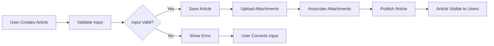

# Functional Requirements Analysis for Economic/Political Discussion Board

## 1. Introduction
This document specifies the complete set of business and functional requirements for the economic/political discussion board service. It provides backend developers with clear, measurable, and actionable details about how the system should behave from a business and user interaction perspective. This document focuses strictly on business requirements; technical implementation details such as database schema or API spec are excluded.

## 2. Business Model

### Why This Service Exists
There is a demand for a focused platform where users can engage in discussions specifically about economic and political topics. The service aims to provide a simple, minimalistic, and efficient discussion board that supports user-generated articles along with attachments to enrich conversations. The market lacks a lightweight, easy-to-use platform catering specifically to such content without complexity.

### Core Value Proposition
- Easy creation and management of discussion articles on economic and political themes.
- Enables sharing of supporting images and files to provide richer context.
- Provides a community interaction space with role-based permissions.

### Success Metrics
- Number of active members creating or commenting on posts
- Stability and responsiveness of the platform under typical usage
- Minimal moderation incidents due to clear permissions and controls

## 3. User Actors and Permissions

| Actor  | Description                                                                                    | Key Permissions                                                             |
|--------|------------------------------------------------------------------------------------------------|-----------------------------------------------------------------------------|
| Guest  | Unauthenticated visitor who can only browse and read articles and comments.                   | View articles and comments only; no creation or modification rights         |
| Member | Authenticated user with rights to manage own articles and participate in discussions through comments. | Create, edit, delete own articles; post comments; view all content          |
| Admin  | System administrator with full management rights over articles, users, and settings.          | Manage all articles and comments; moderate content; manage users and settings|

### Authentication and Authorization
- Members must register and log in to create or modify content.
- Guests have read-only access with no ability to create content or comment.
- Admins have elevated privileges to moderate and manage the system.

## 4. Functional Requirements

### 4.1 Article Management
- WHEN a member submits a new article, THE discussion board SHALL create a new article record associated with that user.
- THE system SHALL require an article to have a non-empty title and content.
- THE article title SHALL be limited to 200 characters.
- THE article content SHALL support text formatted in Markdown.
- WHEN a member edits their own article, THE system SHALL save the updated version.
- WHEN a member deletes their own article, THE system SHALL mark the article as deleted and prevent further access.
- IF a member attempts to edit or delete another member’s article, THEN THE system SHALL deny the action and return an authorization error.
- WHEN an admin deletes an article, THE system SHALL permanently remove or archive it per system policy.

### 4.2 Attachment Support
- WHEN adding an attachment to an article, THE system SHALL support image files (JPEG, PNG, GIF) and common file formats (PDF, DOCX).
- THE maximum allowed size per attachment SHALL be 10 MB.
- THE system SHALL allow multiple attachments per article.
- THE system SHALL associate attachments with their respective articles securely.
- IF an attachment exceeds size limits or unsupported format, THEN THE system SHALL reject the upload with an informative error.
- WHEN an article is deleted, THE system SHALL also remove or archive all associated attachments.

### 4.3 Commenting System
- WHEN a member views an article, THE system SHALL display all its comments in chronological order.
- WHEN a member posts a comment, THE system SHALL create and associate it with the article and the member.
- THE maximum length of comments SHALL be 500 characters.
- WHEN a member deletes their own comment, THE system SHALL remove it from public view.
- IF a member attempts to modify or delete others’ comments, THEN THE system SHALL deny the action.
- WHEN an admin deletes or hides comments, THE system SHALL reflect that instantly for all users.

### 4.4 User Interactions
- WHEN a guest visits the site, THE system SHALL allow read-only browsing of articles and comments.
- WHEN a user registers, THE system SHALL create a new member account with unique email or username.
- WHEN a user logs in, THE system SHALL authenticate and establish a session securely.
- THE system SHALL support secure password management including reset and change.
- WHEN a user logs out, THE system SHALL terminate the session.

### 4.5 Administrative Actions
- THE admin SHALL be able to view a dashboard of articles and user activity.
- THE admin SHALL have the ability to delete or restore articles and comments.
- THE admin SHALL manage user accounts including suspension or role changes.
- THE system SHALL log admin activities for audit.

### 4.6 API Access Control
- THE system SHALL enforce authentication on all APIs that modify data.
- THE system SHALL verify that users can only perform actions permitted by their roles.
- THE system SHALL return appropriate HTTP status codes for success and errors (e.g., 401 Unauthorized, 403 Forbidden).

## 5. Business Rules and Constraints

- Articles must always be linked to the member who created them.
- Attachments must be virus-scanned before storage.
- Members can only modify/delete their own articles and comments within a 24-hour window after creation.
- Admin deletion overrides user ownership constraints.
- Guests SHALL never be permitted to post content.
- Comments SHALL be moderated by admin if reported.

## 6. Error Handling and User Experience

- IF a guest attempts to create content, THEN THE system SHALL return a clear authorization error.
- IF the article title or content is missing or exceeds length limits, THEN THE system SHALL reject the submission with reasons.
- IF an attachment upload fails due to size/type, THEN THE system SHALL provide a descriptive error.
- IF user authentication fails, THEN THE system SHALL inform the user to re-enter credentials.
- ALL errors SHALL be logged for diagnosis.

## 7. Performance Requirements

- THE system SHALL display article lists within 2 seconds under typical load.
- THE system SHALL process content creation or modification requests within 3 seconds.
- ATTACHMENT uploads MAY support progress indication and shall complete within a reasonable timeframe based on network speed.
- PAGE loading for read-only browsing SHALL feel instantaneous to guest users.

## Mermaid Diagram: User Article Lifecycle
