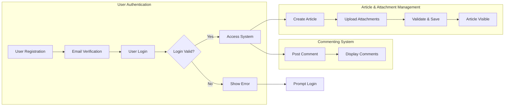

# econPolDiscussionBoard Requirement Analysis Report

## 1. Introduction
The econPolDiscussionBoard is a straightforward web-based discussion platform facilitating focused discussions on economic and political topics. It enables users to post plain-text articles with support for multiple image and file attachments and engage in threaded comments. The service emphasizes simplicity, avoiding complex features to provide a minimal, user-friendly experience.

## 2. Business Model
### 2.1 Purpose
The econPolDiscussionBoard addresses the need for a dedicated discussion forum focused solely on economic and political content to enable clear, meaningful debate and knowledge sharing. It provides a lightweight alternative to complex social networks, promoting civil and informed discourse.

### 2.2 Core Value Proposition
- Provide a simple platform for posting and reading topical articles.
- Support rich content via attachment of images and files.
- Facilitate discussion through comments with minimal moderation.

### 2.3 Success Criteria
- Members create and interact with articles and comments effectively.
- Attachments upload and display reliably within size and format limits.
- System maintains responsiveness under typical user load.

## 3. User Actors
### 3.1 Definitions
- **Guest:** Unauthenticated users allowed read-only access.
- **Member:** Registered, logged-in users with rights to post articles, attach files, and comment.
- **Admin:** Administrators who moderate content and manage users.

### 3.2 Permissions
| Action                    | Guest | Member | Admin |
|--------------------------|-------|--------|-------|
| Browse articles          | ✅    | ✅     | ✅    |
| View attachments         | ✅    | ✅     | ✅    |
| Create articles          | ❌    | ✅     | ✅    |
| Upload attachments       | ❌    | ✅     | ✅    |
| Post comments            | ❌    | ✅     | ✅    |
| Edit/delete own content  | ❌    | ✅     | ✅    |
| Moderate content         | ❌    | ❌     | ✅    |
| Manage users             | ❌    | ❌     | ✅    |

## 4. Functional Requirements
### 4.1 Article Management
- WHEN a member submits an article, THE system SHALL save it with author, timestamp, and unique ID.
- THE article SHALL support plain text content with no HTML or rich text.
- THE system SHALL list articles ordered by newest first with pagination.
- WHEN a member edits their article within 24 hours, THE system SHALL update the content.
- WHEN a member deletes their article, THE system SHALL permanently remove it.

### 4.2 Attachment Support
- WHEN a member attaches images or files to an article, THE system SHALL accept up to 5 attachments per article.
- THE system SHALL accept image files (JPEG, PNG, GIF) and document files (PDF, DOCX, XLSX, TXT).
- THE system SHALL enforce a 10MB maximum size per attachment.
- THE system SHALL reject unsupported file types with clear error messages.
- Image attachments SHALL display inline with the article content.
- Other attachment types SHALL be downloadable via links.

### 4.3 Commenting System
- WHEN a member views an article, THE system SHALL display associated comments in chronological order.
- WHEN a member posts a comment, THE system SHALL save it with author and timestamp.
- THE system SHALL allow edits or deletions of comments within 15 minutes by the author.
- THE system SHALL allow nested replies up to two levels.

## 5. Business Rules and Constraints
- IF a guest attempts to post content or comment, THEN THE system SHALL deny access and prompt login.
- THE system SHALL sanitize all text inputs to prevent injection attacks.
- THE system SHALL flag content containing disallowed material for admin review.
- IF an attachment exceeds size limits or is too numerous, THEN THE system SHALL reject the attachment.
- THE system SHALL prevent posting empty articles or comments.

## 6. Authentication and Authorization
- Users SHALL register with email and password.
- Email verification SHALL be sent after registration to activate accounts.
- Login SHALL issue JWT-based access and refresh tokens.
- Access tokens SHALL expire after 30 minutes; refresh tokens after 14 days.
- Logout SHALL invalidate tokens.
- THE system SHALL enforce role-based access control as defined.

## 7. Error Handling
- IF login fails, THEN THE system SHALL return HTTP 401 with specific error codes.
- IF attachment uploads fail due to size or type, THEN THE system SHALL return HTTP 413 or 415 with descriptive messages.
- IF posting fails validation, THEN THE system SHALL return HTTP 400 with details.
- Network failures during upload SHALL trigger automatic retries when possible.

## 8. Performance Requirements
- Article and comment fetch requests SHALL respond within 2 seconds.
- Posting articles or comments SHALL complete within 3 seconds under typical load.
- THE system SHALL support at least 1000 concurrent users.
- Attachment uploads SHALL complete server-side processing within 5 seconds per file.
- Pagination SHALL limit displayed items to 20 per page.

## 9. Security and Compliance
- User passwords SHALL be stored securely using strong hashing.
- THE system SHALL enforce role-based permissions thoroughly.
- Admin actions SHALL be logged for audit.
- Inputs SHALL be sanitized to prevent XSS and injection.

## 10. Business Process Workflows
### 10.1 User Registration
- User registers with email/password.
- Verification email sent.
- Upon verification, account is activated.

### 10.2 Article Creation
- Member composes article.
- Member uploads attachments.
- System validates and saves article and files.
- Article is made public.

### 10.3 Commenting
- Member posts comment.
- System saves and displays comment.

### 10.4 Editing and Deletion
- Members can edit/delete own articles within 24 hours.
- Comments editable/deletable for 15 minutes.
- Admins have full moderation rights.

## 11. Secondary and Exceptional Scenarios
### 11.1 Unauthorized Posting Attempts
- Guest attempts to post or comment results in denial.

### 11.2 Attachment Upload Errors
- Detection and reporting of unsupported file types or oversize files.
- Retry mechanisms in case of network failure.

### 11.3 Comment Moderation
- Flagging and hiding of prohibited comments pending admin review.

## 12. Success Metrics
- User engagement: active user counts, posts, comments.
- Attachment usage and upload success.
- Server responsiveness and uptime.
- Effective content moderation as per admin logs.

---

