# Economic/Political Discussion Board

## 1. User Account

### 1.1 Sign Up
WHEN a visitor registers, THE system SHALL require a unique email and password.
THE system SHALL validate email format and enforce password rules (minimum length 8, at least one digit, one uppercase letter).
THE system SHALL store user credentials securely using salted hashing.

### 1.2 Log In
WHEN a registered user submits login credentials, THE system SHALL authenticate the email and password.
ON successful authentication, THE system SHALL create a secure session or token for the user.
ON failure, THE system SHALL provide an error message "Invalid email or password" within 2 seconds.

### 1.3 Password Change
WHEN a logged-in user requests to change their password, THE system SHALL verify the old password.
THE system SHALL require the new password to meet security criteria.
ON success, THE system SHALL update the password securely.

### 1.4 Account Deletion
WHEN a logged-in user requests account deletion, THE system SHALL delete user profile, all user's articles, and comments permanently.
THE system SHALL require user confirmation before deletion.

## 2. User Profile

### 2.1 Profile Attributes
EACH user profile SHALL contain a display name and bio text.

### 2.2 Profile Editing
WHEN a user accesses their profile editing page, THE system SHALL allow modifications of display name and bio.

### 2.3 Viewing Profiles
WHEN a user views another user's profile, THE system SHALL display that user's display name, bio, list of articles written by the user, and list of comments authored by the user.

## 3. Sections

### 3.1 Section Attributes
EACH section SHALL have a unique name and description.

### 3.2 Section Management
ONLY administrators SHALL create, edit, or delete sections.

### 3.3 Section Viewing
USERS SHALL be able to view the full list of sections.
WHEN viewing a section, users SHALL see all articles within that section.

## 4. Articles

### 4.1 Article Creation
WHEN a user creates an article, THE article SHALL have a title, content, and belong to one section.
THE system SHALL validate that title and content are not empty.

### 4.2 Attachments
USERS SHALL be able to attach multiple files and images to articles.
THE system SHALL store and allow download of these attachments securely.

### 4.3 Tags
USERS SHALL be able to assign multiple free-text tags to an article.

### 4.4 Edit and Deletion
WHEN a user edits an article, THE system SHALL allow modifications to title, content, attachments, and tags.
WHEN a user deletes an article, THE system SHALL remove it permanently from the system.

## 5. Article List

### 5.1 Pagination
ARTICLE lists SHALL be paginated, with configurable page sizes.

### 5.2 Display Metadata
IN the article list, EACH article SHALL display title, author, tags, comment count, and time posted.

### 5.3 Sorting
USERS SHALL be able to sort articles by newest or oldest first.

## 6. Viewing an Article

### 6.1 Article Content
WHEN viewing an article, THE system SHALL display full title, author, content, attachments, tags, and time posted.

### 6.2 Attachments
USERS SHALL be able to download any attached files or images.

## 7. Searching Articles

### 7.1 Search Parameters
USERS SHALL be able to search articles by title or content keywords.

### 7.2 Filtering
USERS MAY filter search results using tags.

### 7.3 Pagination
SEARCH results SHALL be paginated.

## 8. Comments

### 8.1 Commenting
USERS SHALL be able to write comments on articles.

### 8.2 Comment Display
COMMENTS SHALL be displayed sorted oldest first.

### 8.3 Editing and Deletion
USERS SHALL be able to edit or delete their own comments.

## 9. Administrator System

### 9.1 Becoming Administrator
ANY user MAY request administrator status by submitting a reason.
SUPER administrators SHALL review pending requests.
SUPER administrators SHALL approve or reject requests.
WHEN approved, THE user becomes a regular administrator.

### 9.2 Administrator Grades
THERE SHALL be two grades: regular and super administrators.
SUPER administrators SHALL be able to promote and demote other admins.
SUPER administrators CANNOT demote themselves.

### 9.3 Administrator Capabilities
ADMINISTRATORS SHALL be able to create, edit, delete sections.
ADMINISTRATORS SHALL be able to delete any article or comment.
ADMINISTRATORS SHALL be able to ban or unban users and view banned users list.

## 10. Banning

### 10.1 Ban Effects
WHEN a user is banned, THAT user SHALL be prevented from logging in.
EXISTING articles and comments by the banned user SHALL remain visible.

### 10.2 Ban Reason
BAN reason SHALL be recorded and available to administrators.

---

```mermaid
graph TD
  UserAccount["User Account Management"] -->|"Create Account"| SignUp["Sign Up"]
  UserAccount -->|"Log In"| LogIn["Log In"]
  UserAccount -->|"Change Password"| PasswordChange["Change Password"]
  UserAccount -->|"Delete Account"| AccountDelete["Delete Account"]

  UserProfile["User Profile"] -->|"View Profile"| ProfileView["View Profile"]
  UserProfile -->|"Edit Profile"| ProfileEdit["Edit Profile"]

  Sections["Sections"] -->|"Manage Sections"| AdminSections["Admin Sections"]
  Sections -->|"View Sections"| UserSections["User Sections"]
  Sections -->|"Browse Articles"| ArticlesBrowse["Browse Articles"]

  Articles["Articles"] -->|"Create Article"| ArticleCreate["Create Article"]
  Articles -->|"Edit Article"| ArticleEdit["Edit Article"]
  Articles -->|"Delete Article"| ArticleDelete["Delete Article"]

  ArticleList["Article List"] -->|"View Article List"| ArticleListView["Article List View"]

  ViewArticle["View Article"] -->|"View Content"| ArticleContent["Article Content"]
  Comments["Comments"] -->|"Write Comment"| CommentWrite["Write Comment"]
  Comments -->|"Edit Comment"| CommentEdit["Edit Comment"]
  Comments -->|"Delete Comment"| CommentDelete["Delete Comment"]

  AdminSystem["Administrator System"] -->|"Admin Request"| AdminRequest["Admin Request"]
  AdminSystem -->|"Approve Requests"| ApproveRequest["Approve Requests"]

  AdminSystem -->|"Promote Admin"| PromoteAdmin["Promote Admin"]
  AdminSystem -->|"Demote Admin"| DemoteAdmin["Demote Admin"]

  AdminSystem -->|"Manage Sections"| AdminManageSections["Manage Sections"]
  AdminSystem -->|"Moderate Content"| AdminModerateContent["Moderate Content"]
  AdminSystem -->|"Ban Users"| AdminBanUsers["Ban Users"]

  Banning["Banning System"] -->|"Ban User"| BanUser["Ban User"]
  Banning -->|"Unban User"| UnbanUser["Unban User"]
  Banning -->|"Ban List"| BanListView["Ban List View"]

  UserAccount -->|"User Banned"| BanUser

  AdminSystem -->|"View Banned Users"| BanListView

  Note["Note"] -->|"Delete Account Cascades"| ArticleDelete
  Note -->|"Delete Account Cascades"| CommentDelete
```

