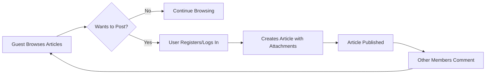

# Simple Economic/Political Discussion Board Requirements Analysis Report

## 1. Introduction

The service provides a simple and focused online discussion board platform dedicated to economic and political topics. It enables users to create articles enriched with images and files, engage in discussions via comments, and offers role-based access with guest browsing and authenticated member participation. The design emphasizes minimalism, usability, and maintainability, rejecting complexity in favor of straightforward functionality.

## 2. Business Model

### Why This Service Exists

The service exists to provide an easy-to-use platform tailored for concise and quality-focused discussions on economics and politics. Unlike generic discussion boards, it supports multiple attachments, suitable for sharing documents or images that support user arguments, fostering grounded discourse.

### Target Audience

Economists, political commentators, academics, students, and casual enthusiasts interested in discussing economic and political issues in a structured yet simple environment.

### Value Proposition

The platform enables seamless article creation with multiple attachments, encourages focused conversations, and caters to users seeking a clutter-free, purpose-built space. It balances simplicity with necessary features like attachments and role control.

### Revenue and Growth Strategy

Initial deployment focuses on attracting a community without charge, with potential monetization via premium features or advertising after establishing a user base.

## 3. Core Values

### Simplicity

THE service SHALL prioritize essential features only, avoiding overly complicated workflows or unnecessary modules.

### Security and Moderation

THE system SHALL enforce authentication for content posting and provide administrative tools for content moderation to maintain quality and compliance.

### Accessibility

THE platform SHALL offer unrestricted read access to guests and encourage registration for content contribution.

## 4. Success Metrics

### Performance

WHEN users browse or post content, THE system SHALL respond within 3 seconds to maintain user satisfaction.

### User Engagement

THE platform SHALL reach a target of 10 new articles posted weekly by active members within 6 months post-launch.

### Content Quality

THE system SHALL enable administrators to act on inappropriate content swiftly, removing flagged posts within 24 hours.

## 5. User Actors

| Actor  | Description | Permissions |
|--------|-------------|-------------|
| Guest  | Unauthenticated users | Read-only access to all public articles and comments; cannot post or upload files. |
| Member | Registered users | Create, edit, delete their own articles and comments; upload multiple images and files per article; manage their profiles. |
| Admin  | Administrators | Full control over content and user management; capable of moderation actions including removal of inappropriate material. |

## 6. Functional Overview

### Articles

- Members SHALL be able to create articles with a title and content body.
- Articles SHALL support uploading multiple attachments, including images and document files.
- Attachments SHALL be limited to a maximum of 5 files per article, each not exceeding 10MB.
- Allowed file types SHALL include JPEG, PNG, GIF for images and PDF, DOCX for document files.
- Articles SHALL be categorized under economic or political topics.
- Members SHALL be able to edit or delete their articles within a defined time window.

### Comments

- Members SHALL be able to post text-only comments on articles.
- Comments SHALL be limited to 1000 characters.
- Members SHALL be able to edit or delete their comments within 15 minutes of posting.

### Authentication and Permissions

- Guests SHALL have read-only access.
- Members MUST authenticate to create or edit content.
- Admins SHALL have full permissions over content and user management.

### Security and Moderation

- Admins SHALL have the ability to remove or flag inappropriate content.
- Input validation SHALL be enforced for file uploads and content fields.

## 7. Business Rules

- Article titles and content are mandatory.
- Attachments SHALL conform to size and type constraints.
- Editing time windows SHALL be explicitly enforced, disallowing modifications beyond limits.
- Comments SHALL comply with length restrictions.

## 8. User Journey

## 9. Error Handling and Feedback

- IF file upload exceeds size or unsupported format, THEN system SHALL reject the file with a clear error message within 2 seconds.
- IF unauthorized posting is attempted by a guest, THEN system SHALL deny the action with an explanatory message.
- IF editing time windows expire, THEN editing options SHALL be disabled with proper user notification.

## 10. Performance Expectations

- THE system SHALL paginate article listings, displaying 20 articles per page.
- Article and attachment loading SHALL complete within 2 seconds under normal operation.

## 11. Appendices

### Glossary

- "Member": Registered user authorized to post content.
- "Guest": Unauthenticated site visitor with read-only privileges.

### References

- Industry best practices for discussion boards.
- File attachment standards.