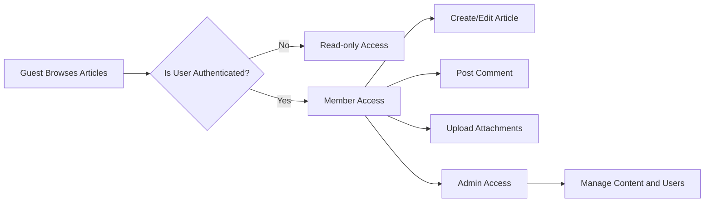

# Functional Requirements

## 1. Introduction

### 1.1 Purpose
This document defines detailed, unambiguous business requirements for implementing a simple economic and political discussion board backend. It sets out clear user roles, functional capabilities, and moderation processes to ensure developers build a service aligned with user expectations and business goals.

### 1.2 Scope
The system allows users to create articles discussing economics and politics, comment on articles, and upload supporting images and files. It supports three user roles: guests, registered members, and administrators.

### 1.3 Definitions and Abbreviations
- Article: Main content item created by members for discussion.
- Attachment: Image or file optionally uploaded and associated with an article.
- Comment: Text response to an article.
- Guest: Unauthenticated user with read-only access.
- Member: Authenticated user who can post, comment, and upload.
- Administrator: User with full access and moderation privileges.

## 2. Business Model

The discussion board provides a focused platform for simple, minimalistic discussion on economics and politics, allowing resource sharing through attachments and civil discourse. It aims for active user engagement with straightforward functionality.

## 3. User Actors

### 3.1 Guest
- Can browse and read all public articles and comments.
- Cannot create, edit, or delete content.

### 3.2 Member
- Can register and authenticate.
- Can create, edit, and delete their own articles within 24 hours of posting.
- Can upload up to 5 images and 3 other file types per article, each up to 5 MB.
- Can comment on articles with plain text only.
- Can edit and delete their own comments within 1 hour of posting.

### 3.3 Administrator
- Has full access to all articles, comments, users, and settings.
- Can delete or edit any user content.
- Can manage user roles and moderate content.

## 4. Functional Requirements

### 4.1 Posting Articles
- WHEN a member creates an article, THE system SHALL allow title and body input.
- THE system SHALL allow multiple images and file attachments per article.
- THE system SHALL associate articles with the creator.
- Articles SHALL have creation and last modification timestamps.
- Articles older than 24 hours SHALL not be editable by members.
- Members SHALL be able to delete their own articles.

### 4.2 File Attachments
- THE system SHALL allow up to 5 images and 3 other files per article.
- THE system SHALL enforce a maximum file size of 5 MB per attachment.
- THE system SHALL validate allowed file types: JPEG, PNG, GIF for images; PDF, DOCX, TXT for files.
- Upload failures SHALL return clear error messages.

### 4.3 Comments
- WHEN a member views an article, THE system SHALL allow plain text comments.
- Comments SHALL not support attachments.
- Members SHALL be able to edit or delete comments within 1 hour of posting.
- Comments SHALL have creation and last modification timestamps.
- GUESTs SHALL not post comments.

### 4.4 User Accounts
- THE system SHALL require email verification before allowing posting or commenting.
- THE system SHALL support secure registration, login, and logout.
- THE system SHALL securely manage user sessions.

### 4.5 Permissions and Roles
- GUESTs SHALL have read-only access.
- MEMBERS SHALL manage their own content.
- ADMINS SHALL have full content and user management.
- THE system SHALL enforce role-based access controls.

### 4.6 Content Moderation
- ADMINS SHALL edit or delete any content.
- THE system SHALL audit content modifications.
- Content flagging SHALL be supported optionally.

## 5. Business Rules

- Articles older than 24 hours SHALL not be editable.
- Comments SHALL be editable/deletable by authors within 1 hour.
- Attachments SHALL conform to size and type constraints.

## 6. Error Handling and Validation

- Invalid submissions SHALL return clear, user-understandable errors.
- Unauthorized access SHALL be denied with proper error codes.
- Expired sessions SHALL prompt re-authentication.

## 7. Performance Expectations

- Article posting and upload SHALL respond within 3 seconds under normal load.
- Browsing SHALL support pagination with instant response.

## 8. User Interaction Flow Diagram

---