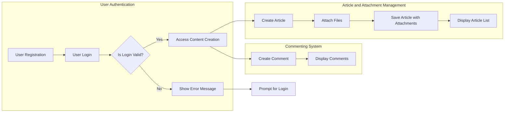

# econPolDiscussionBoard Requirements Analysis Report

## 1. Introduction
The econPolDiscussionBoard is a simple online discussion board dedicated to economic and political topics. It enables users to post articles with plain text content and supports multiple image and file attachments. The service includes a comment system for interaction and discussion, adhering to straightforward, minimalistic design principles.

## 2. Business Model
### 2.1 Purpose and Value
The system provides a focused platform for users interested in economic and political discourse to share and discuss relevant articles enriched with multimedia attachments. It meets the need for a minimal, topic-specific discussion board without overwhelming features.

### 2.2 Success Criteria
- Reliable and efficient article posting with attachments.
- Secure and performant access control distinguishing guests, members, and admins.
- Intuitive, responsive interfaces for article creation, commenting, and attachment management.
- Comprehensive error handling with clear user feedback.

## 3. User Actors
### 3.1 Guest
Unauthenticated users who can browse articles and view attachments but cannot post or comment.

### 3.2 Member
Registered and authenticated users who can create articles, upload attachments, comment, and edit/delete their own content within specified timeframes.

### 3.3 Admin
Administrators with full content and user management capabilities, including moderation of articles and comments.

## 4. Functional Requirements
### 4.1 Article Management
- WHEN a member submits a new article, THE system SHALL create and store it with author, timestamp, and unique ID.
- THE article content SHALL be plain text.
- THE system SHALL support multiple attachments per article.
- THE system SHALL list articles by newest first with pagination.
- MEMBERS may edit or delete their own articles within 24 hours.

### 4.2 Attachment Support
- THE system SHALL accept image files (JPEG, PNG, GIF) and common documents (PDF, DOCX, XLSX, TXT).
- MAX size per attachment SHALL be 10MB.
- UP to 5 attachments per article.
- Image attachments SHALL display inline; other files SHALL be downloadable.
- Unsupported file types SHALL be rejected with user-facing errors.

### 4.3 Commenting
- MEMBERS SHALL be able to comment on articles.
- Comments SHALL be plain text with max length 500 characters.
- Members may edit/delete their own comments within 15 minutes.
- Comments SHALL display in chronological order.
- Nested replies up to 2 levels deep.

## 5. Business Rules and Constraints
- GUESTS cannot post or comment.
- Article content max length 10,000 characters.
- Duplicate posts within 1-minute intervals by the same member disallowed.
- Attachments must be sanitized and validated.
- Disallowed content triggers flagging and admin moderation.
- Admins can override content modifications.

## 6. Authentication and Authorization
- Registration with email/password; email verification required.
- Login issues return specific error codes.
- JWT token based sessions with expiry and refresh mechanisms.
- Role-based access control: Guest, Member, Admin.

## 7. Error Handling
- Defined error codes for login failures, token expiry.
- Upload errors for size and invalid types.
- Validation errors for missing or invalid content.
- Unauthorized actions return HTTP 403 with explanation.

## 8. Performance Requirements
- Article fetch and display within 2-3 seconds.
- Uploads processed within 5 seconds.
- System supports 1000 concurrent authenticated users and 500 simultaneous uploads.
- Graceful rejection under heavy load.

## 9. Security and Compliance
- Secure storage of user credentials.
- Role-based data access enforcement.
- Audit logging of moderation and admin actions.
- Input sanitation to prevent injection attacks.

## 10. Business Processes and Workflows
- User registration and login flow.
- Article creation with attachments and validation.
- Comment posting and moderation flows.
- Attachment upload and error recovery.

## 11. Secondary Scenarios
- Guest attempts to post or comment denied.
- Attachment upload failures handled with retries.
- Admin moderation of flagged content.
- Edit/delete constraints enforced by time limits and role.

## 12. Success Metrics
- Active users and engagement rates.
- Error and upload failure rates.
- Response times and uptime.
- Moderator actions and system scalability.

## Mermaid Diagrams

---

These business requirements enable backend developers to design the econPolDiscussionBoard system keeping the design minimal, clear, and fully functional according to the natural language requirements presented here.