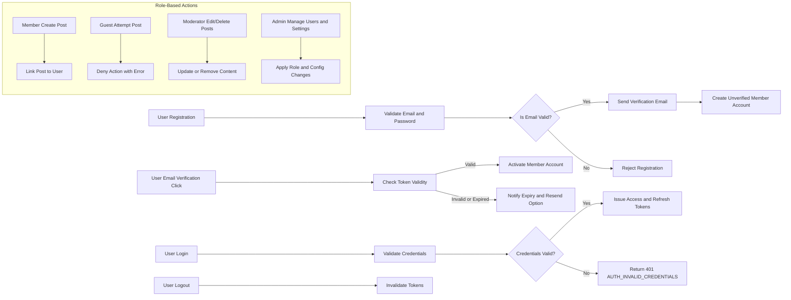

# User Roles and Authentication Requirements for discussionBoard

## 1. Introduction
This document defines all user roles, authentication workflows, permission structures, and role-based access controls for the discussionBoard service. It ensures clarity for backend developers by specifying complete business requirements related to user management and security.

## 2. User Role Definitions

### 2.1 Guest
- Description: Unauthenticated users who can browse discussion topics and view posts.
- Permissions:
  - CAN: View discussion topics and posts.
  - CANNOT: Create posts or replies.

### 2.2 Member
- Description: Authenticated users who can create discussion topics, reply to posts, and manage their own profiles.
- Permissions:
  - CAN: Register an account, log in/out, create new discussion topics, reply to posts, edit own posts and profile details.
  - CANNOT: Edit or delete others’ posts, moderate content, or perform administrative functions.

### 2.3 Moderator
- Description: Users with privileges to manage discussions and replies.
- Permissions:
  - CAN: All Member permissions.
  - CAN: Edit or delete any posts or replies deemed inappropriate.
  - CAN: Manage user-generated content for compliance with community guidelines.
  - CANNOT: Manage system configuration or user role assignments.

### 2.4 Admin
- Description: System administrators with highest privileges.
- Permissions:
  - CAN: All Moderator permissions.
  - CAN: Manage user accounts (including banning users).
  - CAN: Configure system settings.
  - CAN: Oversee moderation activities and audit logs.

## 3. Authentication Workflow

### 3.1 User Registration
WHEN a new user submits registration details, THE system SHALL:
- Validate email format and password strength.
- Send a verification email to the provided email address.
- Create a member account in unverified state until email confirmation.

### 3.2 Login and Logout
WHEN a user submits valid credentials, THE system SHALL:
- Authenticate credentials within 2 seconds.
- Issue a JWT access token valid for 30 minutes.
- Issue a refresh token valid for 14 days.
WHEN a user logs out, THE system SHALL:
- Invalidate the user's active tokens immediately.

### 3.3 Email Verification
WHEN a user clicks the email verification link, THE system SHALL:
- Verify the token's validity within 24 hours.
- Activate the user account upon successful verification.

### 3.4 Password Management
WHEN a user requests password reset, THE system SHALL:
- Send a secure reset link valid for 1 hour.
WHEN a user resets password, THE system SHALL:
- Validate new password complexity.
- Update the password securely.

### 3.5 Session Management
WHILE a user session is active, THE system SHALL:
- Automatically refresh access tokens via refresh tokens after 25 minutes.
- Terminate sessions after 30 days of inactivity.

## 4. Permission Matrix

| Action                         | Guest | Member | Moderator | Admin |
|--------------------------------|-------|--------|-----------|-------|
| Browse discussions & posts      | ✅    | ✅     | ✅        | ✅    |
| Register account               | ❌    | ✅     | ✅        | ✅    |
| Log in / Log out               | ❌    | ✅     | ✅        | ✅    |
| Create new discussion topics    | ❌    | ✅     | ✅        | ✅    |
| Reply to posts                 | ❌    | ✅     | ✅        | ✅    |
| Edit own posts                | ❌    | ✅     | ✅        | ✅    |
| Edit others’ posts             | ❌    | ❌     | ✅        | ✅    |
| Delete posts/replies          | ❌    | ❌     | ✅        | ✅    |
| Manage user accounts           | ❌    | ❌     | ❌        | ✅    |
| Configure system settings       | ❌    | ❌     | ❌        | ✅    |
| Moderate content               | ❌    | ❌     | ✅        | ✅    |

## 5. Role-based Access Control

### 5.1 Posting and Replying
WHEN a Member creates a post or reply, THE system SHALL link content to the user’s account.
WHEN a Guest attempts to create posts or replies, THE system SHALL deny action with an error message.

### 5.2 Moderation Capabilities
WHILE acting as Moderator, THE system SHALL permit editing or deleting any user-generated content.
WHEN inappropriate content is detected and Moderator acts, THE system SHALL update or remove posts accordingly.

### 5.3 System Administration
WHILE acting as Admin, THE system SHALL allow user account banning and role assignment.
WHEN Admin updates system configurations, THE system SHALL apply changes immediately.

## 6. Business Rules Related to Roles
- Users must verify their email before gaining Member privileges.
- Moderators and Admins must have elevated security checks.
- Users cannot elevate their own role; only Admins can assign roles.

## 7. Error Handling and Security
IF authentication fails due to invalid credentials, THEN THE system SHALL return HTTP 401 with error code AUTH_INVALID_CREDENTIALS.
IF a user attempts unauthorized action, THEN THE system SHALL return HTTP 403 with error code AUTH_UNAUTHORIZED_ACTION.
IF email verification link is expired, THEN THE system SHALL notify user and allow to request new verification email.

## 8. Performance Requirements
THE system SHALL respond to authentication requests within 2 seconds under normal load.
THE system SHALL invalidate tokens and reflect permission changes within 5 seconds.

## 9. Summary and Developer Autonomy Statement
This document provides business requirements only.
All technical implementation decisions belong to developers.
Developers have full autonomy over architecture, APIs, and database design.
The document describes WHAT the system should do, not HOW to build it.

---

