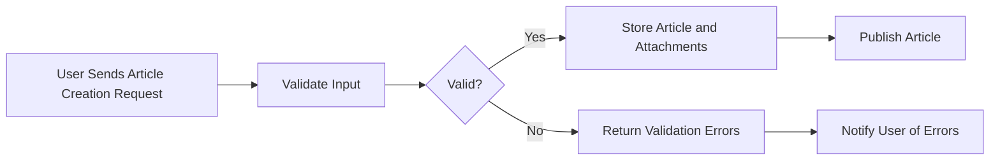
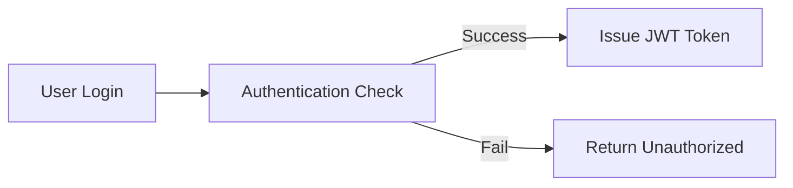

# Requirements Analysis Report for Economic and Political Discussion Board

## 1. Service Overview

### 1.1 Business Model

The economic and political discussion board provides a focused platform where users can create, share, and discuss articles related to economic and political topics. The service aims to be simple and minimal to reduce barriers to participation while supporting rich content through image and file attachments.

The core features include article creation and management, user authentication, role-based access control with guest, member, and admin roles, a commenting system, attachment support, and search and pagination functionalities.

Success of the service is measured by user engagement metrics such as daily and monthly active users, number of articles created, attachment usage rate, and system responsiveness under expected load conditions.

### 1.2 Business Strategy

The service focuses on organic growth by attracting users interested in economic and political discussions, with potential future monetization through advertising or premium features. The system emphasizes simplicity, scalability, and security to ensure consistent user experience without unnecessary complexity.

## 2. User Actors

### 2.1 Guest

- Guests are unauthenticated users who can only view published articles and associated attachments.
- Guests SHALL NOT create, edit, or delete articles or comments.
- Guests SHALL receive an error message if attempting unauthorized actions.

### 2.2 Member

- Members are authenticated users who can create, edit, and delete their own articles.
- Members SHALL be able to upload images and file attachments within specified size and format limits.
- Members SHALL be able to comment on articles and edit or delete their own comments.
- Members SHALL NOT edit or delete others' content.

### 2.3 Admin

- Admins have full permissions to manage all content and user accounts.
- Admins SHALL be able to remove inappropriate articles, comments, or users.
- Admins SHALL have access to system settings and audit logs.

## 3. Functional Requirements

### 3.1 Article Management

- WHEN a member creates an article, THE system SHALL store the article with associated attachments.
- THE article must have a non-empty title with a maximum length of 200 characters.
- THE article content SHALL support rich text in Markdown format and be limited to 10,000 characters.
- Members SHALL be able to edit or delete their own articles.
- THE system SHALL prevent unauthorized editing or deletion by other users.

### 3.2 Attachment Support

- THE system SHALL support uploading image attachments in JPEG, PNG, and GIF formats.
- THE system SHALL support file attachments including PDF, DOCX, XLSX, and TXT formats.
- Attachments SHALL be limited to 10 MB in size.
- An article SHALL support up to 10 attachments.
- THE system SHALL sanitize and validate file content to prevent security risks.
- WHEN an article is deleted, ALL associated attachments SHALL be removed.

### 3.3 Commenting System

- Members SHALL be able to post comments linked to articles.
- Comments SHALL be limited to 1000 characters.
- Members SHALL be able to edit or delete their own comments.
- Admins SHALL have the ability to moderate all comments.

### 3.4 Article Listing and Search

- Articles SHALL be listed in descending order of creation date.
- THE system SHALL paginate articles with 20 articles per page.
- THE system SHALL allow filtering articles by tags or keywords.
- A basic search SHALL be provided over article titles and content.
- THE system SHALL return search results within 2 seconds for queries over the 1000 most recent articles.

### 3.5 Authentication and Authorization

- THE system SHALL support user registration and login using username/email and password.
- Authentication SHALL use secure password hashing and JWT token-based session management.
- THE system SHALL restrict article creation, editing, deletion, and commenting to authenticated members.
- Administrative functions SHALL be restricted to admin users.

## 4. Business Rules and Validation

- Articles SHALL have a non-empty title and content.
- Title length SHALL NOT exceed 200 characters.
- Content length SHALL NOT exceed 10,000 characters.
- Attachments SHALL comply with allowed formats and size limits.
- Members SHALL only modify or delete their own articles and comments.
- Unauthorized attempts SHALL be logged and result in access denial.

## 5. Error Handling

### 5.1 User Errors

- WHEN a guest attempts a restricted action, THE system SHALL respond with HTTP 401 Unauthorized and error code AUTH_REQUIRED.
- WHEN file size limits are exceeded, THE system SHALL respond with HTTP 413 Payload Too Large.
- WHEN unsupported file formats are uploaded, THE system SHALL respond with HTTP 415 Unsupported Media Type.

### 5.2 System Errors

- ON storage failures during uploads, THE system SHALL respond with HTTP 503 Service Unavailable.
- ON database errors during article transactions, THE system SHALL roll back transactions and respond with HTTP 500 Internal Server Error.

### 5.3 Recovery

- THE system SHALL allow users to retry failed uploads.
- ALL errors SHALL be logged with sufficient context for administrative review.

## 6. Performance Expectations

- Article creation, editing, and deletion SHALL complete within 2 seconds under typical load.
- Article listing pages SHALL load within 3 seconds.
- Search queries SHALL complete within 2 seconds for up to 1000 recent articles.
- The system SHALL support at least 100 concurrent users without performance degradation.

## 7. Security and Privacy

- THE system SHALL use industry-standard password hashing algorithms.
- JWT session tokens SHALL have expiration and refresh mechanisms.
- Role-based authorization SHALL be strictly enforced.
- Sensitive data SHALL be stored securely with encryption where applicable.
- THE system SHALL log authentication and authorization events for auditing.

## 8. User Scenarios

### 8.1 Article Creation
- WHEN a member creates an article with attachments, THE system SHALL validate input and store the article and attachments.
- IF validation fails, THE system SHALL provide clear error messages.

### 8.2 Article Editing
- WHEN a member edits an article, THE system SHALL validate ownership and apply changes.
- Unauthorized edits SHALL be denied with error responses.

### 8.3 Article Deletion
- WHEN a member deletes an article, THE system SHALL delete the article and related attachments.
- Admins SHALL be able to delete any article.

### 8.4 Commenting
- WHEN a member posts a comment, THE system SHALL associate it with the article and member.
- Editing and deletion apply similarly as with articles.

### 8.5 Authentication
- User registration, login, logout, password reset, and session refresh SHALL be supported.

## 9. Mermaid Diagrams

## 10. References

- Related documents: User Actors, Service Overview, Business Rules.

> This report captures all business requirements in clear, measurable terms, suitable for immediate backend development. It avoids technical implementation specifics while providing comprehensive functional, security, and error scenarios necessary for a minimal yet robust economic/political discussion board backend.