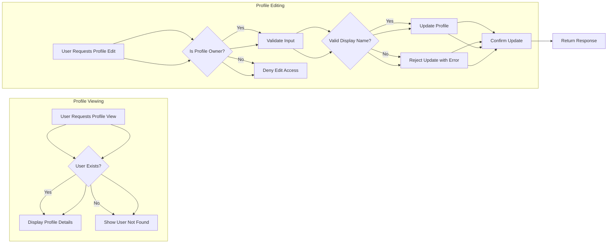

# Economic/Political Discussion Board

## User Account Management

### User Registration
WHEN a visitor wants to participate in the discussion board, THE system SHALL allow the visitor to register an account by providing a valid email address and a password.

- The email address MUST be unique across all users.
- The password SHALL meet defined security rules (e.g., minimum 8 characters, including letters and numbers).

IF the email is already registered, THEN THE system SHALL reject the registration with an appropriate error message.

### User Login
WHEN a registered user attempts to log in, THE system SHALL authenticate the user by verifying the provided email and password.

- IF authentication inputs are invalid, THEN THE system SHALL reject the login attempt and provide an error message.
- Successful login SHALL establish a secure session or issue a token for the user.

### Password Change
WHEN a logged-in user requests to change their password, THE system SHALL require the old password to confirm identity.

- IF the old password is incorrect, THEN THE system SHALL reject the change request.
- THE new password SHALL comply with the security rules.
- Upon successful change, THE system SHALL notify the user.

### Account Deletion
WHEN a user chooses to delete their account, THE system SHALL delete the user's account record and all associated data.

- This includes deleting all articles and comments the user has written.
- The deletion SHALL be irreversible.
- The system SHALL prompt the user for confirmation before deletion.

## User Profiles

### Profile Information
THE system SHALL store for each user a profile consisting of:
- Display name (required, non-empty string)
- Bio text (optional string)

### Profile Editing
WHEN a user requests to edit their profile, THE system SHALL allow edits to the display name and bio text fields.

- Display name edits SHALL be validated to ensure the value is not empty.
- Bio text MAY be empty or omitted.
- IF validation fails, THEN THE system SHALL reject the update and notify the user.

### Profile Viewing
THE system SHALL allow any user, whether authenticated or guest, to view other users' profiles.

- The profile view SHALL include the display name, bio text, a list of all articles written by that user (with titles and IDs), and a list of all comments written (with IDs and associated article IDs).
- IF the user has no bio, the system SHALL display an empty or placeholder bio field.
- IF the user has no articles or comments, the corresponding lists SHALL be empty.

### Profile Security
THE system SHALL restrict profile edits to the profile owner only.

- Any user can view public profiles.
- WHEN a user deletes their account, THE system SHALL delete the corresponding profile and all related content.

### Profile Management Flow

## Sections

### Section Attributes
THE system SHALL manage discussion board content divided into sections.

- Each section SHALL have a unique name and a descriptive text.

### Section Management
ONLY administrators SHALL be authorized to create, edit, and delete sections.

- WHEN an administrator creates a section, THE system SHALL require a name and description.
- Editing or deleting sections SHALL also be restricted to administrators.

### Section Viewing
ALL users SHALL be able to view the list of all sections.

- Sections SHALL be displayed with their names and descriptions.

### Browsing Articles
WHEN users select a section, THE system SHALL display a list of articles belonging to that section.

## Articles

### Article Creation
WHEN a user creates an article, THE system SHALL require a title, content, and assignment to a section.

- Title and content SHALL be mandatory fields.
- The section must be a valid, existing section.

### Attachments
Users SHALL be able to attach multiple files and images to an article.

- Attachments SHALL be stored and linked to the article.
- Users SHALL be able to add multiple tags to articles; tags are free-text.

### Article Editing
Users SHALL be able to edit their own articles.

- Editable fields include title, content, attachments, and tags.

- The system SHALL validate ownership before allowing edits.

### Article Deletion
Users SHALL be able to delete their own articles.

- Administrators SHALL be able to delete any article.

### Article Attributes
Each article SHALL record the following:
- Title
- Content
- Section
- Tags
- List of attached files and images
- Author information
- Timestamp of creation and updates

## Article List

### Viewing
WHEN viewing a section, THE system SHALL provide a paginated list of articles.

- Each entry SHALL show title, author, tags, comment count, and posted time.
- The content itself SHALL NOT be displayed in the list.

### Sorting
Users SHALL be able to sort articles by "newest first" or "oldest first".

## Viewing an Article

WHEN a user selects an article, THE system SHALL display the article in full detail.

- Full content, attachments, tags, author information, and timestamp SHALL be shown.
- Users SHALL be able to download attached files and images.

## Searching Articles

### Search Capability
Users SHALL be able to search articles by title or content.

- Search results SHALL be paginated.
- Users MAY filter search results by tags.

## Comments

### Comment Creation
Users SHALL be able to post comments on articles.

- Comments SHALL be flat (non-nested).

### Comment Viewing
Users SHALL be able to view all comments on an article.

- Comments SHALL be sorted by oldest first.

### Comment Editing and Deletion
Users SHALL be able to edit or delete their own comments.

- The system SHALL verify ownership before allowing modification or deletion.

### Comment Attributes
Each comment SHALL include author, content, and timestamp.

## Administrator System

### Becoming an Administrator
ANY user MAY submit a request to become an administrator by providing a reason.

- Super administrators SHALL be able to view all pending requests.
- Approval or rejection SHALL be performed by super administrators.
- Upon approval, the user SHALL become a regular administrator.

### Administrator Grades
Two grades exist:
- Regular administrator
- Super administrator

- Super administrators SHALL be able to promote regular administrators to super administrators.
- Super administrators SHALL be able to demote other super administrators to regular administrators, except themselves.

### Administrator Rights
Administrators SHALL have all regular user rights plus:
- Creating, editing, and deleting sections
- Deleting any article
- Deleting any comment
- Banning and unbanning users
- Viewing banned users and ban reasons

## Banning

### Ban Enforcement
WHEN a user is banned, THE system SHALL prevent the user from logging in.

- Existing articles and comments by banned users SHALL remain visible.

### Ban Records
THE system SHALL record a reason for each ban.

- Administrators SHALL be able to view ban reasons.

### Ban List
Administrators SHALL be able to view the full list of banned users.

## Overall System Security and Permissions

- THE system SHALL enforce authentication for all actions requiring logged-in users.
- THE system SHALL restrict administrative functions to authorized administrators only.
- THE system SHALL verify user ownership when editing or deleting content.
- THE system SHALL handle all deletions as permanent.
- THE system SHALL log administrative actions such as banning and section management for auditing.

## Non-Functional Requirements

- THE system SHALL respond to all user requests within 2 seconds under normal load.
- THE system SHALL be available 99.9% of the time, excluding scheduled maintenance.
- THE system SHALL securely store all user passwords using strong hashing algorithms.

---

The specification above provides full business logic and workflows for the Economic/Political Discussion Board, suitable for implementation by backend developers.