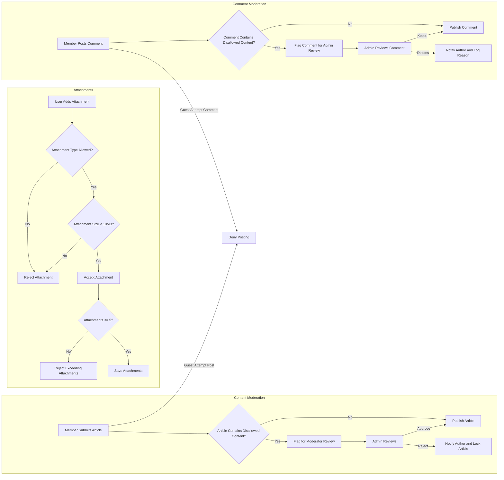

# Business Rules and Validation Requirements for econPolDiscussionBoard

This document specifies the detailed business rules and validation constraints for article posting, attachment management, and comment moderation within the econPolDiscussionBoard system. It ensures clear, measurable, and testable backend requirements for developers to follow, enabling consistent and secure operation of the discussion board.

---

## 1. Content Moderation Rules

### 1.1 Article Posting Rules

- WHEN a member submits a new article, THE system SHALL accept plain text content with optional image and file attachments.
- WHEN a guest attempts to create an article, THE system SHALL deny posting and return an appropriate authorization error.
- THE system SHALL limit article content to a maximum of 10,000 characters.
- WHERE an article contains disallowed content such as hate speech, profanity, or spam, THE system SHALL flag the article for moderator review before publication.
- THE system SHALL prevent duplicate article submissions by the same member within a 1-minute interval.

### 1.2 Article Review and Moderation

- WHERE an article is flagged for review, THE system SHALL notify administrators for manual moderation.
- THE system SHALL allow administrators to approve or reject flagged articles.
- WHEN an administrator rejects an article, THE system SHALL notify the article author with the rejection reason.
- THE system SHALL lock rejected articles from public display and prevent further commenting.

### 1.3 User Permissions and Actions

- THE guest user SHALL have read-only access to browse articles and view attachments.
- THE member user SHALL have privileges to create, edit (within 15 minutes after posting), and delete their own articles.
- THE admin user SHALL have full privileges to edit, delete, or hide any article regardless of authorship.
- THE system SHALL enforce that members cannot edit or delete articles owned by others.

---

## 2. Attachment Restrictions

### 2.1 Allowed File Types

- THE system SHALL allow attachments with MIME types: image/jpeg, image/png, image/gif, application/pdf, application/msword, and application/vnd.openxmlformats-officedocument.wordprocessingml.document.
- THE system SHALL reject any attachment with disallowed file types.

### 2.2 File Size Limits

- THE system SHALL enforce a maximum attachment size of 10 MB per file.
- IF an attachment exceeds 10 MB, THEN THE system SHALL reject the upload and return an error indicating the size limit.

### 2.3 Attachment Quantity Limits

- THE system SHALL allow up to 5 attachments per article.
- IF the user attempts to attach more than 5 files, THEN THE system SHALL reject the additional files and notify the user.

---

## 3. Comment Validation

### 3.1 Comment Posting Rules

- WHEN a member submits a comment on an article, THE system SHALL accept plain-text content up to 2,000 characters.
- WHEN a guest attempts to post a comment, THE system SHALL deny posting and return an authorization error.
- THE system SHALL prevent members from posting identical comments consecutively on the same article.

### 3.2 Comment Moderation

- WHERE comments contain disallowed content per community guidelines, THE system SHALL flag such comments for administrator review.
- THE system SHALL notify administrators of flagged comments.
- WHEN an administrator deletes a comment, THE system SHALL log the deletion reason and notify the comment author.
- THE system SHALL allow administrators to hide or delete any comment.

### 3.3 Content Restrictions

- THE system SHALL restrict comments from containing executable scripts or harmful content to prevent security risks.
- THE system SHALL reject comments containing blocked words or phrases as defined by community standards.

---

## Diagrams

