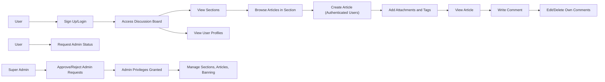

# Economic/Political Discussion Board

## User Account

Users shall have an individual account to access discussion features. The system shall support the following account-related functions:

- **Sign Up:** WHEN a new user attempts to sign up, THE system SHALL require a unique email and a password. The email must be validated for proper format. The password shall adhere to security standards.

- **Login:** WHEN a user attempts to log in, THE system SHALL authenticate using their registered email and password.

- **Change Password:** WHEN a logged-in user requests to change the password, THE system SHALL verify the current password and allow setting a new secure password.

- **Delete Account:** WHEN a user deletes their account, THE system SHALL permanently remove the user data and cascade-delete all articles and comments authored by that user to maintain data consistency.

## User Profile

Each user shall have a profile containing a display name and a bio text. The following requirements apply:

- WHEN a user updates their profile, THE system SHALL allow editing of the display name and bio.
- WHEN a user views another user's profile, THE system SHALL display the display name, bio, a list of articles authored by the user, and a list of comments written by the user.

## Sections

- Sections represent thematic categories such as Politics, Economy, or Current Affairs.
- WHEN an administrator creates a section, THE system SHALL require a unique name and a description.
- WHEN an administrator edits a section, THE system SHALL validate uniqueness of the name and update the description accordingly.
- WHEN an administrator deletes a section, THE system SHALL remove the section and disable access to contained articles.
- ONLY administrators SHALL have permission to manage sections.
- Users SHALL be able to view the list of all sections and browse articles within specific sections.

## Articles

- Users SHALL be authenticated to create articles within any existing section.
- WHEN creating an article, THE user SHALL provide a title and content. The title and content are mandatory fields.
- Articles SHALL belong to exactly one existing section chosen by the user.
- Users SHALL be able to attach multiple files and images to an article.
- Users SHALL be able to add multiple free-text tags to an article.
- WHEN editing an article, THE system SHALL verify that the editor is the original author or an administrator.
- Users SHALL be able to modify the article's title, content, attachments, and tags.
- WHEN deleting an article, THE system SHALL confirm the requester is the article's author or an administrator and perform the deletion of the article and all its associated comments and attachments.

## Article List

- Users SHALL be able to view paginated lists of articles within a chosen section.
- Each article entry in the list SHALL show the title, author display name, tags, comment count, and timestamp of posting.
- Articles in the list SHALL NOT display full content, only the title.
- Users SHALL have the ability to sort articles by newest first or oldest first.

## Viewing an Article

- Users SHALL be able to view a single article with full title, author, content, attachments, tags, and time posted.
- Users SHALL be able to download all attached files and images.

## Searching Articles

- Users SHALL be able to search articles by matching keywords in the title or content.
- Search results SHALL be paginated.
- Users SHALL be able to filter search results by one or more tags.

## Comments

- Comments SHALL only be one-level (no nested replies).
- Users SHALL be able to write comments on articles.
- Comments SHALL be shown sorted oldest first.
- Each comment SHALL show the author display name, content, and posting time.
- Users SHALL be able to edit or delete ONLY their own comments.

## Administrator System

### Becoming an Administrator

- Any user SHALL be able to request administrator status by submitting a request with a reason.
- Super administrators SHALL have capabilities to view, approve, or reject pending admin requests.
- Upon approval, the user SHALL become a regular administrator.

### Administrator Grades

- Administrator roles include regular administrators and super administrators.
- Super administrators SHALL be able to promote regular administrators to super administrators.
- Super administrators SHALL NOT be able to demote themselves.
- Super administrators SHALL be able to demote other super administrators to regular administrator.

### Administrator Capabilities

- Administrators SHALL have all capabilities of regular users including article and comment management.
- Administrators SHALL be able to create, edit, and delete sections.
- Administrators SHALL be able to delete any article or comment.
- Administrators SHALL be able to ban or unban users.
- Administrators SHALL be able to see the list of banned users and view ban reasons.

## Banning

- WHEN a user is banned, THE system SHALL record the ban reason and prevent the user from logging in.
- Articles and comments of banned users SHALL remain visible.
- Administrators SHALL be able to view ban reasons for users.

---

## Authentication and Authorization

- Users SHALL authenticate with email and password.
- Sessions SHALL be managed securely with appropriate session expiration and renewal policies.
- Access control SHALL enforce strict permission checks based on user role (guest, member, administrator).
- Banned users SHALL be denied access at login.

## Error Handling

- WHEN a requested operation fails due to invalid input or permission violation, THE system SHALL provide a clear error message.
- Validation errors for required fields, uniqueness constraints, and permission checks SHALL be explicit.

## Pagination and Sorting Details

- Pagination SHALL support configurable page size and page number parameters.
- Sorting SHALL support ascending and descending order by creation timestamp.

---

## Mermaid Diagram: Workflow Overview

