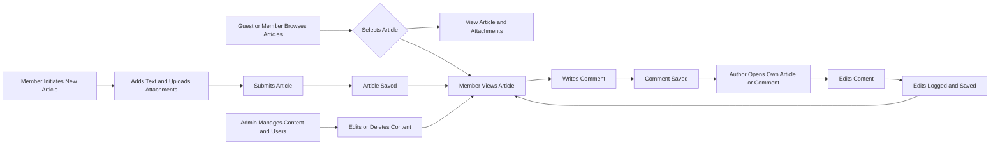

# Simple Economic/Political Discussion Board Requirements Analysis

## Introduction

### Purpose
To define a minimal and clear set of business and functional requirements for a simple economic and political discussion board supporting plain articles with image and file attachments.

### Scope
Focus on core discussion board features with simple user roles and workflows emphasizing ease of use and maintenance.

## User Roles

### Guest
Unauthenticated users can browse articles and comments only.

### Member
Registered users with rights to create, edit, and delete their own articles and comments and upload attachments.

### Admin
System administrators with rights to moderate content and manage users.

## Functional Requirements

### Article Management

- Articles shall allow multiple image and file attachments per post.
- Article submissions shall validate attachment types (images: jpeg, png, gif; files: pdf, docx).
- Attachment size per file shall be limited to 5MB.
- Members shall be limited to 10 attachments per article.
- Articles shall include title and body content, minimum 10 characters long.

### Browsing

- Guests and members can browse articles and attached content.
- Articles shall be displayed newest first.

### Comments

- Members can add text-only comments to articles.
- Comments shall have a maximum length of 500 characters.

### Editing and Deletion

- Authors (members) can edit or delete their own articles and comments within 24 hours of creation.
- Admins can edit or delete any content at any time.
- All edits and deletions shall be logged with timestamps.

### Authentication

- Registration via email and password for members.
- Admins have elevated permissions.
- Guests have read-only access.

### Administration

- Admins manage user accounts and content moderation.

### Error Handling

- Upload validation errors for size and format.
- Unauthorized actions shall be blocked with clear user feedback.
- System errors shall provide meaningful error messages and retry mechanisms.

### Performance

- Article browsing response within 2 seconds.
- Uploads complete within 5 seconds.
- Instant comment submission response.

## Business Rules

- Minimum text lengths and attachment limits enforced.
- User permissions strictly enforced.

## User Scenarios

Visual workflows are provided showing browsing, content creation, commenting, editing, and administration.

## Conclusion

This specification provides a clear, minimal, and actionable foundation for development of the simple economic and political discussion board. It balances functionality with simplicity per client request.