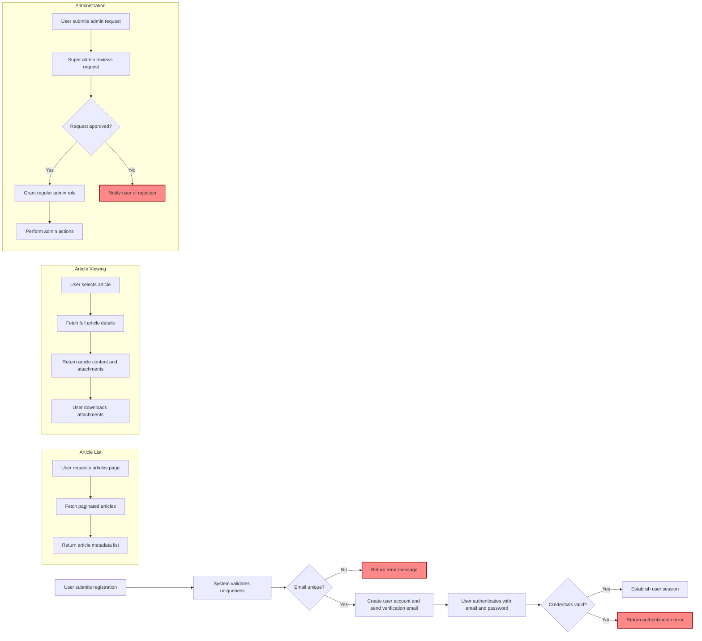

# Economic/Political Discussion Board Requirements Specification

## 1. User Account Management

### 1.1 User Registration
- WHEN a user submits an email and password, THE system SHALL create a new user account.
- THE user's email SHALL be unique across the platform.
- THE system SHALL send a verification email to the provided address.
- AFTER successful registration, THE user SHALL be able to log in using their email and password.

### 1.2 User Login
- WHEN a user provides valid email and password, THE system SHALL authenticate the user and establish a session or issue a JWT token.
- IF credentials are invalid, THEN THE system SHALL return an authentication error with a clear message.

### 1.3 Password Change
- WHEN a logged-in user submits their current password and a new password, THE system SHALL verify the current password.
- WHEN verification succeeds, THE system SHALL update the password to the new password.
- IF verification fails, THEN THE system SHALL respond with an appropriate error.

### 1.4 Account Deletion
- WHEN a user requests deletion, THE system SHALL delete the user's account.
- ALL articles and comments authored by the user SHALL also be deleted permanently.
- THE system SHALL notify the user upon successful deletion.

### 1.5 Authentication and Session Management
- THE system SHALL enforce secure password storage using industry best practices (e.g., bcrypt).
- THE system SHALL invalidate sessions or tokens upon password change or account deletion.
- THE system SHALL prevent login from banned users and show a message with ban reason.

## 2. User Profiles

### 2.1 Profile Attributes
- EACH user SHALL have a profile consisting of:
  - Display name (required)
  - Biography text (optional)

### 2.2 Profile Management
- WHEN a user updates their display name or biography, THE system SHALL save changes.
- THE system SHALL validate display name length and content to prevent abuse.

### 2.3 Viewing Profiles
- USERS SHALL be able to view other users' profiles.
- A profile view SHALL display:
  - The user's display name and biography.
  - A paginated list of articles authored by the user.
  - A paginated list of comments authored by the user.

## 3. Sections Management

### 3.1 Sections Overview
- THE discussion board SHALL be divided into sections (e.g., Politics, Economy, Current Affairs).
- EACH section SHALL have a unique name and description.

### 3.2 Section Creation and Management
- ONLY administrators SHALL be permitted to create, edit, or delete sections.
- WHEN an administrator creates or edits a section, THE system SHALL validate uniqueness and required fields.

### 3.3 Viewing Sections
- USERS SHALL be able to view a list of all sections.
- USERS SHALL be able to browse articles within a specific section.

## 4. Articles

### 4.1 Article Creation
- USERS SHALL be able to create articles within any section.
- EACH article SHALL have:
  - Title (required, non-empty string)
  - Content (required, text)
  - Section (required, must associate with exactly one existing section)
  - Tags (optional, multiple allowed, free text)
  - Attachments (optional, multiple files and images allowed)

### 4.2 Article Editing and Deletion
- USERS SHALL be able to edit their own articles, including title, content, tags, and attachments.
- USERS SHALL be able to delete their own articles.
- ADMINISTRATORS SHALL be able to delete any article.

### 4.3 Viewing Article Details
- USERS SHALL be able to view full article details including:
  - Title
  - Author display name
  - Content
  - Attachments (files and images)
  - Tags
  - Posting timestamp
- USERS SHALL be able to download attachments preserving original file names and content.

## 5. Article List

### 5.1 Listing Articles
- THE system SHALL provide paginated article lists per section.
- DEFAULT page size SHALL be 20 articles.
- USERS MAY specify page numbers; when omitted, the first page is returned.

### 5.2 Article Metadata Display
- EACH article entry SHALL display:
  - Title
  - Author display name
  - Tags
  - Comment count
  - Posting time in ISO 8601 format
- THE full article content SHALL NOT be included in the list.

### 5.3 Sorting Articles
- USERS MAY sort articles by:
  - Newest first (default)
  - Oldest first

### 5.4 Pagination and Boundaries
- IF a user requests a page number beyond the available range, THE system SHALL return an empty list.
- THE system SHALL ensure consistent ordering and pagination despite concurrent modifications.

## 6. Searching Articles

### 6.1 Search Parameters
- USERS SHALL be able to search articles by title or content.
- USERS SHALL be able to filter search results by tags.

### 6.2 Search Results
- SEARCH results SHALL be paginated.
- THE system SHALL support sorting and filtering as per article list requirements.

## 7. Comments

### 7.1 Commenting
- USERS SHALL be able to post comments on articles.
- COMMENTS SHALL be single-level only; no nested replies.

### 7.2 Comment Viewing
- ALL comments for an article SHALL be visible.
- COMMENTS SHALL be sorted oldest first.
- EACH comment SHALL display:
  - Author display name
  - Content
  - Posting timestamp

### 7.3 Comment Editing and Deletion
- USERS SHALL be able to edit their own comments.
- USERS SHALL be able to delete their own comments.
- ADMINISTRATORS SHALL be able to delete any comment.

## 8. Administrator System

### 8.1 Administrator Roles
- THERE SHALL be two administrator grades:
  - Regular administrator
  - Super administrator

### 8.2 Becoming an Administrator
- ANY user SHALL be able to request administrator privileges by submitting a reason.
- SUPER administrators SHALL be able to view all pending requests.
- SUPER administrators SHALL be able to approve or reject requests.
- WHEN approved, the user SHALL become a regular administrator.

### 8.3 Administrator Privileges
- ADMINISTRATORS SHALL have all permissions of regular users.
- ADMINISTRATORS SHALL be able to create, edit, and delete sections.
- ADMINISTRATORS SHALL be able to delete any article or comment.
- ADMINISTRATORS SHALL be able to ban and unban users.
- ADMINISTRATORS SHALL be able to view the list of banned users.
- SUPER administrators SHALL be able to promote regular administrators to super administrators.
- SUPER administrators SHALL be able to demote other super administrators to regular administrators, but not themselves.

### 8.4 Demotion and Promotion Rules
- SUPER administrators SHALL NOT demote themselves.
- PROMOTIONS and demotions SHALL be tracked with timestamps and acting administrator.

## 9. Banning

### 9.1 Banning Effects
- WHEN a user is banned, THE system SHALL prevent the user from logging in.
- BANNED users' existing articles and comments SHALL remain visible.
- THE system SHALL record a ban reason for each banned user.
- ADMINISTRATORS SHALL be able to view ban reasons.

### 9.2 Ban Management
- ADMINISTRATORS SHALL be able to ban users with a specified reason.
- ADMINISTRATORS SHALL be able to unban users.

---

## 10. Business Rules and Validation

- THE system SHALL validate all inputs and enforce uniqueness constraints.
- THE system SHALL enforce authorization and permission checks for all operations.
- ERROR messages SHALL be clear and informative.
- THE system SHALL handle concurrent modifications gracefully.

## 11. Error Handling and Performance

- THE system SHALL respond to user requests within 2 seconds under normal load.
- VALIDATION errors SHALL return HTTP 4xx status codes with error details.
- SYSTEM errors SHALL log detailed diagnostics and respond with generic user-friendly messages.
- FILE downloads SHALL preserve integrity and complete in reasonable time.

---

## 12. Workflow Diagram

