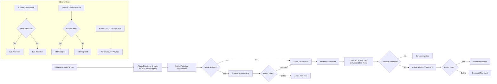

# Simple Economic/Political Discussion Board Requirements Analysis

## 1. Introduction

The system is a straightforward discussion board focused on economic and political topics, allowing registered members to post articles with text content and multiple attachments including images and files. Guests cannot post content.

## 2. Functional Requirements

### 2.1 Posting Articles

- WHEN a member creates a new article, THE system SHALL allow inclusion of text content with a maximum length of 10,000 characters.
- THE system SHALL allow uploading up to 5 attachments per article.
- ALLOWED attachment types SHALL include JPEG, PNG, GIF images, and PDF, DOC, DOCX, XLS, XLSX files.
- EACH attachment SHALL be limited to 10 megabytes in size.
- THE system SHALL reject unsupported file types or oversized files with appropriate error messages.
- GUESTS SHALL NOT be permitted to create articles.

### 2.2 File Attachments

- The system SHALL enforce allowed file types and size limits strictly upon upload.
- THE system SHALL provide upload status feedback with success or failure notifications.
- MULTIPLE files MAY be uploaded per article, up to the maximum count of 5.

### 2.3 Comments

- WHEN a member posts a comment on an article, THE system SHALL allow plain text content only, limited to 1,500 characters.
- COMMENTS SHALL NOT support file or image attachments.
- GUESTS SHALL NOT be permitted to post comments.

### 2.4 User Accounts and Roles

- MEMBERS must register and authenticate before posting articles or comments.
- ADMINS have rights to moderate articles and comments at any time.
- GUESTS have read-only access.

### 2.5 Permissions and Moderation

- Articles and comments SHALL be publicly visible upon creation unless flagged.
- WHEN users or admins flag content as inappropriate, THE system SHALL mark content as under review and restrict public visibility.
- ADMINS SHALL be able to delete or reinstate flagged content.

### 2.6 Editing and Deletion

- MEMBERS SHALL be able to edit their own articles within 24 hours of posting.
- COMMENTS may be edited only within 1 hour of posting.
- ADMINS SHALL have unrestricted editing and deletion capabilities.
- ALL edits and deletions SHALL be logged with timestamps and user identifiers for audit purposes.

## 3. Business Rules

### 3.1 Article Content Rules

- Articles content text up to 10,000 characters.
- Attachments restricted to specified file types and size.
- Maximum 5 attachments per article.
- Immediate public visibility on creation.

### 3.2 Attachment Constraints

- Only JPEG, PNG, GIF image files.
- PDF, DOC, DOCX, XLS, XLSX as non-image files.
- Max 10 MB per file.
- Invalid types or sizes rejected immediately.

### 3.3 Comment Guidelines

- Plain text comments only, max 1500 characters.
- No attachments allowed.
- Immediate visibility unless flagged.

### 3.4 Editing and Deletion Policies

- Article edits within 24 hours only.
- Comment edits within 1 hour only.
- Admin overrides permitted anytime.
- All changes logged.

## 4. User Roles and Permissions

### 4.1 Roles

- MEMBER: Can create and edit own articles/comments, comment, and view all content.
- ADMIN: Can moderate all content, edit or delete any user content.
- GUEST: Can read content only.

### 4.2 Permissions Matrix

| Action             | Guest | Member | Admin |
|--------------------|-------|--------|-------|
| View Articles      | Yes   | Yes    | Yes   |
| Create Articles    | No    | Yes    | Yes   |
| Edit Own Articles  | No    | Yes    | Yes   |
| Delete Own Articles| No    | Yes    | Yes   |
| Comment            | No    | Yes    | Yes   |
| Moderate Content   | No    | No     | Yes   |

## 5. Authentication and Authorization

- User login required for posting and commenting.
- Authentication tokens or sessions managed securely.
- Permissions enforced per roles as per the permissions matrix.

## 6. Error Handling

- Upload failures SHALL return errors specifying oversize or invalid file type.
- Unauthorized actions SHALL be rejected with clear error messages.
- Validation errors SHALL be descriptively reported.

## 7. Business Rules Flow Diagram

## 8. Appendix

- Glossary of terms related to user roles and permissions.
- References to compliance guidelines for handling user data.
