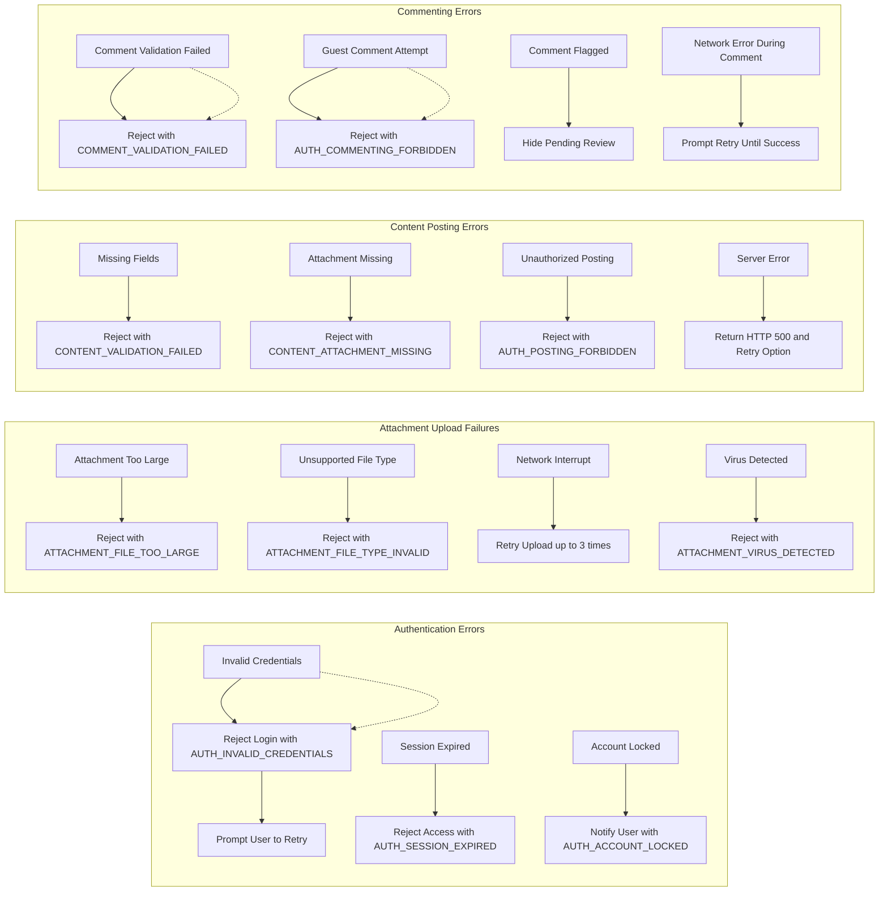

# Error Handling Requirements for econPolDiscussionBoard

## 1. Introduction
This document specifies error handling requirements to be implemented within the econPolDiscussionBoard system. It focuses on the user perspective and the system's response when errors occur during authentication, attachment uploads, content posting, and commenting.

## 2. Authentication Errors

### 2.1 User Login Failures
WHEN a user submits invalid login credentials, THE system SHALL respond with an HTTP 401 Unauthorized status and return a specific error code `AUTH_INVALID_CREDENTIALS` with a descriptive user-friendly message indicating the login failure.

### 2.2 Session Expiry
WHEN a user tries to access a protected resource with an expired session token, THE system SHALL respond with an HTTP 401 Unauthorized status and an error code `AUTH_SESSION_EXPIRED` prompting the user to log in again.

### 2.3 Account Locked
IF the system detects multiple failed login attempts exceeding the threshold (e.g., 5 attempts within 15 minutes), THEN THE system SHALL lock the user account temporarily and notify the user with error code `AUTH_ACCOUNT_LOCKED` explaining the lockout reason.

### 2.4 Password Reset Failures
WHEN a user requests a password reset with an invalid or expired token, THE system SHALL respond with HTTP 400 Bad Request and error code `AUTH_RESET_TOKEN_INVALID` with appropriate instructions to retry the reset process.

## 3. Attachment Upload Failures

### 3.1 File Size Limits
WHEN a user attempts to upload an attachment exceeding the size limit (e.g., 10MB), THE system SHALL reject the upload with HTTP 413 Payload Too Large and error code `ATTACHMENT_FILE_TOO_LARGE` clearly indicating the size violation.

### 3.2 Invalid File Type
WHEN a user uploads an unsupported file type, THE system SHALL reject the upload with HTTP 415 Unsupported Media Type and error code `ATTACHMENT_FILE_TYPE_INVALID` informing the user of allowed file types.

### 3.3 Network Interruptions
IF the attachment upload is interrupted due to network failure, THEN THE system SHALL allow automatic retry up to 3 times before reporting failure with error code `ATTACHMENT_UPLOAD_FAILED_NETWORK`.

### 3.4 Virus Scan Failure
WHEN the uploaded file fails virus scanning, THE system SHALL reject the file and return error code `ATTACHMENT_VIRUS_DETECTED` with notification to the user for security.

## 4. Content Posting Errors

### 4.1 Validation Failures
WHEN a user submits an article with missing required fields (e.g., title or body), THE system SHALL reject the post with HTTP 400 Bad Request and error code `CONTENT_VALIDATION_FAILED` explaining which fields are missing.

### 4.2 Attachment Linking Errors
IF an article references an attachment that was not successfully uploaded, THEN THE system SHALL reject the post and notify the user with error code `CONTENT_ATTACHMENT_MISSING` to ensure consistency.

### 4.3 Unauthorized Posting
WHEN a guest attempts to post an article, THE system SHALL deny the action with HTTP 403 Forbidden and error code `AUTH_POSTING_FORBIDDEN`.

### 4.4 Server Errors
IF the system encounters an internal error when saving a post, THEN THE system SHALL respond with HTTP 500 Internal Server Error and provide a retry option in the user interface.

## 5. Commenting Errors

### 5.1 Comment Validation
WHEN a user submits a comment exceeding 500 characters or containing prohibited content, THE system SHALL reject the comment with error code `COMMENT_VALIDATION_FAILED` and provide clear feedback to the user.

### 5.2 Comment Posting by Guests
WHEN a guest tries to submit a comment, THE system SHALL deny the request with HTTP 403 Forbidden and error code `AUTH_COMMENTING_FORBIDDEN`.

### 5.3 Comment Moderation
IF a comment is flagged during moderation, THEN THE system SHALL temporarily hide the comment pending review and notify the commenter.

### 5.4 Network or Server Issues During Comment Submission
IF a network or server error occurs while submitting a comment, THEN THE system SHALL prompt the user to retry submission with persistent feedback until successful.

## 6. Summary
This document provides explicit error handling requirements to ensure reliable, user-friendly responses and recovery paths in the econPolDiscussionBoard system. Implementing these scenarios will enhance system robustness and user trust.

---

---

This document contains only business requirements. Technical implementation details are at developer discretion.