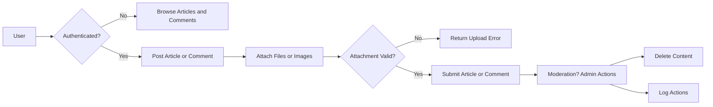

# Simple Economic/Political Discussion Board Requirements Analysis

## 1. Introduction
This document specifies the functional and non-functional requirements for a simple economic/political discussion board backend application. The system allows users to post articles on economic and political topics, attach images and files, and engage in discussion via comments. The design prioritizes simplicity and minimalism while ensuring essential functionality, security, and data integrity.

## 2. User Actors and Roles
- **Guest User**: Unauthenticated visitors who can browse articles and comments.
- **Registered User**: Authenticated users who can post articles, upload attachments, and comment.
- **Administrator**: Users with elevated permissions to moderate content and manage user actions.

## 3. Functional Requirements

### 3.1 Posting Articles
- WHEN a registered user creates an article, THE system SHALL accept article title, body content, and allow multiple image and file attachments.
- WHEN creating an article, THE system SHALL validate that the article title is not empty and does not exceed 150 characters.
- WHEN creating an article, THE system SHALL validate that the article body content is not empty and does not exceed 5000 characters.
- WHEN attachments are uploaded, THE system SHALL validate file types against allowed formats and limit size to 10 MB each.
- WHEN multiple attachments are included, THE system SHALL ensure atomicity so that either all attachments succeed or the submission fails.

### 3.2 File and Image Attachments
- THE system SHALL support image formats PNG, JPG, and GIF.
- THE system SHALL support common document files including PDF, DOCX, and TXT.
- THE system SHALL limit maximum size of each attachment to 10 MB.
- WHEN a user uploads an unsupported file type or oversize attachment, THE system SHALL reject the upload with an appropriate error message.

### 3.3 Comments
- WHEN a registered user posts a comment on an article, THE system SHALL accept plain text content only.
- THE system SHALL validate that comment text is not empty and does not exceed 1000 characters.
- WHEN a comment is submitted, THE system SHALL associate it with the target article and the posting user.

### 3.4 User Accounts and Authentication
- THE system SHALL allow users to register using a valid email address and a password.
- THE system SHALL verify emails for proper format but need not implement email confirmation.
- THE system SHALL require users to log in before posting articles or comments.
- THE system SHALL support session management with automatic timeout after 30 minutes of inactivity.

### 3.5 Permissions and Roles
- ONLY registered users SHALL be allowed to create articles and comments.
- ONLY administrators SHALL be allowed to delete or edit any article or comment.
- Registered users SHALL be able to edit or delete their own articles and comments.
- WHEN a user attempts unauthorized actions, THE system SHALL deny access and return appropriate error responses.

### 3.6 Content Moderation
- ADMINISTRATORS SHALL be able to delete articles and comments that violate guidelines.
- The system SHALL provide audit logs for all deletion actions including the acting administrator, timestamp, and reason.

## 4. Error Handling
- All error handling SHALL follow the specifications provided in the loaded "06-error-handling.md" document.

## 5. Non-functional Requirements
- THE system SHALL respond to user requests within 2 seconds under normal load.
- THE system SHALL support concurrent users posting articles and comments without data loss.
- THE system SHALL ensure the security of user data, following data privacy best practices.

## 6. Glossary
- **Article**: A post created by a registered user including text content and optional attachments.
- **Attachment**: An image or file uploaded and linked to an article.
- **Comment**: A text-only response linked to a specific article.
- **Administrator**: A privileged user with moderation capabilities.

## 7. Appendix

