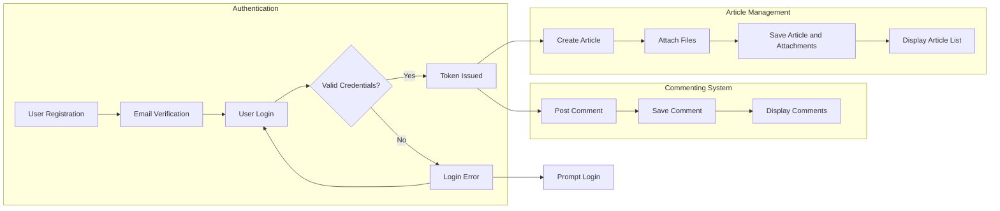

# econPolDiscussionBoard Functional and Business Requirements

## 1. Introduction
The econPolDiscussionBoard is a simple, minimalistic discussion board focused on economic and political topics. It supports posting articles with images and file attachments and enables user interaction through comments. The platform differentiates user roles as Guests, Members, and Admins with distinct permissions to ensure secure and organized access.

## 2. Business Model
### 2.1 Purpose
The platform addresses a need for a straightforward discussion board dedicated to economic and political discourse without excessive complexity or unnecessary features.

### 2.2 Core Value
It enables users to express ideas clearly with plain-text articles enriched by images and file attachments facilitating effective communication and engagement.

### 2.3 Success Criteria
- High engagement of members in posting and commenting.
- Reliable attachment uploads with clear size and format limits.
- Responsive system performance meeting defined time thresholds.

## 3. User Actors and Permissions
### 3.1 Actors Overview
- **Guest:** Unauthenticated users who can browse articles and view attachments.
- **Member:** Authenticated users authorized to post articles, upload attachments, and comment.
- **Admin:** Administrators who manage users, moderate content, and maintain system operations.

### 3.2 Permission Matrix
| Action                    | Guest | Member | Admin |
|---------------------------|-------|--------|-------|
| Browse articles           | ✅    | ✅     | ✅    |
| View attachments          | ✅    | ✅     | ✅    |
| Create articles           | ❌    | ✅     | ✅    |
| Upload attachments        | ❌    | ✅     | ✅    |
| Comment on articles       | ❌    | ✅     | ✅    |
| Edit own content          | ❌    | ✅     | ✅    |
| Moderate content          | ❌    | ❌     | ✅    |
| Manage users              | ❌    | ❌     | ✅    |

## 4. Functional Requirements
### 4.1 Article Management
- WHEN a member creates an article, THE system SHALL save it with author association and timestamp.
- THE article content SHALL be plain text without formatting.
- THE system SHALL order articles newest first on lists.
- THE system SHALL paginate article lists with 20 items per page.
- WHEN a member edits their article within 24 hours, THE system SHALL allow modifications.
- THE system SHALL prevent members from editing or deleting articles they do not own.

### 4.2 Attachment Support
- WHEN attachments are added, THE system SHALL permit up to 5 files per article.
- THE system SHALL accept image files (JPEG, PNG, GIF) and common documents (PDF, DOCX).
- THE system SHALL reject unsupported file types with clear error messages.
- THE maximum file size shall be 10 MB per attachment.
- THE system SHALL store attachments securely and link them to articles.
- IMAGE attachments SHALL display inline; other files SHALL be downloadable.

### 4.3 Commenting System
- WHEN a member posts a comment, THE system SHALL record it with author and timestamp.
- COMMENTS SHALL be plain text and limited to 500 characters.
- MEMBERS may edit or delete own comments within 15 minutes.
- COMMENTS SHALL display in chronological order under respective articles.
- THE system SHALL support nested replies up to 2 levels depth.

## 5. Business Rules
- GUEST users SHALL have read-only access.
- MEMBERS SHALL manage only own articles and comments.
- ADMINS SHALL have system-wide moderation privileges.
- Articles and comments SHALL be free of prohibited content; flagged items shall be reviewed by admins.
- Posting empty articles or comments SHALL be disallowed.
- System SHALL sanitize all inputs to prevent injection attacks.

## 6. Authentication and Authorization
- USERS SHALL register with email and password.
- THE system SHALL use token-based authentication with access tokens valid for 30 minutes and refresh tokens valid for 14 days.
- USERS SHALL log out to invalidate sessions.
- ROLE-based access controls SHALL enforce all permissions specified.

## 7. Error Handling
- INVALID login SHALL respond with clear error codes.
- ATTACHMENT upload errors SHALL specify size or type violations.
- POST submissions with empty content SHALL be rejected with immediate feedback.
- SYSTEM errors SHALL notify users gracefully and log issues for admins.

## 8. Performance Requirements
- ARTICLE listings SHALL load within 2 seconds.
- ARTICLE content and comments SHALL load within 3 seconds.
- SYSTEM SHALL handle 1000 concurrent users with smooth performance.
- UPLOADs SHALL process within 5 seconds per attachment.

## 9. Security and Compliance
- USER credentials SHALL be stored securely using encryption.
- ACCESS control SHALL verify roles before data modification.
- ADMIN actions SHALL be logged with timestamps.

## 10. Business Process Workflows
### 10.1 Registration and Login
- New USERS SHALL register and verify via email.
- AUTHENTICATED users shall obtain access tokens.
- LOGOUT SHALL invalidate tokens immediately.

### 10.2 Article Creation and Management
- MEMBERS SHALL create and submit articles with attachments.
- EDITS allowed within 24 hours only by article owners.
- ADMINS may override edits and deletes.

### 10.3 Attachment Management
- ATTACHMENTS SHALL be validated for type and size at upload.
- IMAGES display inline; files downloadable.

### 10.4 Commenting
- MEMBERS SHALL post comments under articles.
- COMMENTS display immediately and support nesting.
- EDIT or delete own comments within 15 minutes.

## 11. Secondary and Exceptional Scenarios
- GUEST posting attempts SHALL be denied.
- UPLOADS exceeding attachment limits or size SHALL be rejected.
- ADMIN SHALL moderate flagged inappropriate content.
- NETWORK errors during uploads SHALL allow retries.

## 12. Success Metrics
- ACTIVE users and article/comment volumes.
- SYSTEM responsiveness and uptime.
- ATTACHMENT upload success rate.
- MODERATION logs and actions.

## 13. Mermaid Diagram of System Workflow

This report specifies precise business requirements for backend developers to implement the econPolDiscussionBoard system focusing on minimalism, security, and clear user workflows without prescribing technical implementation details.