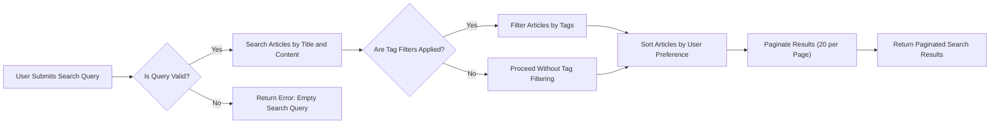
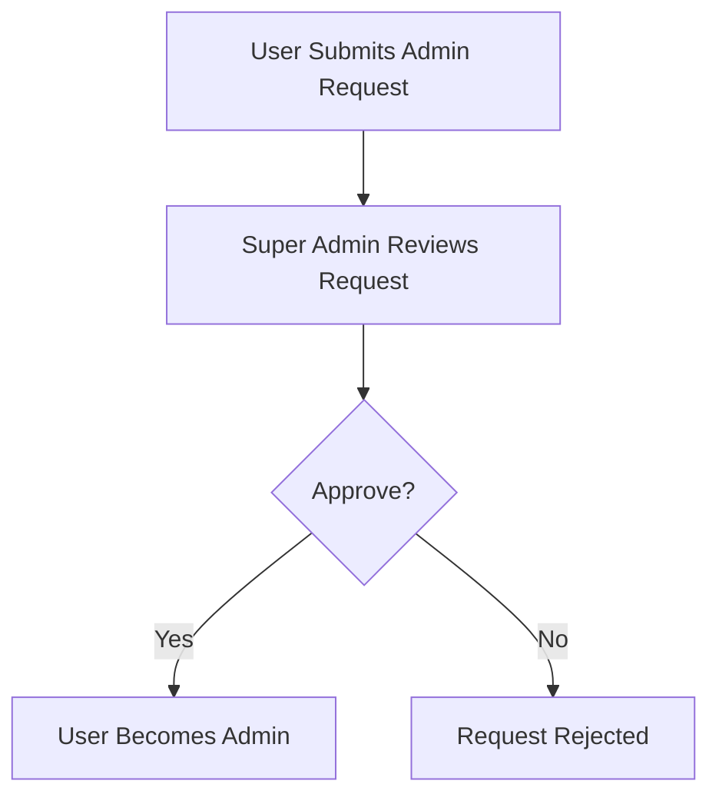
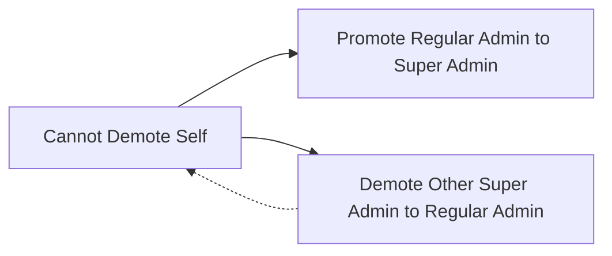
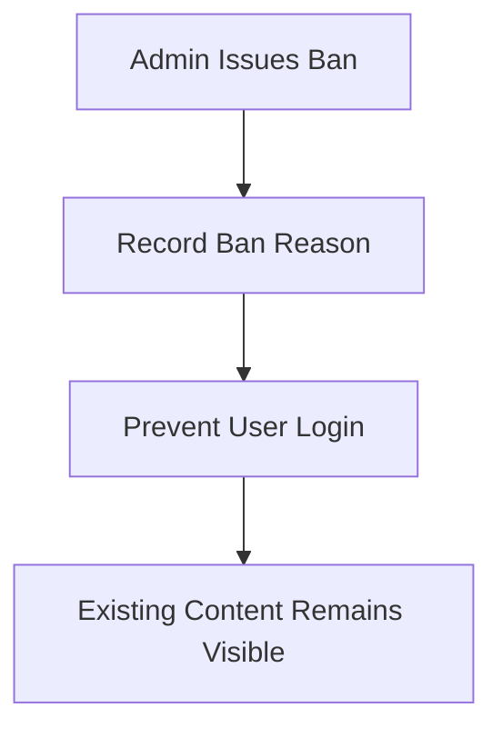

# Economic and Political Discussion Board Requirements

## 1. User Account Management

### 1.1 User Registration
WHEN a user submits a valid email and password, THE system SHALL create a user account.
	- The email SHALL be unique in the system.
	- The password SHALL meet minimum security criteria: at least 8 characters, including letters and numbers.

### 1.2 User Login
WHEN a user enters a valid email and password,
THE system SHALL authenticate the user and create a session.
	- The system SHALL deny login if the user is banned.
	- The session SHALL have a defined timeout period after inactivity.

### 1.3 Password Change
WHEN a logged-in user requests password change,
THE system SHALL verify the current password.
WHEN current password is correct, THE system SHALL update to a new password.
	- The new password SHALL meet the same security criteria as registration.

### 1.4 Account Deletion
WHEN a user requests account deletion, THE system SHALL delete the user account,
INCLUDING all articles and comments authored by the user.
	- Deleted data SHALL not be recoverable by standard means.

## 2. User Profile Management

### 2.1 Profile Attributes
Each user SHALL have a profile containing:
- Display name (editable)
- Bio text (editable)

### 2.2 Editing Profile
WHEN a user requests to edit their profile,
THE system SHALL update the display name and bio accordingly.

### 2.3 View Profiles
WHEN a user views another user's profile,
THE system SHALL display:
- Display name
- Bio text
- List of all articles authored by the user
- List of all comments authored by the user

## 3. Sections Management

### 3.1 Section Attributes
Each section SHALL have a name and description.

### 3.2 Section Management
Only administrators SHALL create, edit, or delete sections.

### 3.3 Section Browsing
Users SHALL be able to view the list of all sections.
Users SHALL be able to browse articles within any specific section.

## 4. Article Management

### 4.1 Article Creation
WHEN a logged-in user creates an article,
THE system SHALL require title, content, and section selection.
- Title and content are required fields.
- The section SHALL be selected from existing sections.

Multiple files and images MAY be attached to an article.

### 4.2 Article Editing
Users SHALL be able to edit their own articles,
INCLUDING title, content, attachments, and tags.

### 4.3 Article Deletion
Users SHALL be able to delete their own articles.

### 4.4 Tags
Users MAY add multiple free-text tags to articles.

### 4.5 Attachments
Files and images MAY be attached in multiple numbers per article.

## 5. Article List Viewing

### 5.1 Pagination
Article lists SHALL be paginated.

### 5.2 Metadata Display
Each article list entry SHALL show title, author display name, tags, comment count, and time posted.

### 5.3 Sorting
Users SHALL be able to sort articles by newest first and oldest first.

## 6. Article Viewing

### 6.1 Article Details
Users SHALL be able to view the full article content,
inclusive of title, author, content, tags, attachments, and posted time.

### 6.2 Download Attachments
Users SHALL be able to download attached files and images from articles.

## 7. Article Search Functionality

WHEN a user submits a search query,
THE system SHALL search article titles and content by the keywords provided.

WHEN filtering by tags, THE system SHALL limit results to articles matching any specified tags (case-insensitive).

Search results SHALL be paginated with 20 articles per page.

Results SHALL be sortable by newest first or oldest first, defaulting to newest first.

Search results list SHALL show article metadata but not full content or attachments.

### 7.1 Search Error Handling
IF a search query is empty, THE system SHALL return an error indicating that search query must be provided.

IF a tag filter is invalid (empty string), THE system SHALL return an error indicating invalid tag filter.

## 8. Comment Management

### 8.1 Comment Creation
Users SHALL be able to write comments on articles.

### 8.2 Comment Viewing
Users SHALL be able to view all comments on an article, sorted oldest first.

### 8.3 Comment Editing and Deletion
Users SHALL be able to edit and delete their own comments.

### 8.4 Single-level Comments
Comments SHALL be single-level only; nested replies are not supported.

## 9. Administrator System

### 9.1 Request to Become Administrator
Users MAY submit requests to become administrators with a textual reason.

### 9.2 Pending Requests
Super administrators SHALL view the list of pending requests.

### 9.3 Approve or Reject Requests
Super administrators SHALL approve or reject admin requests.

### 9.4 Administrator Promotion and Demotion
Super administrators SHALL promote regular administrators to super administrators.
Super administrators SHALL demote other super administrators to regular administrators, but SHALL NOT demote themselves.

### 9.5 Administrator Capabilities
Administrators SHALL have all regular user capabilities.
Administrators SHALL create, edit, and delete sections.
Administrators SHALL delete any article or comment.
Administrators SHALL ban and unban users.
Administrators SHALL view the list of banned users with ban reasons.

## 10. User Banning

### 10.1 Ban Enforcement
Banned users SHALL be prevented from logging in.
Existing articles and comments of banned users SHALL remain visible.

### 10.2 Ban Reasons
When a user is banned, a ban reason SHALL be recorded and viewable by administrators.

## 11. Business Rules

### 11.1 Content Ownership
Users SHALL have exclusive modification rights on their own articles and comments.
Administrators MAY override deletions of any content.

### 11.2 Section Validation
Sections referenced by articles SHALL exist.

### 11.3 Attachment Validation
Attachments SHALL be scanned for allowed file types and sizes.

### 11.4 Input Validation
All user inputs such as article titles, content, tags, and comments SHALL be validated for length and forbidden characters.

## 12. Authentication and Authorization

### 12.1 Authentication Flow
User authentication SHALL be accomplished with email and password.
Sessions SHALL be created upon successful login.

### 12.2 Session Management
Sessions SHALL expire after a configurable timeout of inactivity.
Sessions SHALL be invalidated upon logout.

### 12.3 Access Control
All endpoints SHALL verify user authentication and authorization based on role.

## 13. Error Handling and Performance

### 13.1 Error Messages
System SHALL provide clear and consistent error messages for validation failures and internal errors.

### 13.2 Performance
Search and article list queries SHALL respond within 3 seconds under typical load.

## 14. Mermaid Diagrams

### 14.1 Search Workflow

### 14.2 Administrator Request Management Workflow

### 14.3 Administrator Promotion/Demotion Rules

### 14.4 User Ban Workflow

## 15. Glossary

- Remarks about terms like Article, Section, Tag, Comment, Administrator, etc.

## 16. References

- Related documents: Article List, Search, Comments, Administrator System
