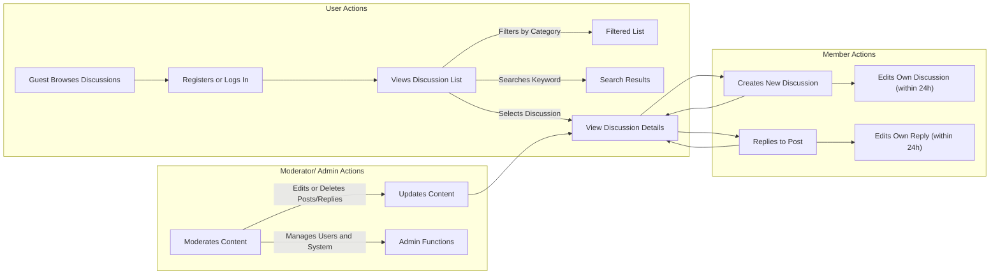

# Functional Requirements Analysis for Economic and Political Discussion Board

## 1. Introduction
This document details the functional requirements of a simple web-based discussion board platform focused on economic and political topics. The system supports user-generated discussion topics and threaded replies with basic moderation capabilities. This document is intended for backend developers and outlines all necessary business rules, user roles, workflows, and constraints.

## 2. User Roles and Permissions

### 2.1 User Roles
- **Guest**: Unauthenticated users who can browse discussion topics and view posts but cannot create or reply to content.
- **Member**: Authenticated users who can create new discussion topics, reply to existing posts, and manage their own profiles.
- **Moderator**: Users with elevated privileges to manage posts and replies, including editing and deleting content deemed inappropriate.
- **Admin**: System administrators with full privileges including user management, system configuration, and moderation oversight.

### 2.2 Permissions Summary Table
| Action                     | Guest | Member | Moderator | Admin |
|----------------------------|:-----:|:------:|:---------:|:-----:|
| Browse and view discussions |  ✅   |   ✅    |    ✅     |  ✅   |
| Create new discussion topics|  ❌   |   ✅    |    ✅     |  ✅   |
| Reply to posts              |  ❌   |   ✅    |    ✅     |  ✅   |
| Edit own posts/replies      |  ❌   |   ✅    |    ✅     |  ✅   |
| Edit others' posts/replies  |  ❌   |   ❌    |    ✅     |  ✅   |
| Delete posts/replies        |  ❌   |   ❌    |    ✅     |  ✅   |
| User management             |  ❌   |   ❌    |    ❌     |  ✅   |
| System config management    |  ❌   |   ❌    |    ❌     |  ✅   |

## 3. Posting Discussions

### 3.1 Creating a New Discussion Topic
- WHEN a member submits a new discussion topic, THE system SHALL validate the content and store it under either the "Economic" or "Political" category.
- THE discussion topic SHALL have a title and a body of text content.
- THE title SHALL be between 5 and 100 characters.
- THE body content SHALL not exceed 5000 characters.
- IF the content includes profanity, THEN THE system SHALL reject the submission and return an appropriate error message.
- THE system SHALL categorize the topic as either "Economic" or "Political" based on user selection.
- WHEN a new discussion topic is successfully created, THE system SHALL make it visible to all users immediately.

### 3.2 Editing and Deleting Topics
- WHEN a member edits their own discussion topic, THE system SHALL allow edits within 24 hours of original posting.
- WHEN a moderator or admin edits any discussion topic, THE system SHALL update the content immediately.
- WHEN a moderator or admin deletes a discussion topic, THE system SHALL remove it and all associated replies from view.

## 4. Replying to Posts

### 4.1 Creating Replies
- WHEN a member adds a reply to a discussion topic, THE system SHALL validate the reply content.
- THE reply content SHALL not exceed 1000 characters.
- IF the reply contains profanity, THEN THE system SHALL reject it and return an error.
- THE system SHALL associate the reply to the correct discussion topic.
- THE system SHALL make the reply visible immediately after acceptance.

### 4.2 Editing and Deleting Replies
- WHEN a member edits their own reply, THE system SHALL allow edits within 24 hours.
- WHEN a moderator or admin edits or deletes any reply, THE system SHALL update or remove it respectively.

## 5. User Registration and Login

### 5.1 Registration
- WHEN a guest submits registration details, THE system SHALL validate the email format and password strength.
- THE password SHALL be at least 8 characters, including letters and numbers.
- THE system SHALL verify email uniqueness.
- WHEN registration is successful, THE system SHALL create a member account.

### 5.2 Login and Session Management
- WHEN a member submits login credentials, THE system SHALL authenticate the user.
- IF credentials are invalid, THEN THE system SHALL return an authentication failure message.
- THE system SHALL maintain user sessions securely for continuous authentication.

### 5.3 Profile Management
- THE system SHALL allow members to update basic profile information such as display name.

## 6. Browsing and Searching Discussions

### 6.1 Browsing
- THE system SHALL provide a paginated list of discussion topics ordered by latest activity (newest posts and replies first).
- EACH page SHALL display up to 20 discussion topics.
- THE system SHALL allow filtering discussion topics by category (Economic or Political).

### 6.2 Searching
- WHEN a user performs a search query by keywords, THE system SHALL return matching discussion topics.
- THE search SHALL be case-insensitive and support partial matches within titles and bodies.
- THE search response SHALL be paginated with the same page size of 20.

## 7. Business Rules and Constraints

### 7.1 Content Limits
- Discussion titles: minimum 5 characters, maximum 100 characters.
- Discussion bodies: maximum 5000 characters.
- Reply bodies: maximum 1000 characters.

### 7.2 Profanity Filtering
- THE system SHALL apply a simple profanity filter to posts and replies.
- IF profanity is detected, THE system SHALL reject the content and notify the user.

### 7.3 Moderation
- Moderators SHALL be able to edit or delete any content immediately.
- Members can only edit their own content and only within 24 hours of posting.

## 8. Use Case Diagrams and Workflows

## Summary
This document strictly defines the functional requirements of the discussion board, focusing on user roles, posting and replying functionality, user authentication, browsing and searching capabilities, and core business constraints like content length limits and profanity filtering. The workflows and roles described provide a clear foundation for backend implementation of a simple, effective economic and political discussion platform.

> This document provides business requirements only. All technical implementation decisions belong to developers. Developers have full autonomy over architecture, APIs, and database design. This document describes WHAT the system should do, not HOW to build it.