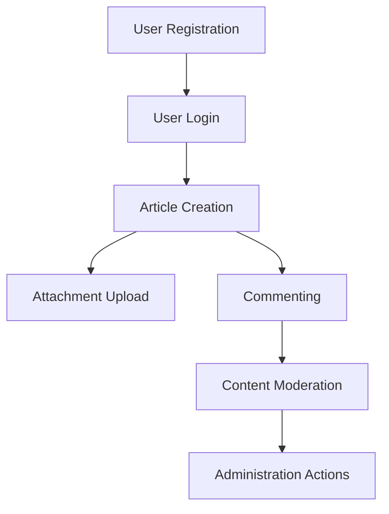

# Simple Economic and Political Discussion Board Requirements Analysis

## 1. Introduction

### 1.1 Purpose
The purpose of this system is to provide a straightforward and user-friendly online discussion board dedicated to economic and political topics. Users can create articles, attach images and files, and participate in discussions through comments. The goal is to facilitate open communication while maintaining a minimal, easy-to-use interface without unnecessary complexity.

### 1.2 Scope
This system will support registered users who can post articles and comments, upload multiple attachments, and browse existing content. It does not aim to include advanced social networking features such as likes, shares, or complex moderation workflows.

### 1.3 Target Users
- General public interested in economics and politics
- Academics and professionals sharing insights
- Community members seeking discussion and news exchange

## 2. Functional Requirements

### 2.1 User Management
- WHEN a new user registers, THE system SHALL create an account with a unique username and password.
- WHEN a user logs in, THE system SHALL authenticate credentials and establish a user session.
- THE system SHALL allow users to reset passwords securely.
- THE system SHALL support user logout and session expiration mechanisms.

### 2.2 Roles and Permissions
- THE system SHALL define two main roles: Member and Administrator.
- Members SHALL be able to create articles, upload attachments, and comment.
- Administrators SHALL have the ability to moderate content including editing or deleting any article or comment.
- THE system SHALL restrict article creation and commenting to authenticated users only.

### 2.3 Article Management
- WHEN a member creates an article, THE system SHALL allow attaching multiple images and files.
- THE system SHALL support article metadata including title, content body, creation timestamp, and author.
- WHEN an article is created, THE system SHALL automatically assign it a unique identifier.
- THE system SHALL allow members to edit or delete their own articles.
- Administrators SHALL have rights to edit or delete any article.

### 2.4 Attachment Handling
- THE system SHALL support uploading multiple attachments per article, including images (JPEG, PNG, GIF) and files (PDF, DOCX, TXT).
- WHEN attachments are uploaded, THE system SHALL validate file types and sizes, rejecting unsupported formats or files exceeding 10 MB.
- THE system SHALL securely store attachments associating them with the respective articles.

### 2.5 Comment Management
- WHEN a member posts a comment on an article, THE system SHALL save the comment with author information and timestamp.
- THE system SHALL allow comments to be edited or deleted by their authors.
- Administrators SHALL have rights to moderate comments.
- Comments SHALL be plain text without attachments.

### 2.6 Content Moderation
- Administrators SHALL be able to flag inappropriate content.
- THE system SHALL allow administrators to remove flagged articles or comments.
- THE system SHALL log moderation actions for accountability.

## 3. Non-Functional Requirements

### 3.1 Performance
- WHEN a member submits an article with attachments, THE system SHALL save and confirm publication within 3 seconds.
- WHEN users browse or search articles, THE system SHALL return paginated results within 2 seconds.
- THE system SHALL handle at least 100 concurrent active users without performance degradation.

### 3.2 Security
- THE system SHALL enforce secure password storage and transmission.
- ALL user input SHALL be validated to prevent injection attacks.
- THE system SHALL provide role-based access control enforcing permissions.

### 3.3 Error Handling
- WHEN an invalid operation occurs (e.g., unsupported file upload), THE system SHALL notify the user with a descriptive error message.
- Critical errors SHALL be logged with timestamps for troubleshooting.

## 4. Business Process Workflows

### 4.1 User Registration and Authentication
1. A prospective user accesses the registration page.
2. The user provides a unique username and password.
3. The system validates the input and creates a user account.
4. The user logs in with credentials, receiving a session token.

### 4.2 Article Creation
1. A logged-in member navigates to the article creation page.
2. The user inputs title and content.
3. The user uploads attachments.
4. Upon submission, the system validates content and attachments.
5. The article and attachments are saved, and the user receives confirmation.

### 4.3 Commenting
1. A logged-in member views an article.
2. The member enters a comment in plain text.
3. The system saves the comment associated with the article.
4. The comment appears immediately on the article page.

### 4.4 Attachment Upload
1. Attachments are submitted via file upload controls.
2. The system validates file type and size.
3. Valid files are stored securely with association to the article.
4. Invalid files are rejected with descriptive messages.

## 5. Glossary and Definitions

- Member: Registered user with privileges to post articles and comments.
- Administrator: User with elevated privileges for content moderation and management.
- Article: A discussion post comprising textual content and optional attachments.
- Attachment: Image or file uploaded to accompany an article.
- Comment: User feedback or discussion related to an article, text only.

## Mermaid Diagram: High-Level Process Flow

```mermaid
graph TD
  A["User Registration"] --> B["User Login"]
  B --> C["Article Creation"]
  C --> D["Attachment Upload"]
  C --> E["Commenting"]
  E --> F["Content Moderation"]
  F --> G["Administration Actions"]
```

This completes the requirements analysis for the simple economic and political discussion board supporting image and file attachments for articles.