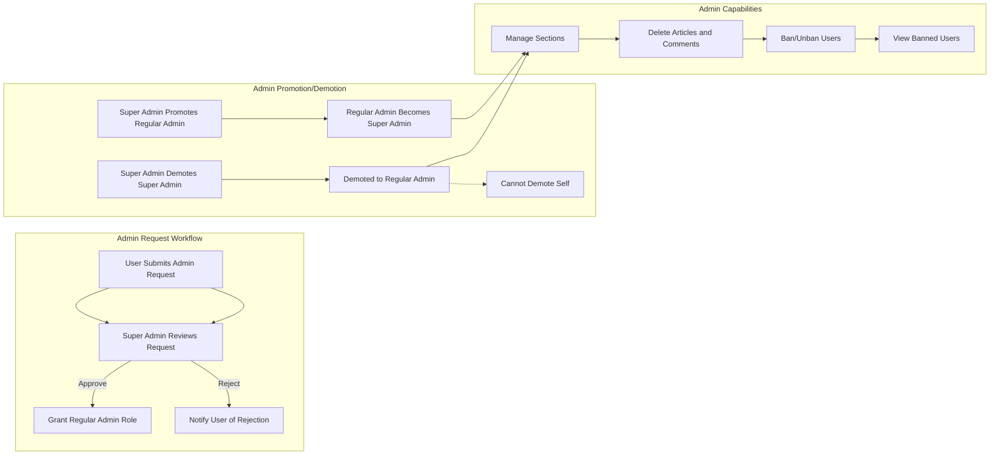

# Economic/Political Discussion Board Requirements Specification

## User Account Management

### User Registration
- When a user provides a valid email and password, the system SHALL create a new user account.
- The email SHALL be unique within the system.
- When registration is successful, the user SHALL be able to log in immediately.

### User Authentication
- When a user submits email and password, THE system SHALL authenticate and allow login if credentials are correct.
- When authentication fails, THE system SHALL provide a clear error message.

### Password Management
- When a logged-in user requests a password change, THE system SHALL validate the current password and update it with the new password.
- When a password change is successful, THE system SHALL notify the user.

### Account Deletion
- When a user requests account deletion, THE system SHALL delete the user's account along with all their articles and comments.

## User Profile Management

### Profile Attributes
- Each user SHALL have a profile containing a display name and a bio text.

### Profile Editing
- When a user edits their profile, THE system SHALL allow modifying the display name and bio.

### Viewing Profiles
- When viewing another user's profile, THE system SHALL display that user's display name, bio, all articles written by the user, and all comments written by the user.

## Section Management and Browsing

### Sections
- The board SHALL be divided into multiple sections such as Politics, Economy, and Current Affairs.
- Each section SHALL have a name and a description.

### Administrator Management
- Only administrators SHALL be able to create, edit, and delete sections.
- All users SHALL be able to view the list of sections.
- Users SHALL be able to browse articles within a given section.

## Article Management

### Article Attributes
- Every article SHALL have a title and content (both required).
- Every article SHALL belong to exactly one section.
- Users SHALL be able to attach multiple files and images to an article.
- Users SHALL be able to add multiple free-text tags to articles.

### Article Operations
- Users SHALL be able to create new articles in any section.
- Users SHALL be able to edit their own articles including title, content, attachments, and tags.
- Users SHALL be able to delete their own articles.

## Article List

### Listing and Metadata
- When viewing a section's article list, the system SHALL display paginated lists.
- Each article in the list SHALL show the title, author, tags, comment count, and time posted.
- The full content SHALL NOT be displayed in the list.

### Sorting
- Users SHALL be able to sort articles by newest first or oldest first.

## Article Viewing

### Full Article Display
- When viewing an article, the system SHALL display the full content including title, author, content, attachments, tags, and time posted.
- Users SHALL be able to download any attachments.

## Article Searching

### Search Capabilities
- Users SHALL be able to search articles by title and content.
- Search results SHALL be paginated.
- Users SHALL be able to filter search results by tags.

## Comment Management

### Comment Attributes
- Comments SHALL be single-level only (no nested replies).
- Each comment SHALL show author, content, and time posted.

### Comment Operations
- Users SHALL be able to write comments on articles.
- Users SHALL be able to edit and delete their own comments.
- Comments SHALL be sorted by oldest first.

## Administrator System

### Administrator Roles
- There SHALL be two administrator grades: regular administrator and super administrator.
- Regular administrators SHALL have permissions to manage sections, delete any articles or comments, and manage user bans.
- Super administrators SHALL have all regular administrator permissions plus the ability to approve or reject administrator requests, promote regular administrators to super administrators, and demote other super administrators to regular administrators.
- Super administrators SHALL NOT be able to demote themselves.

### Administrator Request Workflow
- Any user SHALL be able to submit a request to become an administrator with a reason.
- Super administrators SHALL be able to view a list of pending administrator requests.
- Super administrators SHALL be able to approve or reject these requests.
- When a request is approved, THE system SHALL grant regular administrator privileges to the user.

### Administrator Promotion and Demotion
- WHEN a super administrator promotes a regular administrator, THE system SHALL upgrade the user to super administrator.
- WHEN a super administrator demotes another super administrator, THE system SHALL downgrade them to regular administrator.
- THE system SHALL prevent a super administrator from demoting themselves.

### Administrator Capabilities
- Administrators SHALL be able to create, edit, and delete sections.
- Administrators SHALL be able to delete any article or comment.
- Administrators SHALL be able to ban and unban users.
- Administrators SHALL be able to view the list of banned users.
- Administrators SHALL have all the permissions regular users have.

## Banning

### Ban Restrictions
- Banned users SHALL NOT be able to log in.
- Existing articles and comments of banned users SHALL remain visible.
- When a user is banned, THE system SHALL record the ban reason.
- Administrators SHALL be able to view ban reasons.

---

## Mermaid Diagram: Administrator Roles and Workflows

