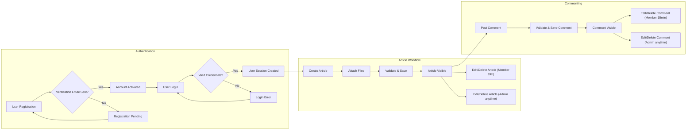

# Business Process Workflows for econPolDiscussionBoard

This document provides a detailed description of the core business process workflows for the Economic and Political Discussion Board service (econPolDiscussionBoard) to support backend implementation. It defines user interactions, business rules, permissions, error handling scenarios, and performance expectations in natural language.

This document focuses exclusively on the business-side requirements describing WHAT the system must achieve and HOW users interact with it. All technical implementation details such as database and API design are outside its scope.

---

## 1. User Registration and Login

### 1.1 User Actors
- **Guest**: Unauthenticated users who can browse articles and view attachments.
- **Member**: Registered and authenticated users who can post articles, upload attachments, and comment.
- **Admin**: Administrators with elevated permissions to manage users, moderate content, and maintain the system.

### 1.2 Registration Process
- WHEN a new user submits registration details, THE system SHALL validate user input including required fields (email, password) and respond with success or error within 2 seconds.
- WHEN registration is successful, THE system SHALL send a verification email to the user.
- WHEN a user clicks the verification link, THE system SHALL activate the member account.

### 1.3 Login Process
- WHEN a user provides login credentials, THE system SHALL authenticate and authorize the user.
- IF login credentials are invalid, THEN THE system SHALL respond with appropriate error status to prevent access.
- WHEN authentication succeeds, THE system SHALL create a secure session or token valid for 30 minutes.
- THE system SHALL allow users to log out explicitly, invalidating their session immediately.

---

## 2. Article Creation Workflow

### 2.1 Article Creation by Members
- WHEN a member accesses the article creation interface, THE system SHALL allow composing a new article with a title and body text.
- THE system SHALL allow members to attach images and files (see Attachment Upload Flow for details).
- WHEN the member submits the article, THE system SHALL validate the content for required fields.
- THE system SHALL save the article and mark it as visible.
- IF validation fails, THEN the system SHALL return descriptive error messages.

### 2.2 Article Visibility
- Articles created by members SHALL be publicly viewable by guests and members immediately upon successful creation.

### 2.3 Article Editing and Deletion
- Members SHALL be able to edit or delete their own articles within 24 hours of creation.
- Admins SHALL have the permission to edit or delete any article at any time.

---

## 3. Attachment Upload Flow

### 3.1 Attachment Types and Limits
- THE system SHALL support image file attachments of types JPG, PNG, GIF.
- THE system SHALL allow additional file types for attachments such as PDF, DOCX, XLSX, and TXT.
- THE system SHALL limit individual attachment size to a maximum of 10MB.
- THE system SHALL allow up to 5 attachments per article.

### 3.2 Upload Process
- WHEN a member uploads files during article creation or editing, THE system SHALL validate the file type and size immediately.
- IF an invalid file type or over-sized file is detected, THEN THE system SHALL reject the file and return an error message.
- THE system SHALL store uploaded files securely and associate them with the correct article in the database.

### 3.3 Attachment Display
- Image attachments SHALL be displayed inline within the article content.
- Other file types SHALL be presented as downloadable links.

---

## 4. Commenting Process

### 4.1 Commenting Permissions
- MEMBERS SHALL be able to post comments on any article.
- GUESTS SHALL NOT be able to post comments.
- ADMINS SHALL have the ability to delete or edit any comment.

### 4.2 Comment Creation
- WHEN a member submits a comment, THE system SHALL check the comment content is not empty and does not exceed 500 characters.
- THE system SHALL save valid comments and associate them with the target article and member.
- Comments SHALL be visible immediately upon posting.

### 4.3 Comment Editing and Deletion
- Members SHALL be able to edit or delete their own comments within 15 minutes of posting.
- Admins SHALL have rights to edit or delete any comment at any time.

---

## Mermaid Diagram: User Interaction Flow

---

## Summary
This document specifies the durable workflows that the backend implementation of econPolDiscussionBoard must satisfy to ensure correct business behavior and user experience. It empowers developers to realize all system behaviors in a consistent, testable manner following the natural language business requirements.

All technical implementation decisions such as API design, database schema, or frontend UI are delegated to the development team who will implement this business logic accordingly.

> This document provides business requirements only. All technical implementation decisions belong to developers. The document describes WHAT the system should do, not HOW to build it.