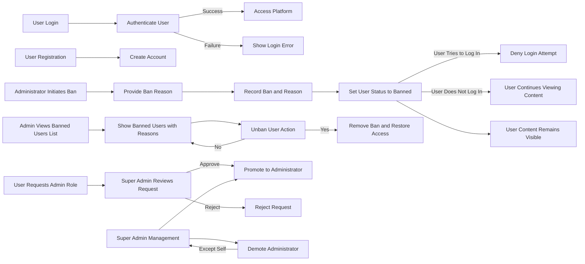

# Economic/Political Discussion Board

## 1. User Account

### 1.1 Registration
WHEN a guest user submits an email and password during registration, THE system SHALL create a new user account with a unique identifier, storing the email securely and hashing the password.

### 1.2 Login
WHEN a registered user submits valid email and password credentials, THE system SHALL authenticate the user and establish a user session.

### 1.3 Password Change
WHEN a logged-in user provides the current password and a new password, THE system SHALL verify the current password and update the user account with the new password.

### 1.4 Account Deletion
WHEN a logged-in user requests account deletion, THE system SHALL delete the user's account along with all articles and comments authored by the user.

## 2. User Profile

### 2.1 Profile View
WHEN any user views another user's profile, THE system SHALL display the user's display name and bio along with lists of all articles and comments authored by that user.

### 2.2 Profile Edit
WHEN a logged-in user requests to edit their profile, THE system SHALL allow updating their display name and bio.

## 3. Sections

### 3.1 Section Attributes
EVERY section SHALL have a name and description.

### 3.2 Section Management
ONLY administrators SHALL be able to create, edit, or delete sections.

### 3.3 Section Access
WHEN users request the list of sections, THE system SHALL provide all existing sections.

WHEN users browse articles by section, THE system SHALL list all articles within the specified section.

## 4. Articles

### 4.1 Article Creation
WHEN a logged-in user creates an article, THE system SHALL require title, content, and selection of a section.

Users SHALL be able to attach multiple files and images to an article.

Users MAY add multiple free-text tags to articles.

### 4.2 Article Management
Users SHALL be able to edit or delete their own articles.

Administrators SHALL be able to delete any article.

## 5. Article List

### 5.1 Pagination
WHEN users view articles in a section, THE system SHALL paginate the list.

### 5.2 Sorting
Users SHALL be able to sort articles by newest first or oldest first.

### 5.3 List View
Each article entry in the list SHALL show title, author, tags, comment count, and time posted.

## 6. Viewing an Article

WHEN users view a single article, THE system SHALL show title, author, content, attachments, tags, and time posted.

Users SHALL be able to download attached files and images.

## 7. Searching Articles

WHEN users search articles by title or content, THE system SHALL provide paginated results.

Users MAY filter the results by one or more tags.

## 8. Comments

### 8.1 Comment Creation
WHEN a logged-in user adds a comment to an article, THE system SHALL store the comment linked to the article and author.

### 8.2 Comment Display
Comments SHALL be single-level only and sorted by oldest first.

Each comment SHALL display author, content, and time posted.

### 8.3 Comment Management
Users SHALL be able to edit or delete their own comments.

Administrators SHALL be able to delete any comment.

## 9. Administrator System

### 9.1 Administrator Roles
Administrator roles are regular administrator and super administrator.

### 9.2 Becoming Administrator
Any user can submit a request with a reason to become an administrator.

Super administrators SHALL review pending requests and approve or reject them.

Upon approval, users become regular administrators.

### 9.3 Administrator Management
Super administrators SHALL be able to promote regular administrators to super administrators.

Super administrators SHALL be able to demote other super administrators to regular administrators, except themselves.

### 9.4 Administrator Permissions
Administrators SHALL have all user capabilities plus section management, content deletion, banning, and viewing ban lists.

## 10. Banning

### 10.1 Ban Policy
Administrators SHALL be able to ban users with a mandatory ban reason.

Banned users SHALL be prevented from logging in but their content remains visible.

Super administrators and administrators SHALL be able to view banned users with ban reasons and unban users.

## Diagrams

