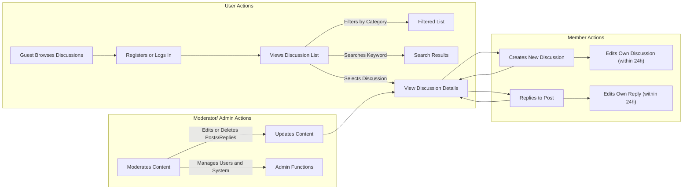

# Functional Requirements Analysis for Economic and Political Discussion Board

## 1. Introduction
This document details the functional business requirements for a simple economic and political discussion board backend service. It is intended for backend developers and product owners to provide clear specifications of all necessary workflows, user roles, validations, and business rules.

## 2. User Roles and Permissions
This system includes four primary user roles: Guest, Member, Moderator, and Administrator. Each role has explicit permissions for reading, creating, editing, and deleting discussion topics and posts, enforced by business rules and authentication policies.

## 3. Posting Discussions
### 3.1 Creating a New Discussion Topic
- WHEN a Member submits a new discussion topic, THE system SHALL validate the topic title and body content.
- THE title SHALL be between 5 and 100 characters.
- THE body SHALL be between 20 and 2000 characters.
- IF the content contains profanity, THEN THE system SHALL reject the topic and notify the user with a clear error message.
- THE topic SHALL belong to one of two categories: "Economic" or "Political". THE Member SHALL select the category at creation.
- WHEN the topic is successfully created, THE system SHALL make it immediately visible to all users.
### 3.2 Editing and Deleting Topics
- WHEN a Member edits their own topic within 24 hours of creation, THE system SHALL allow updates with the same validation rules.
- WHEN a Moderator or Administrator edits any topic, THE system SHALL allow immediate update without time restriction.
- WHEN a Moderator or Administrator deletes a topic, THE system SHALL remove it along with all associated replies immediately.

## 4. Replying to Posts
### 4.1 Creating Replies
- WHEN a Member submits a reply to a discussion topic, THE system SHALL validate the reply content.
- THE reply SHALL be between 5 and 1000 characters.
- IF the reply contains profanity, THEN THE system SHALL reject it with a clear error message.
- THE reply SHALL be linked to its parent discussion topic.
- THE system SHALL display the reply immediately upon acceptance.
### 4.2 Editing and Deleting Replies
- WHEN a Member edits their own reply within 24 hours, THE system SHALL allow updates subject to the same validations.
- WHEN a Moderator or Administrator edits or deletes any reply, THE system SHALL allow immediate action.

## 5. User Registration and Login
### 5.1 Registration
- WHEN a Guest submits registration details, THE system SHALL validate email format and password strength.
- THE password SHALL contain at least 8 characters including letters and numbers.
- THE system SHALL ensure the email address is unique.
- WHEN registration succeeds, THE system SHALL create a Member account with unverified status until email confirmation.
### 5.2 Login and Session Management
- WHEN a Member submits login credentials, THE system SHALL authenticate and create a session.
- IF authentication fails, THEN THE system SHALL return an appropriate error.
- THE system SHALL maintain user sessions securely and handle session expiration and refresh accordingly.

## 6. Browsing and Searching Discussions
- THE system SHALL provide a paginated list of discussion topics, 20 items per page.
- THE list SHALL be ordered by most recent activity.
- THE system SHALL support filtering discussion topics by category (Economic or Political).
- WHEN a search query is submitted, THE system SHALL return matching discussion topics based on titles and content.
- THE search SHALL be case-insensitive and support partial matches.

## 7. Business Rules and Constraints
- Discussion titles MUST have a minimum of 5 and a maximum of 100 characters.
- Topics’ body content MUST be between 20 and 2000 characters.
- Replies MUST be between 5 and 1000 characters.
- Acceptable content MUST not contain profane language as defined by the system profanity list.
- Moderators and Administrators have unrestricted editing and deletion privileges.
- Members’ editing is limited to their own content and within 24 hours.

## 8. Use Case Diagrams and Workflows

## 9. Summary
This document defines the core functional requirements for the economic and political discussion board backend. It specifies user roles, workflows, content validation rules, and browsing/search functionalities with clear business rules. All requirements are expressed in business language (EARS format) to support immediate backend implementation by developers.

> This document provides business requirements only. All technical implementation decisions belong to developers. Developers have full autonomy over architecture, APIs, and database design. This document describes WHAT the system should do, not HOW to build it.