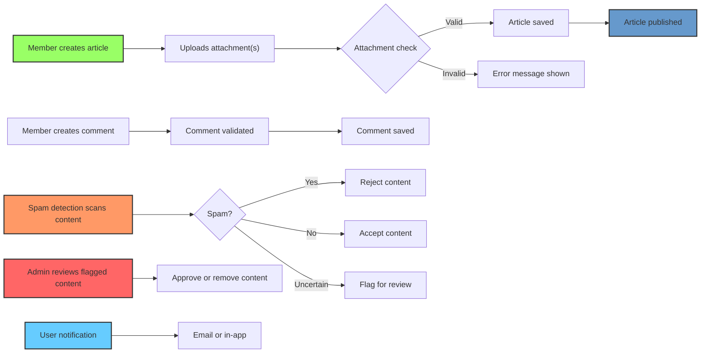

# Economic and Political Discussion Board

## 1. Introduction

The economic and political discussion board is a simple platform that allows registered users to post articles, attach images and files, comment on articles, and interact with other community members. The system is designed with simplicity and minimalism in mind, focusing only on essential features to provide a smooth user experience without unnecessary complexity.

## 2. User Roles and Permissions

There are three main user roles:

- **Guest**: Can browse published articles and comments but cannot create or modify content.
- **Member**: Can create articles, upload attachments, comment on articles, edit and delete their own posts and comments.
- **Administrator**: Has all member permissions plus the ability to moderate content, delete any article or comment, and manage user permissions.

| Role         | Create Article | Edit Own Article | Delete Own Article | Comment | Moderate Content |
|--------------|----------------|------------------|--------------------|---------|------------------|
| Guest        | No             | No               | No                 | No      | No               |
| Member       | Yes            | Yes              | Yes                | Yes     | No               |
| Administrator| Yes            | Yes              | Yes                | Yes     | Yes              |

## 3. Article Management

### 3.1 Creating Articles

WHEN a member wants to create an article, THE system SHALL allow the member to enter a title and body content.

THE article SHALL support attaching multiple images and files.

WHEN the member submits the article, THE system SHALL validate the inputs and ensure that attachments meet size and format requirements.

### 3.2 Editing Articles

WHEN a member wants to edit their own article, THE system SHALL allow editing of the title, body, and attachments.

THE system SHALL maintain the history of editing for audit and recovery purposes.

### 3.3 Deleting Articles

WHEN a member or administrator deletes an article, THE system SHALL remove the article and associated attachments from public view.

THE deleted content SHALL be retained in a soft-delete state for 30 days before permanent deletion.

## 4. Comments

WHEN a member views an article, THE system SHALL allow the member to comment on the article.

THE comments SHALL support plain text only without attachments.

WHEN a member submits a comment, THE system SHALL validate content for length and spam detection.

COMMENTS SHALL be editable and deletable by the original author.

ADMINISTRATORS SHALL be able to moderate comments for inappropriate content.

## 5. File Attachments

THE system SHALL support uploading multiple images and files per article.

Supported image formats include JPEG, PNG, and GIF.

Supported file types include PDF, DOCX, and XLSX.

WHEN a file is uploaded, THE system SHALL validate the file size does not exceed 10 MB.

IF a file exceeds this limit or is an unsupported format, THEN THE upload SHALL be rejected with a descriptive error message.

THE system SHALL scan uploaded files for viruses or malware before final acceptance.

## 6. Content Moderation

THE system SHALL employ a spam detection mechanism for articles and comments.

WHEN content is flagged as spam or inappropriate, THEN THE content SHALL be held for administrative review.

ADMINISTRATORS SHALL be notified of flagged content and have tools to approve, edit, or remove posts and comments.

## 7. Authentication and Security

THE system SHALL require users to register and log in before posting or commenting.

USER passwords SHALL be stored securely following industry best practices.

USER sessions SHALL use secure tokens ensuring confidentiality and integrity.

ACCESS to create, edit, delete, or moderate content SHALL be controlled based on user roles.

All external integrations, such as file storage and spam detection, SHALL communicate over encrypted channels.

## 8. Error Handling

THE system SHALL provide clear and actionable error messages for invalid inputs, failed uploads, authentication failures, and authorization violations.

WHEN an upload fails due to size, format, or virus issues, THE system SHALL inform the user immediately.

## 9. Notification and External Integrations

THE system SHALL integrate with external file storage services to store attachments securely.

Spam detection services SHALL be used to maintain content quality.

THE system SHALL notify users of content moderation actions via email or in-app notifications.

## 10. Performance Requirements

THE system SHALL respond to user actions within 2 seconds under normal load conditions.

Upload streams SHALL be efficient and resilient to network failures.

## 11. Glossary

- **Attachment**: Files or images uploaded and linked to articles.
- **Spam Detection**: External service used to filter unwanted or abusive content.
- **Soft Delete**: Marking content as deleted without permanent removal for a grace period.

---

```mermaid
graph LR
  A["Member creates article"] --> B["Uploads attachment(s)"]
  B --> C{"Attachment check"}
  C -->|"Valid"| D["Article saved"]
  C -->|"Invalid"| E["Error message shown"]
  D --> F["Article published"]

  G["Member creates comment"] --> H["Comment validated"]
  H --> I["Comment saved"]

  J["Spam detection scans content"] --> K{"Spam?"}
  K -->|"Yes"| L["Reject content"]
  K -->|"No"| M["Accept content"]
  K -->|"Uncertain"| N["Flag for review"]

  O["Admin reviews flagged content"] --> P["Approve or remove content"]

  Q["User notification"] --> R["Email or in-app"]

  style A fill:#9f6,stroke:#333,stroke-width:2px
  style F fill:#69c,stroke:#333,stroke-width:2px
  style J fill:#f96,stroke:#333,stroke-width:2px
  style O fill:#f66,stroke:#333,stroke-width:2px
  style Q fill:#6cf,stroke:#333,stroke-width:2px
```