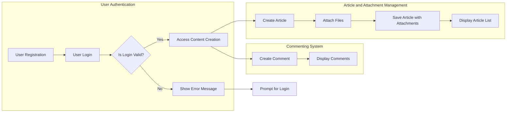

# Requirements Analysis Report for econPolDiscussionBoard

## 1. Introduction

The econPolDiscussionBoard is a focused discussion board platform for economic and political topics. It provides a simple, minimalistic interface for posting articles enriched with image and file attachments, enabling users to engage in informed discussions without unnecessary complexity.

## 2. Business Model

The platform exists to deliver a niche forum dedicated solely to economic and political discourse, encouraging quality content and clear communication. Its core value is in providing a straightforward user experience supporting rich content through attachments while maintaining role-based access control to protect system integrity.

## 3. User Actors

Three types of actors are defined:

- Guests: Unauthenticated users who can browse articles and view attachments but cannot post or comment.
- Members: Registered, authenticated users who can create articles, upload attachments, and comment.
- Admins: Privileged users responsible for content moderation, user management, and system maintenance.

## 4. Functional Requirements

### 4.1 Article Management

- Members SHALL be able to create articles with plain-text content.
- Articles SHALL support multiple attachments including images and files.
- Articles SHALL include metadata such as author, timestamps, and unique identifiers.
- Members SHALL be able to edit or delete their own articles within 24 hours of posting.
- Articles SHALL be listed ordered by newest first with pagination support.

### 4.2 Attachment Support

- The system SHALL accept image attachments: JPEG, PNG, GIF.
- The system SHALL accept document/file attachments: PDF, DOCX, XLSX, TXT.
- Attachment file size SHALL be limited to 10 MB per file.
- Members SHALL be able to attach up to 5 files per article.
- Images SHALL be displayed inline; other files shall be downloadable via links.

### 4.3 Commenting System

- Members SHALL be able to post comments on articles.
- Comments WILL be stored with author, timestamp, and reference to the article.
- Members may edit or delete their comments within a 15-minute window.
- Comments SHALL be ordered chronologically with support for two levels of nested replies.

## 5. Business Rules and Constraints

- Guests SHALL have read-only access.
- Attachment uploads SHALL be rejected if exceeding size or unsupported file type.
- Duplicate article submissions within one minute by the same member SHALL be prevented.
- Content SHALL be sanitized to prevent injection attacks.
- Members SHALL only modify or delete their own content unless they are admins.
- Moderators SHALL be notified of flagged content for review.

## 6. Authentication and Authorization

- User registration requires email and password with email verification.
- Login sessions SHALL be managed using JWT tokens with access tokens expiring at 30 minutes and refresh tokens at 14 days.
- Role-based access control SHALL enforce permissions per user actor.
- Logout SHALL invalidate tokens immediately.

## 7. Error Handling

- Authentication failures SHALL return HTTP 401 with specific error codes.
- Invalid attachment uploads SHALL return clear errors with HTTP 413 or 415 status.
- Validation errors on posting SHALL show detailed reasons.
- Server errors SHALL return HTTP 500 with retry prompts.
- Comment posting SHALL reject overlong or prohibited content comments with specific errors.

## 8. Performance Requirements

- Article list requests SHALL respond within 2 seconds.
- Article content and comments SHALL load within 3 seconds.
- Posting actions SHALL complete within 3-5 seconds depending on load.
- The system SHALL support 1000 concurrent users and 500 simultaneous uploads.
- Graceful degradation SHALL reject new writes when overloaded.

## 9. Secondary and Exceptional Scenarios

- Guests attempting to post or comment SHALL be denied with appropriate errors.
- Attachment limits SHALL be strictly enforced with clear messages.
- Edits and deletions SHALL respect time windows.
- Upload failures due to network or invalid files SHALL allow retries.
- Moderators SHALL review flagged content before public display.

## 10. Conclusion

These business requirements define a minimalistic yet fully functional discussion board service for economic and political topics. Developers have full discretion to design and implement technical solutions meeting these specifications, which emphasize clarity, security, and user experience.

These requirements exclude technical specifications such as API contracts, backend architecture, and database schema, leaving implementation details to the development team.