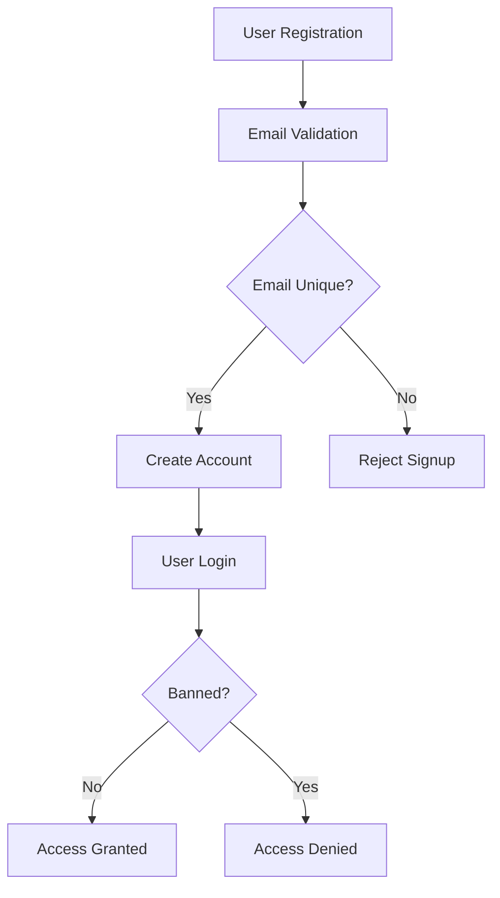

# Economic and Political Discussion Board Requirements Specification

## 1. User Account Management

### 1.1 User Registration

- WHEN a user signs up, THE system SHALL require a valid email address and password.
- WHEN a user signs up, THE system SHALL validate the email for standard email format compliance.
- WHEN a user signs up, THE system SHALL ensure the email is unique in the system.
- WHEN a user sets a password, THE system SHALL enforce a minimum length of 8 characters.
- WHEN a user sets a password, THE system SHALL enforce inclusion of at least one uppercase letter, one lowercase letter, one number, and one special character.

### 1.2 User Login

- WHEN a user attempts to log in, THE system SHALL verify the email and password match an existing account.
- WHEN a user attempts to log in, THE system SHALL check if the user is banned and deny access if banned.

### 1.3 Password Change

- WHEN a user requests to change their password, THE system SHALL require authentication of the current password.
- WHEN a user changes their password, THE system SHALL enforce password strength requirements as in registration.

### 1.4 Account Deletion

- WHEN a user requests account deletion, THE system SHALL delete the account and all associated articles and comments atomically.

## 2. User Profiles

### 2.1 Profile Attributes

- EACH user profile SHALL store a display name and a bio text.

### 2.2 Profile Editing

- WHEN a user edits their profile, THE system SHALL allow changes to display name and bio.

### 2.3 Viewing Profiles

- USERS SHALL be able to view other users' profiles.
- A user profile page SHALL display the user's display name, bio, list of authored articles, and list of authored comments.

## 3. Sections

### 3.1 Section Definition

- THE board SHALL be divided into sections such as Politics, Economy, and Current Affairs.
- EACH section SHALL have a non-empty name and optional description of up to 1000 characters.

### 3.2 Section Management

- ONLY administrators SHALL be able to create, edit, or delete sections.
- Administrators SHALL validate that section names are unique and non-empty.

### 3.3 Section Browsing

- USERS SHALL be able to view a list of all sections.
- USERS SHALL be able to browse articles filtered by a specific section.

## 4. Articles

### 4.1 Article Creation

- USERS SHALL be able to create articles only within existing sections.
- WHEN creating an article, THE system SHALL require the title, content, and section.
- THE title and content SHALL be non-empty strings.
- Articles may have multiple attachments comprising files and images.
- USERS SHALL be able to add multiple tags as non-empty trimmed strings.

### 4.2 Article Editing and Deletion

- USERS SHALL be able to edit or delete only their own articles.
- Administrators SHALL be able to delete any article.
- Editing SHALL include updates to title, content, attachments, and tags.

### 4.3 Attachments and Tags

- Attachments SHALL only be allowed for articles and must be supported file types (jpg, png, gif, pdf, docx, txt).
- EACH attachment SHALL be validated for file type and size limits (maximum 10 MB per file).
- Tags SHALL be free-text, trimmed, and prevent duplicates on the same article.

## 5. Article List Viewing

### 5.1 Pagination and Sorting

- USERS SHALL be able to view articles in a paginated list per section.
- ARTICLES SHALL be sortable by newest first and oldest first.

### 5.2 Metadata in List

- Each article listing SHALL display the title, author display name, tags, comment count, and time posted.
- The article list SHALL NOT show full article content.

## 6. Article Viewing

- USERS SHALL be able to view a single article page showing title, author, full content, attachments, tags, and post time.
- USERS SHALL be able to download attached files and images securely.

## 7. Searching Articles

- USERS SHALL be able to search articles by matching title or content text.
- SEARCH results SHALL be paginated.
- USERS SHALL be able to filter search results by tags.

## 8. Comments

- USERS SHALL be able to write single-level comments on articles.
- COMMENTS SHALL be sorted by oldest first.
- EACH comment SHALL display author display name, content, and time posted.
- USERS SHALL be able to edit and delete only their own comments.
- Administrators SHALL be able to delete any comment.

## 9. Administrator System

### 9.1 Administrator Roles

- Administrator grades SHALL include regular administrators and super administrators.
- Super administrators SHALL have additional privileges such as approving admin requests and managing administrator ranks.

### 9.2 Becoming an Administrator

- USERS SHALL be able to submit admin requests including a reason text.
- Super administrators SHALL be able to view, approve, or reject pending admin requests.
- Upon approval, THE user SHALL become a regular administrator.

### 9.3 Promotion and Demotion

- Super administrators SHALL be able to promote regular administrators to super administrator.
- Super administrators SHALL be able to demote other super administrators to regular administrator.
- Super administrators SHALL NOT be able to demote themselves.

### 9.4 Administrator Capabilities

- ADMINISTRATORS SHALL have all user capabilities plus:
  - Create, edit, and delete sections
  - Delete any article or comment
  - Ban and unban users
  - View banned users list with reasons

## 10. Banning

- WHEN a user is banned, THE system SHALL deny login access.
- Existing articles and comments by banned users SHALL remain visible.
- Ban reasons SHALL be recorded and viewable by administrators.

## 11. Business Rules and Validation

- ALL inputs SHALL be validated as per the business rules in 10-business-rules.md.
- THE system SHALL enforce all data integrity and validation constraints.

## 12. Error Handling and Performance

- WHEN validation fails, THE system SHALL return descriptive errors.
- WHEN unauthorized actions are attempted, THE system SHALL deny access with proper messages.
- SYSTEM errors SHALL be logged and administrators notified.

## 13. Security and Authentication

- PASSWORDS SHALL be securely hashed using strong algorithms.
- SESSION tokens SHALL have expiration and invalidation mechanisms.
- BANNED users SHALL not have access to any authenticated endpoints.

---

## Mermaid Diagram: User Workflow

---

## Glossary

- **User**: Registered user with an account on the discussion board.
- **Administrator**: User with elevated privileges to manage sections, content, and users.
- **Super Administrator**: Administrator with higher-level permissions, including managing other admins.
- **Section**: A category of economic or political topics.
- **Article**: A post created by a user within a section.
- **Comment**: A single-level response to an article.
- **Attachment**: Files or images associated with articles.
- **Tag**: Free-text labels assigned to articles for categorization.
- **Banned User**: A user prohibited from logging in due to policy violations.

---

This specification provides a comprehensive, implementation-ready basis for backend development of the Economic and Political Discussion Board platform.