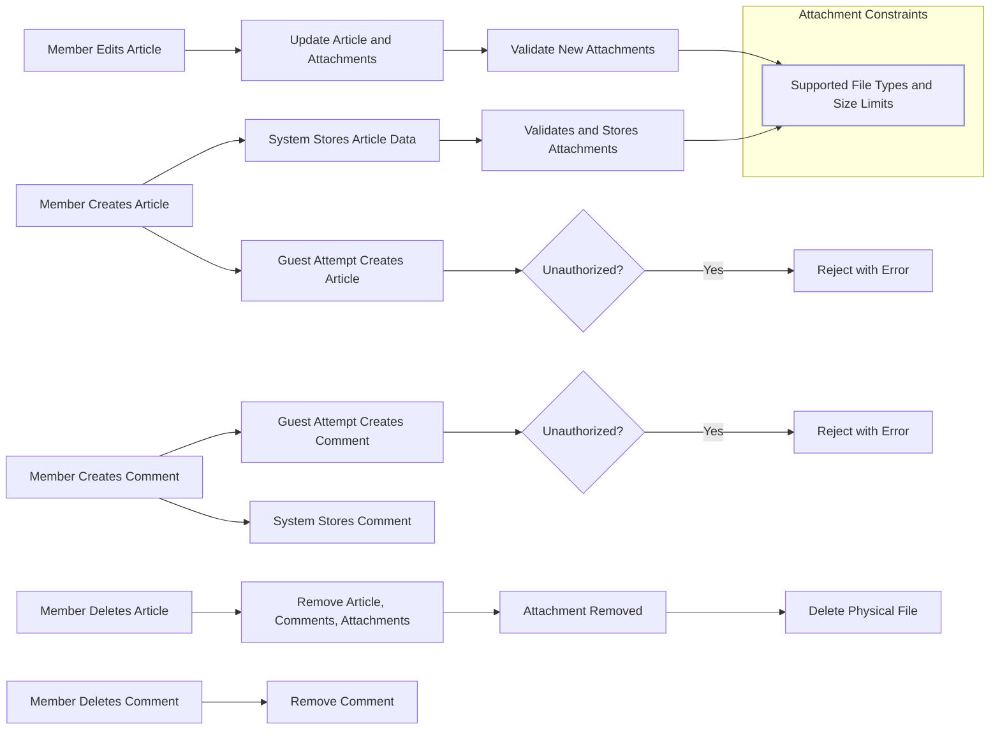

# Simple Economic/Political Discussion Board Requirements Analysis

## 1. Introduction
This document specifies the functional requirements for a simple discussion board dedicated to economic and political topics. The board allows registered users to post articles, comment, and manage file attachments. The system aims for straightforward operation without unnecessary complexity.

## 2. User Roles and Permissions

### 2.1 User Roles
- **Guest**: Can browse and read articles and attachments but cannot post or comment.
- **Member**: Registered user who can post articles, comment, edit own content, and delete own content.
- **Admin**: Has full permissions including moderate content, delete any article or comment, and manage users.

### 2.2 Permissions Matrix
| Action                 | Guest       | Member      | Admin       |
|------------------------|-------------|-------------|-------------|
| Browse Articles        | Allowed     | Allowed     | Allowed     |
| Post Article           | Denied      | Allowed     | Allowed     |
| Comment on Article     | Denied      | Allowed     | Allowed     |
| Edit Own Article       | Denied      | Allowed     | Allowed     |
| Edit Own Comment       | Denied      | Allowed     | Allowed     |
| Delete Own Article     | Denied      | Allowed     | Allowed     |
| Delete Own Comment     | Denied      | Allowed     | Allowed     |
| Moderate Content       | Denied      | Denied      | Allowed     |

## 3. Article Posting and Attachments

### 3.1 Article Composition
WHEN a member submits a new article, THE system SHALL create a record with article text content supporting arbitrary length, author identity, and timestamps.

### 3.2 Attachments
- THE system SHALL allow multiple attachments per article.
- THE attachments SHALL support images (jpeg, png, gif) and document files (pdf, docx, xlsx).
- THE system SHALL validate each file's type and size before association.
- THE maximum single file size SHALL be 10 MB.
- THE cumulative size of attachments per article SHALL not exceed 50 MB.
- THE system SHALL reject unsupported types or files exceeding size limits with clear error messages.

## 4. Commenting

### 4.1 Comment Creation
WHEN a member submits a comment on an article, THE system SHALL create a comment record linked to the article and author with content supporting up to 1000 characters.

### 4.2 Attachment in Comments
Comments SHALL NOT support attachments.

## 5. Article and Comment Editing

### 5.1 Editing Rights
WHILE a member can edit their own articles and comments, they SHALL NOT edit content of others.

### 5.2 Editing Process
WHEN editing, THE system SHALL update content and timestamps, and validate changes.

### 5.3 Attachments
Attachments can only be added or removed when editing articles, not comments.

## 6. Deletion Policies

### 6.1 Self-Deletion
Members SHALL be able to delete their own articles and comments.

### 6.2 Admin Deletion
Admins SHALL have authority to delete any article or comment.

### 6.3 Cascading Deletion
Deleting an article SHALL delete all related comments and attachments.

## 7. Authentication and Authorization

### 7.1 User Registration and Login
WHEN a new user registers, THE system SHALL create a member account with secure password storage.

WHEN a user logs in, THE system SHALL validate credentials and create a session or token.

### 7.2 Session Management
THE system SHALL manage user sessions securely, including timeout and renewal.

### 7.3 Access Control
THE system SHALL enforce role-based access control according to permissions matrix.

## 8. Attachment Management

### 8.1 Upload and Validation
WHEN an attachment is uploaded, THE system SHALL validate file type and size inline.

### 8.2 Storage
Attachments SHALL be securely stored and linked to their article records.

### 8.3 Access
Members and guests SHALL be able to view attachments in public articles.

### 8.4 Deletion
WHEN attachments are removed or articles deleted, THE system SHALL delete associated files from storage.

## 9. Data Flow and Lifecycle

This system follows the lifecycle documented in the loaded data flow lifecycle requirements, ensuring data consistency and permission compliance.

## 10. Error Handling

WHEN an invalid operation occurs (invalid file type, unauthorized action, over size limits), THE system SHALL return clear, user-friendly error messages indicating the reason.

## 11. Security Considerations

THE system SHALL implement secure password storage, input validation to prevent injections, and secure file storage.

Access control SHALL be strictly enforced to prevent unauthorized data manipulation.

## 12. Performance and Scalability

THE system SHALL respond to user actions within 2 seconds under normal load and handle up to 100 concurrent users without degradation of functionality.
