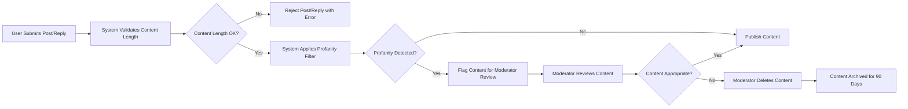
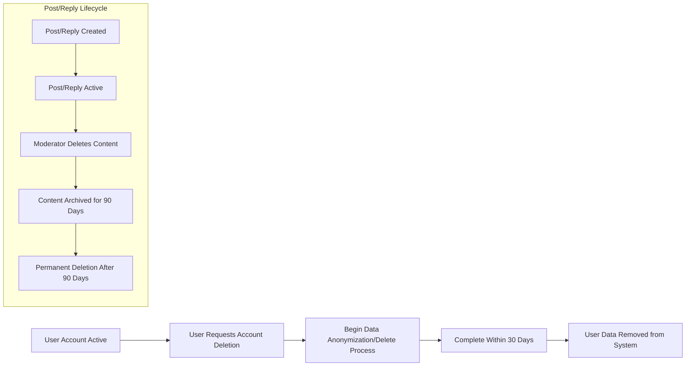

# Non-Functional Requirements for Economic/Political Discussion Board

This document defines comprehensive non-functional requirements for the discussion board service focused on economic and political topics. These requirements ensure reliable, secure, and efficient operation, providing detailed operational constraints, data retention policies, and backup/recovery strategies to support backend implementation.

## 1. Introduction
The economic and political discussion board requires specific non-functional guarantees beyond core features. These encompass performance, security, data lifecycle management, and operational reliability to maintain user trust and service quality.

## 2. Operational Constraints

### 2.1 Performance Requirements
- WHEN users access any discussion list or topic, THE system SHALL respond within 3 seconds under normal operating conditions.
- WHEN users submit new posts or replies, THE system SHALL confirm success or failure within 2 seconds.
- THE system SHALL support concurrent activity of at least 500 active users performing read and write operations with no degradation of performance.

### 2.2 Security Constraints
- THE system SHALL fully enforce role-based access controls according to defined user roles.
- Guests MAY browse discussions but SHALL NOT create posts or replies.
- Members SHALL be able to create posts and replies within the specified content limits.
- Moderators SHALL have rights to edit or delete content and manage user behavior.
- Admins SHALL have full privileges over system management.
- THE system SHALL log all moderation actions with timestamps, user ID, and action details for audit purposes.

### 2.3 Moderation and Content Policies
- THE system SHALL implement a profanity filter, rejecting posts and replies that contain prohibited language with clear error messages.
- IF content violates policies, THEN the system SHALL mark content as flagged for moderator review.
- THE system SHALL enforce a maximum of 2000 characters for posts and 1000 characters for replies.

## 3. Data Retention Policies

### 3.1 User Data Retention
- THE system SHALL retain user account information indefinitely unless deletion is requested.
- WHEN an account deletion is requested, THEN the system SHALL anonymize or permanently delete all personally identifiable information within 30 calendar days.

### 3.2 Post and Reply Data Retention
- THE system SHALL retain all posts and replies indefinitely unless removed by moderator or admin actions.
- IF content is removed, THEN THE system SHALL archive deleted content securely for 90 days prior to permanent deletion.

### 3.3 Logging and Audit Trails
- THE system SHALL store all moderation and administrative action logs securely for a minimum duration of one year.
- THE system SHALL protect logs from unauthorized access and tampering.

## 4. Backup and Recovery

### 4.1 Backup Procedures
- THE system SHALL perform full data backups daily.
- Backups SHALL be stored redundantly across geographically separated data centers.
- THE system SHALL verify backup integrity at least once per week.

### 4.2 Recovery Procedures
- In case of data loss, THE system SHALL restore from the most recent verified backup within 4 hours.
- THE system SHALL maintain documented recovery procedures accessible to operations personnel.

### 4.3 Disaster Recovery
- THE system SHALL maintain an updated disaster recovery plan, reviewed and tested every 6 months.
- The plan SHALL include manual fallback options to restore critical user data access.

## 5. Summary
This set of non-functional requirements establishes mandatory operational constraints, data retention policies, and backup/recovery strategies for the economic and political discussion board backend service. Adherence is required to ensure system reliability, security, and regulatory compliance.

## Mermaid Diagrams

### Operational Flow for Post Submission and Moderation

### Data Retention and Deletion Workflow

