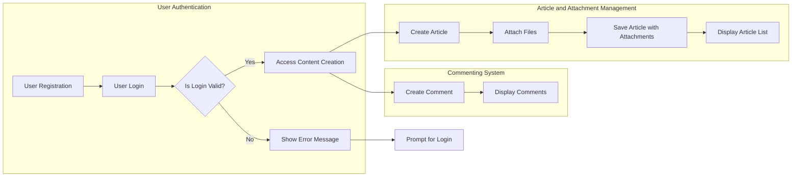

# econPolDiscussionBoard Requirements Analysis Report

## 1. Introduction
The econPolDiscussionBoard is a minimalistic, focused online discussion board dedicated to economic and political topics. It enables members to post articles with plain-text content enhanced by multiple attachments including images and files. The service supports commenting and engagement while maintaining simplicity and clarity in user interactions.

## 2. Business Model
### Purpose
To provide a reliable, easy-to-use platform tailored for focused economic and political discussions. It fills the gap for a lightweight yet functional forum that encourages quality discourse without unnecessary complexity.

### Core Value
The platform empowers members to express ideas effectively by supporting article attachments and streamlined content management.

### Success Criteria
- Active member participation through article posting and commenting.
- Secure, reliable management of attachments.
- Consistent system responsiveness with clear user feedback.

## 3. User Actors
### 3.1 Guest
Guests are unauthenticated users with read-only access. They can browse articles and view attachments but cannot post content or comment.

### 3.2 Member
Members are registered and authenticated users. They can create articles, upload multiple attachments, comment, and edit or delete their own content within specified timeframes.

### 3.3 Admin
Admins hold elevated privileges for user management, content moderation, and system maintenance. They can manage users, moderate articles and comments, and have override permissions.

### 3.4 Permissions Summary
| Actions                    | Guest | Member | Admin |
|----------------------------|-------|--------|-------|
| Browse articles            | Yes   | Yes    | Yes   |
| View attachments           | Yes   | Yes    | Yes   |
| Create articles            | No    | Yes    | Yes   |
| Edit own articles          | No    | Yes    | Yes   |
| Delete own articles        | No    | Yes    | Yes   |
| Upload attachments         | No    | Yes    | Yes   |
| Comment on articles        | No    | Yes    | Yes   |
| Moderate content           | No    | No     | Yes   |
| Manage users               | No    | No     | Yes   |

## 4. Functional Requirements
### 4.1 Article Management
- WHEN a member creates an article, THE system SHALL store it with author association, timestamp, and unique identifier.
- THE article SHALL support plain text content.
- THE system SHALL list articles ordered by creation date, newest first.
- WHEN a member edits or deletes their own article, THE system SHALL permit changes within 24 hours of posting.
- ADMINS SHALL be able to edit or delete any article at any time.

### 4.2 Attachment Features
- MEMBERS SHALL be able to attach multiple files per article.
- THE system SHALL support image attachments (JPEG, PNG, GIF) and document files (PDF, DOCX).
- THE maximum attachment size SHALL be 10 MB per file.
- ATTACHMENT count SHALL be limited to 5 per article.
- Unsupported file types SHALL be rejected with clear error messages.
- IMAGE attachments SHALL be displayed inline; other files SHALL be downloadable.

### 4.3 Commenting System
- MEMBERS SHALL be able to post comments on articles.
- THE system SHALL save comments with author, timestamp, and article linkage.
- MEMBERS SHALL be allowed to edit/delete comments within 15 minutes.
- ADMINS SHALL have moderation rights over all comments.
- COMMENT display SHALL be chronological with nested replies up to two levels.

## 5. Business Rules and Constraints
- GUESTS MUST NOT be allowed to post or comment.
- MEMBERS can only edit/delete their own content within allowed time windows.
- ARTICLES and COMMENTS containing disallowed content SHALL be flagged for moderation.
- ATTACHMENTS exceeding size or count limits SHALL be rejected.
- THE system SHALL sanitize all inputs to prevent security risks.

## 6. Authentication and Authorization
- USERS SHALL register with email and password.
- LOGIN SHALL generate temporary access tokens expiring after 30 minutes.
- REFRESH tokens SHALL allow session extension up to 14 days.
- LOGOUT SHALL invalidate tokens and sessions.
- ROLE-BASED ACCESS SHALL be enforced for all functionalities.

## 7. Error Handling
- FAILED authentication SHALL produce clear error codes and messages.
- FILE upload errors (invalid type, size) SHALL return descriptive feedback.
- ATTEMPTS to post empty or invalid content SHALL be rejected with explanations.
- SYSTEM errors SHALL provide friendly messages and allow retry.

## 8. Performance Requirements
- ARTICLE list queries SHALL respond within 2 seconds under typical load.
- ARTICLE content and comments SHALL load within 3 seconds.
- ATTACHMENT uploads SHALL complete within 5 seconds per file.
- SYSTEM SHALL handle at least 1000 concurrent users with graceful degradation when overloaded.

## 9. Security and Compliance
- USER credentials SHALL be securely hashed.
- ACCESS control SHALL verify roles before any modification.
- ADMIN actions SHALL be logged for audit.

## 10. Business Process Workflows
### 10.1 Registration and Login
- USERS submit registration data.
- SYSTEM validates and sends email verification.
- UPON verification, ACCOUNTS activate.
- USERS login to receive access tokens.

### 10.2 Article Creation
- MEMBERS create article with optional attachments.
- SYSTEM validates and stores article and attachments.
- ARTICLES become publicly visible immediately.

### 10.3 Commenting
- MEMBERS post comments linked to articles.
- SYSTEM saves and displays comments.

### 10.4 Administration
- ADMINS moderate and manage content and users.

## 11. Secondary Scenarios
- GUEST posting attempts are denied.
- ATTACHMENT upload failures provide retry options.
- EDITING is time-limited for members but unrestricted for admins.
- COMMENTS flagged for inappropriate content are reviewed before display.

## 12. Success Metrics
- ACTIVE users and engagement levels.
- NUMBER and quality of articles and comments.
- ATTACHMENT upload success rates.
- SYSTEM uptime and response time compliance.

Backend developers shall follow these business requirements with no ambiguity. The document excludes technical specifications such as API endpoints, database schema, or implementation details, maintaining clear separation between business rules and technical design.