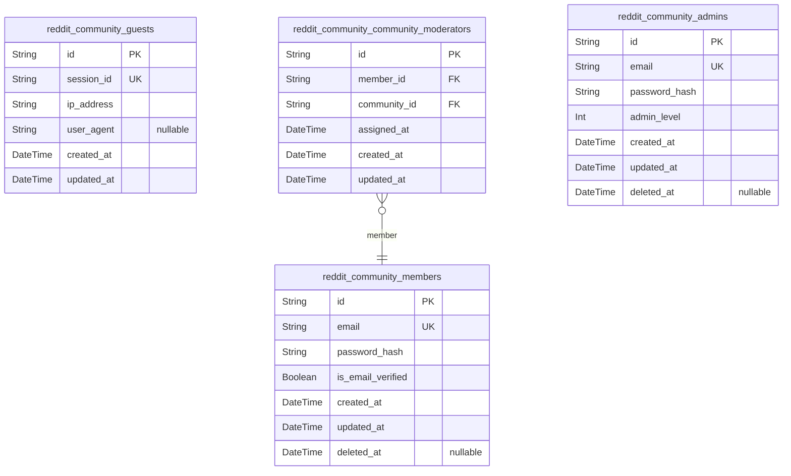
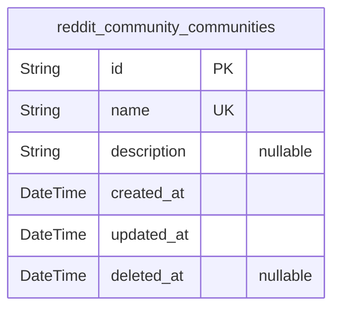
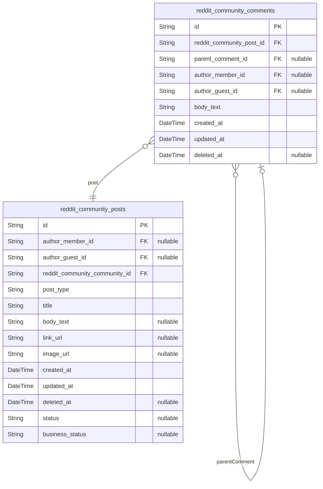
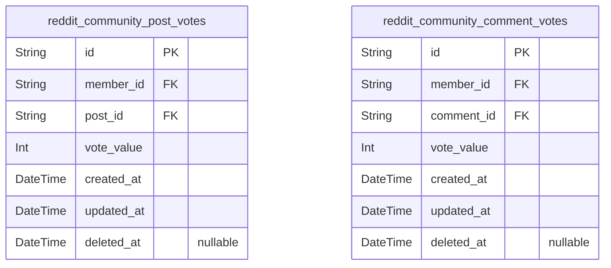
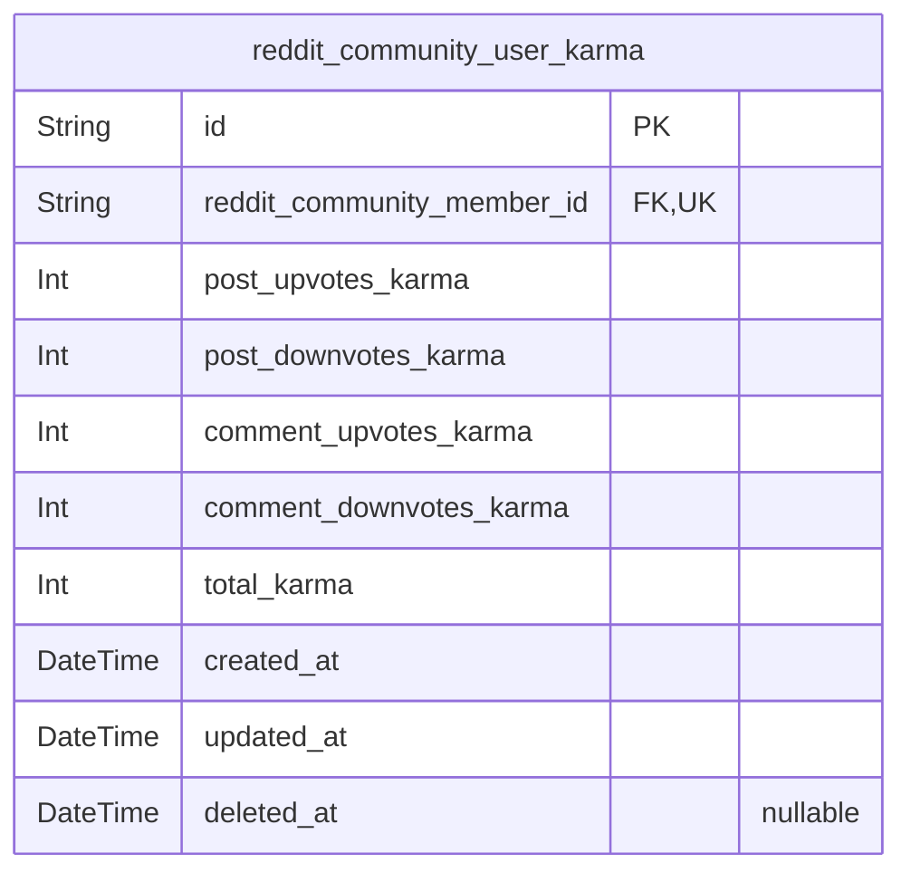
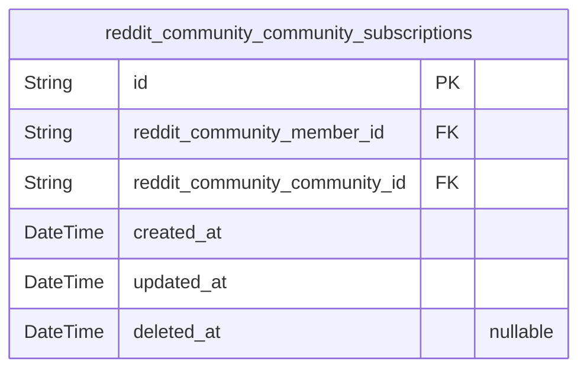
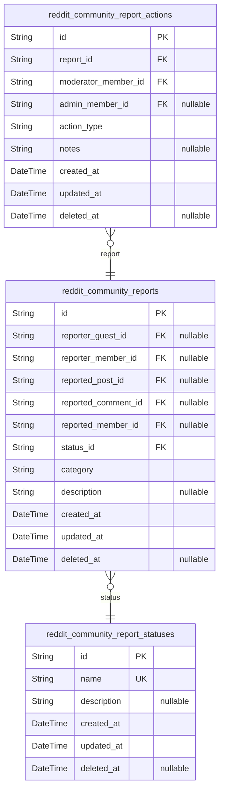
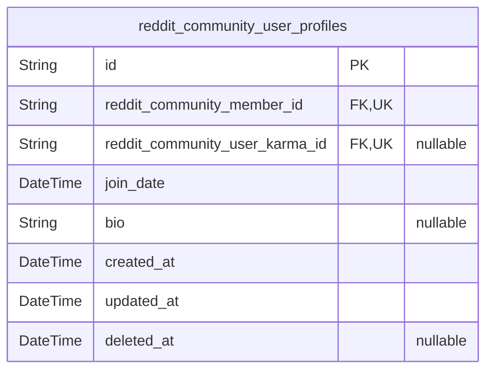

# Prisma Markdown

> Generated by [`prisma-markdown`](https://github.com/samchon/prisma-markdown)

- [Actors](#actors)
- [Communities](#communities)
- [Content](#content)
- [Voting](#voting)
- [Karma](#karma)
- [Subscriptions](#subscriptions)
- [Reporting](#reporting)
- [Profiles](#profiles)

## Actors

### `reddit_community_guests`

Guests of the redditCommunity platform with minimal access and no
authentication credentials, representing unauthenticated users. Guests
can browse public content but cannot create posts or comment. This table
stores guest session tracking and metadata for auditing.

Properties as follows:

- `id`: Primary Key.
- `session_id`: Session identifier for tracking guest browsing sessions.
- `ip_address`: IP address of the guest user for security and logging.
- `user_agent`: User agent string from the guest's browser or device.
- `created_at`: Timestamp of guest creation.
- `updated_at`: Timestamp of last guest data update.

### `reddit_community_members`

Members are registered and authenticated users who can create content,
vote, comment, and subscribe. This table includes authentication details
such as unique email addresses and password hashes, along with timestamps
for account lifecycle management.

Properties as follows:

- `id`: Primary Key.
- `email`: Unique email address used for login and communication.
- `password_hash`: Hashed password for secure authentication.
- `is_email_verified`: Indicates whether the member has verified their email.
- `created_at`: Timestamp of member creation.
- `updated_at`: Timestamp of last member data update.
- `deleted_at`: Timestamp indicating soft deletion (account deactivation).

### `reddit_community_community_moderators`

Community moderators are members assigned to manage and moderate specific
communities. This table links members to communities, defining their
moderator roles and permissions within those communities.

Properties as follows:

- `id`: Primary Key.
- `member_id`: Belonged community member's [reddit_community_members.id](#reddit_community_members)
- `community_id`: Belonged community's [reddit_community_communities.id](#reddit_community_communities)
- `assigned_at`: Timestamp when member was assigned as moderator of the community.
- `created_at`: Timestamp of moderator record creation.
- `updated_at`: Timestamp of last update to moderator record.

### `reddit_community_admins`

Admins are system-wide users with full administrative privileges across
all communities and platform settings. This table stores admin user
authentication data and role-specific metadata.

Properties as follows:

- `id`: Primary Key.
- `email`: Unique admin email address used for login and communication.
- `password_hash`: Hashed password for secure authentication.
- `admin_level`: Integer indicating the level of administrative privileges.
- `created_at`: Timestamp of admin user creation.
- `updated_at`: Timestamp of last admin user record update.
- `deleted_at`: Timestamp indicating soft deletion (account deactivation).

## Communities

### `reddit_community_communities`

Community entities representing user-created communities. Each community
has a unique name, description, creator reference (via other domain
tables), and timestamps. Supports soft delete. Serves as the primary
domain for community management.

Properties as follows:

- `id`: Primary Key.
- `name`
  > Unique community name adhering to naming rules (3-50
  > alphanumeric/underscore characters).
- `description`: Optional community description text.
- `created_at`: Timestamp when the community was created.
- `updated_at`: Timestamp when the community was last updated.
- `deleted_at`: Soft delete timestamp; null if not deleted.

## Content

### `reddit_community_posts`

Posts created by users within communities, supporting text, link, or
single image content. Each post is authored by a member or guest, belongs
to a single community, and includes metadata for creation, editing,
status, and soft deletion. Relationships link posts to their authors and
parent communities. Supports business workflows via status fields and
tracks vote and comment counts externally.

Properties as follows:

- `id`: Primary Key.
- `author_member_id`: Authoring member's [reddit_community_members.id](#reddit_community_members).
- `author_guest_id`: Authoring guest's [reddit_community_guests.id](#reddit_community_guests).
- `reddit_community_community_id`: Target community's [reddit_community_communities.id](#reddit_community_communities).
- `post_type`: Type of the post content: text, link, or image.
- `title`: Title of the post, max 300 characters.
- `body_text`: Text content for text posts.
- `link_url`: URL for link posts.
- `image_url`: URL to the image file for image posts.
- `created_at`: Creation timestamp.
- `updated_at`: Last update timestamp.
- `deleted_at`: Soft delete timestamp.
- `status`: Status representing lifecycle or workflow state.
- `business_status`: Business-specific status or lifecycle state.

### `reddit_community_comments`

Comments on posts within the redditCommunity platform allowing nested
replies with unlimited depth. Each comment is authored by a member or
guest user and references its parent post and optionally a parent comment
for nesting. Supports soft deletion and tracks creation and modification
timestamps. Voting data and karma calculations are maintained externally.

Properties as follows:

- `id`: Primary Key.
- `reddit_community_post_id`: Parent post's [reddit_community_posts.id](#reddit_community_posts).
- `parent_comment_id`: Parent comment for nested replies. Nullable for root comments.
- `author_member_id`: Authoring member's [reddit_community_members.id](#reddit_community_members).
- `author_guest_id`: Authoring guest's [reddit_community_guests.id](#reddit_community_guests).
- `body_text`: Text content of the comment limited to 2,000 characters.
- `created_at`: Creation timestamp.
- `updated_at`: Last update timestamp.
- `deleted_at`: Soft delete timestamp.

## Voting

### `reddit_community_post_votes`

Record of votes cast by members on posts within communities. Each vote is
linked to the member who cast it and the specific post voted upon.
Ensures one active vote per member per post, supporting upvotes and
downvotes. Includes temporal fields for creation, update, and soft
deletion to allow vote tracking and audit trailing.

Properties as follows:

- `id`: Primary Key.
- `member_id`: Belonged member's [reddit_community_members.id](#reddit_community_members).
- `post_id`: Voted post's [reddit_community_posts.id](#reddit_community_posts).
- `vote_value`: Value of the vote: +1 for upvote, -1 for downvote, 0 for vote removed.
- `created_at`: Timestamp when the vote was created.
- `updated_at`: Timestamp when the vote was last updated.
- `deleted_at`: Timestamp for soft deletion of the vote.

### `reddit_community_comment_votes`

Record of votes cast by members on comments within communities. Each vote
is linked to the member who cast it and the specific comment voted upon.
Ensures one active vote per member per comment, supporting upvotes and
downvotes. Temporal fields for creation, update, and soft deletion ensure
vote tracking and audit trailing capabilities.

Properties as follows:

- `id`: Primary Key.
- `member_id`: Belonged member's [reddit_community_members.id](#reddit_community_members).
- `comment_id`: Voted comment's [reddit_community_comments.id](#reddit_community_comments).
- `vote_value`: Value of the vote: +1 for upvote, -1 for downvote, 0 for vote removed.
- `created_at`: Timestamp when the vote was created.
- `updated_at`: Timestamp when the vote was last updated.
- `deleted_at`: Timestamp for soft deletion of the vote.

## Karma

### `reddit_community_user_karma`

User karma representing the reputation accumulated from voting activity
on posts and comments. Includes total karma and subcomponent values.
Belongs to a single user (member). Maintains created, updated, and
soft-deleted timestamps for lifecycle management and auditing. Uniquely
identified by user to enforce one karma record per member. Integral to
the Karma domain and used for reputation-based features.

Properties as follows:

- `id`: Primary Key.
- `reddit_community_member_id`
  > Belonged member's [reddit_community_members.id](#reddit_community_members) whose karma this
  > represents.
- `post_upvotes_karma`: Karma points from upvotes on user's posts.
- `post_downvotes_karma`: Karma points deducted from downvotes on user's posts.
- `comment_upvotes_karma`: Karma points from upvotes on user's comments.
- `comment_downvotes_karma`: Karma points deducted from downvotes on user's comments.
- `total_karma`: Total karma sum from posts and comments karma components.
- `created_at`: Record creation timestamp.
- `updated_at`: Record last updated timestamp.
- `deleted_at`: Soft deletion timestamp. Null means record is active.

## Subscriptions

### `reddit_community_community_subscriptions`

Tracks subscriptions of members to communities, enabling personalized
feed generation and access control in the Reddit-like community platform.
References membership to existing members and communities, supporting
soft deletes and audit timestamps. Allows each member to subscribe to
multiple communities and each community to have multiple subscribers.

Properties as follows:

- `id`: Primary Key.
- `reddit_community_member_id`: Belonged member's [reddit_community_members.id](#reddit_community_members).
- `reddit_community_community_id`: Belonged community's [reddit_community_communities.id](#reddit_community_communities).
- `created_at`: Timestamp when the subscription was created.
- `updated_at`: Timestamp when the subscription was last updated.
- `deleted_at`: Timestamp when the subscription was soft-deleted (logical deletion).

## Reporting

### `reddit_community_reports`

Stores reports made by guests or members against posts, comments, or
members. Tracks reporter identity, reported content references, report
category, description, timestamps, and current report status to support
moderation workflows.

Properties as follows:

- `id`: Primary Key.
- `reporter_guest_id`: Reporting guest user [reddit_community_guests.id](#reddit_community_guests).
- `reporter_member_id`: Reporting member user [reddit_community_members.id](#reddit_community_members).
- `reported_post_id`: Reported post [reddit_community_posts.id](#reddit_community_posts).
- `reported_comment_id`: Reported comment [reddit_community_comments.id](#reddit_community_comments).
- `reported_member_id`: Reported member user [reddit_community_members.id](#reddit_community_members).
- `status_id`: Current status of the report [reddit_community_report_statuses.id](#reddit_community_report_statuses).
- `category`: Category of the report such as spam, abuse, or other violation.
- `description`: Detailed optional description provided by the reporter.
- `created_at`: Timestamp when the report was created.
- `updated_at`: Timestamp of last update to the report.
- `deleted_at`: Timestamp if the report is soft deleted.

### `reddit_community_report_actions`

Represents moderation actions taken in response to reports. Links actions
to specific reports and moderators or admins performing the actions.
Records action types, optional notes, timestamps for tracking moderation
activities and auditing.

Properties as follows:

- `id`: Primary Key.
- `report_id`: Linked report [reddit_community_reports.id](#reddit_community_reports).
- `moderator_member_id`
  > Moderator member who performed the action {@link
  > reddit_community_members.id}.
- `admin_member_id`: Admin member who performed the action [reddit_community_admins.id](#reddit_community_admins).
- `action_type`: Type of moderation action taken, e.g., warning, deletion, suspension.
- `notes`: Optional detailed notes regarding the action.
- `created_at`: Timestamp when the action was created.
- `updated_at`: Timestamp of last update to the action.
- `deleted_at`: Timestamp if the action is soft deleted.

### `reddit_community_report_statuses`

Lookup table for possible statuses of reports, such as pending, reviewed,
action taken, or dismissed. Supports status-based filtering and lifecycle
tracking of reports.

Properties as follows:

- `id`: Primary Key.
- `name`: Name of the report status, e.g., pending, reviewed, action taken.
- `description`: Detailed description about the status meaning and usage.
- `created_at`: Timestamp when the status record was created.
- `updated_at`: Timestamp of last update to the status record.
- `deleted_at`: Timestamp if the status record is soft deleted.

## Profiles

### `reddit_community_user_profiles`

User profile metadata including public bio, join date, and association to
user identity and karma. This table stores enriched user information
separate from authentication and role data, facilitating public profile
display and user-specific metadata management. It references core user
identity tables and karma entities for reputation tracking.

Properties as follows:

- `id`: Primary Key.
- `reddit_community_member_id`: Referenced user identity from reddit_community_members.id.
- `reddit_community_user_karma_id`: Referenced user karma record from reddit_community_user_karma.id.
- `join_date`: Date when the user joined the platform, tracking membership duration.
- `bio`: Public bio or description provided by the user for profile display.
- `created_at`: Record creation timestamp, for auditing and temporal queries.
- `updated_at`: Last record update timestamp, for auditing and synchronization.
- `deleted_at`: Soft delete timestamp; null if record is active.
