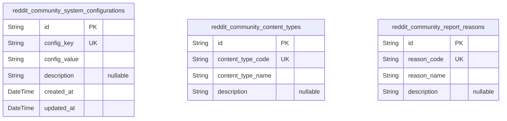
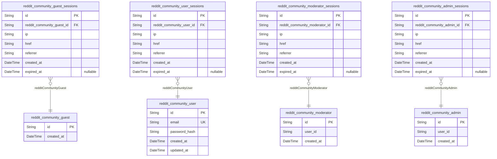
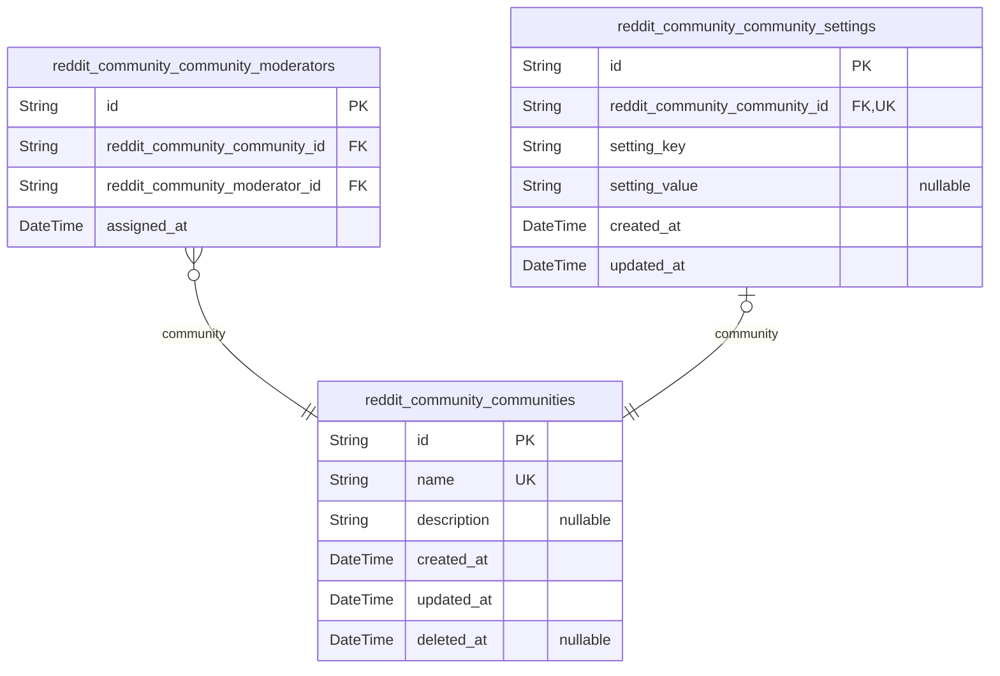
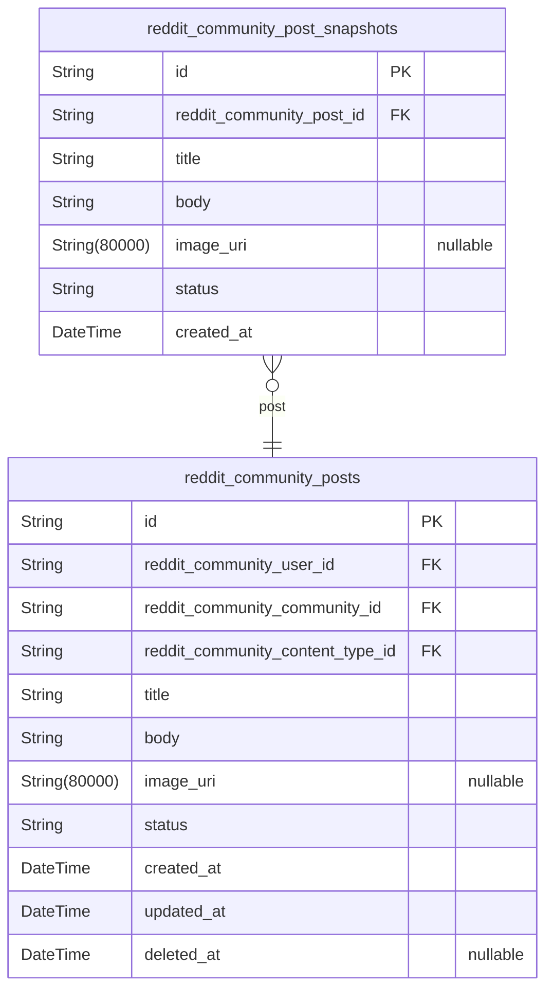
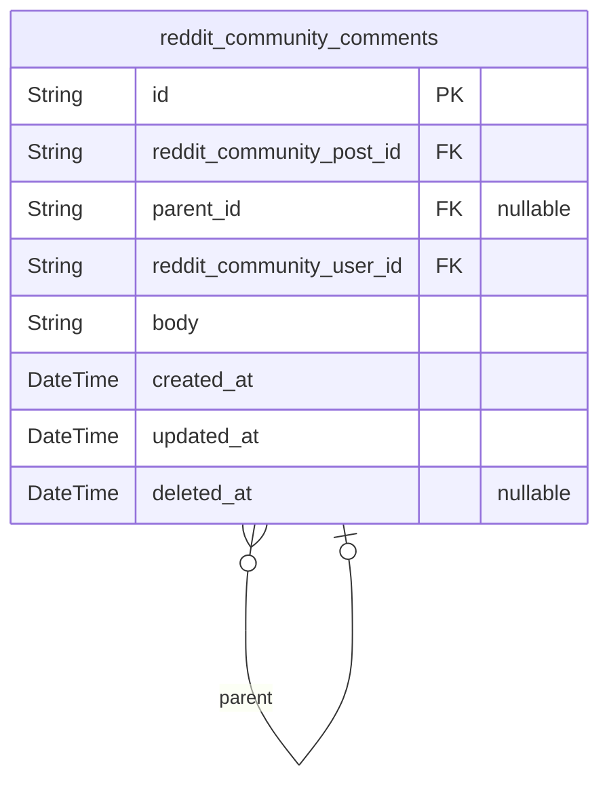
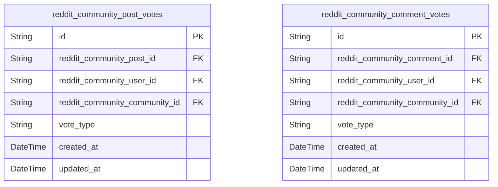
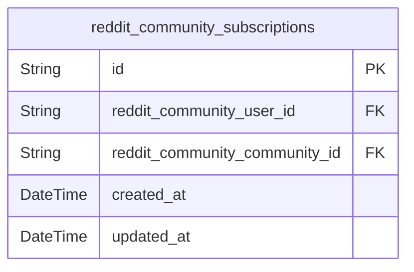
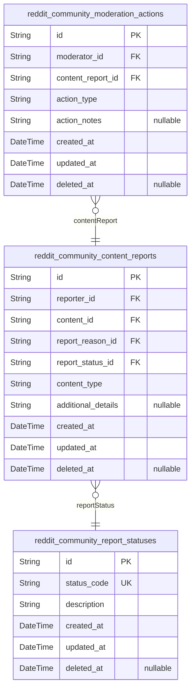

# Prisma Markdown

> Generated by [`prisma-markdown`](https://github.com/samchon/prisma-markdown)

- [Systematic](#systematic)
- [Actors](#actors)
- [Communities](#communities)
- [Posts](#posts)
- [Comments](#comments)
- [Voting](#voting)
- [Subscriptions](#subscriptions)
- [Reports](#reports)

## Systematic

```mermaid
erDiagram
"reddit_community_system_configurations" {
  String id PK
  String config_key UK
  String config_value
  String description "nullable"
  DateTime created_at
  DateTime updated_at
}
"reddit_community_content_types" {
  String id PK
  String content_type_code UK
  String content_type_name
  String description "nullable"
}
"reddit_community_report_reasons" {
  String id PK
  String reason_code UK
  String reason_name
  String description "nullable"
}
```

### `reddit_community_system_configurations`

Core system configurations for the redditCommunity platform. Contains
key-value settings that govern platform-wide behaviors and validation
rules such as community naming policies and other global system
parameters. This table serves as the authoritative source for
system-level runtime configuration.

Properties as follows:

- `id`: Primary Key.
- `config_key`: Unique key identifying the configuration setting.
- `config_value`: Value of the configuration setting as a string.
- `description`: Detailed explanation of the configuration setting's purpose and usage.
- `created_at`: Timestamp when the configuration was created.
- `updated_at`: Timestamp when the configuration was last updated.

### `reddit_community_content_types`

Enumeration of valid content types that users can post within
communities, such as text, link, and image. This table underpins
validation logic and enforces allowed content categories ensuring
consistency and integration with moderation workflows.

Properties as follows:

- `id`: Primary Key.
- `content_type_code`: Unique code representing the content type (e.g., 'text', 'link', 'image').
- `content_type_name`: Human-readable name of the content type.
- `description`: Detailed description of the content type and its validation rules.

### `reddit_community_report_reasons`

Enumeration of reasons users may provide when reporting inappropriate
content. Enables structured reporting and improves moderation efficiency
by categorizing reports according to predefined reasons.

Properties as follows:

- `id`: Primary Key.
- `reason_code`: Unique code representing the report reason.
- `reason_name`: Descriptive name of the report reason.
- `description`: Detailed explanation of the report reason to guide user selection.

## Actors

```mermaid
erDiagram
"reddit_community_guest" {
  String id PK
  DateTime created_at
}
"reddit_community_guest_sessions" {
  String id PK
  String reddit_community_guest_id FK
  String ip
  String href
  String referrer
  DateTime created_at
  DateTime expired_at "nullable"
}
"reddit_community_user" {
  String id PK
  String email UK
  String password_hash
  DateTime created_at
  DateTime updated_at
}
"reddit_community_user_sessions" {
  String id PK
  String reddit_community_user_id FK
  String ip
  String href
  String referrer
  DateTime created_at
  DateTime expired_at "nullable"
}
"reddit_community_moderator" {
  String id PK
  String user_id
  DateTime created_at
}
"reddit_community_moderator_sessions" {
  String id PK
  String reddit_community_moderator_id FK
  String ip
  String href
  String referrer
  DateTime created_at
  DateTime expired_at "nullable"
}
"reddit_community_admin" {
  String id PK
  String user_id
  DateTime created_at
}
"reddit_community_admin_sessions" {
  String id PK
  String reddit_community_admin_id FK
  String ip
  String href
  String referrer
  DateTime created_at
  DateTime expired_at "nullable"
}
"reddit_community_guest_sessions" }o--|| "reddit_community_guest" : redditCommunityGuest
"reddit_community_user_sessions" }o--|| "reddit_community_user" : redditCommunityUser
"reddit_community_moderator_sessions" }o--|| "reddit_community_moderator" : redditCommunityModerator
"reddit_community_admin_sessions" }o--|| "reddit_community_admin" : redditCommunityAdmin
```

### `reddit_community_guest`

Guest users who can browse public communities without authentication.
This table stores guest actor identities for audit and tracking purposes.
Guests have read-only access privileges and do not require authentication
credentials.

Properties as follows:

- `id`: Primary Key.
- `created_at`: Record creation timestamp.

### `reddit_community_guest_sessions`

Sessions of guest users tracking connection metadata for audit. Each
session belongs to one guest. Session data excludes authentication tokens
and stores connection IP, referer, and URL for security and analytics.

Properties as follows:

- `id`: Primary Key.
- `reddit_community_guest_id`: Belonged guest's [reddit_community_guest.id](#reddit_community_guest).
- `ip`: IP address of the session.
- `href`: Request URL string.
- `referrer`: Referrer URL string.
- `created_at`: Session creation timestamp.
- `expired_at`: Session expiration timestamp.

### `reddit_community_user`

Registered users with authentication credentials who can create
communities, post content, vote, comment, subscribe, and report. Stores
essential user identity data for login and permission management.

Properties as follows:

- `id`: Primary Key.
- `email`: User email address for login and communication.
- `password_hash`: Hash of the user's password for authentication.
- `created_at`: User account creation timestamp.
- `updated_at`: User account last update timestamp.

### `reddit_community_user_sessions`

Active login sessions associated with registered users. Records
connection metadata excluding sensitive tokens, supporting secure session
management and auditing. One user can have multiple concurrent sessions.

Properties as follows:

- `id`: Primary Key.
- `reddit_community_user_id`: Belonged user's [reddit_community_user.id](#reddit_community_user).
- `ip`: IP address of the session.
- `href`: Request URL string.
- `referrer`: Referrer URL string.
- `created_at`: Session creation timestamp.
- `expired_at`: Session expiration timestamp.

### `reddit_community_moderator`

Community moderators are users with elevated permissions to moderate
content within assigned communities. This table stores moderator actor
identities and permission metadata for audit and access control.

Properties as follows:

- `id`: Primary Key.
- `user_id`: Corresponding registered user ID for this moderator.
- `created_at`: Moderator actor creation timestamp.

### `reddit_community_moderator_sessions`

Sessions of community moderators capturing connection context for
security and auditing. Links to the moderator actor table. Sessions
exclude authentication tokens and preserve IP, referrer, and accessed URL
data.

Properties as follows:

- `id`: Primary Key.
- `reddit_community_moderator_id`: Belonged moderator's [reddit_community_moderator.id](#reddit_community_moderator).
- `ip`: IP address of the session.
- `href`: Request URL string.
- `referrer`: Referrer URL string.
- `created_at`: Session creation timestamp.
- `expired_at`: Session expiration timestamp.

### `reddit_community_admin`

System administrators with full platform-wide permissions to manage
users, communities, and content moderation. Stores admin identity and
essential auditing information.

Properties as follows:

- `id`: Primary Key.
- `user_id`: Corresponding registered user ID for this admin.
- `created_at`: Admin actor creation timestamp.

### `reddit_community_admin_sessions`

Sessions of system administrators capturing connection metadata for
secure audit trails. Sessions link to admin actors and store IP,
referrer, and URL information. No authentication tokens stored in this
table.

Properties as follows:

- `id`: Primary Key.
- `reddit_community_admin_id`: Belonged admin's [reddit_community_admin.id](#reddit_community_admin).
- `ip`: IP address of the session.
- `href`: Request URL string.
- `referrer`: Referrer URL string.
- `created_at`: Session creation timestamp.
- `expired_at`: Session expiration timestamp.

## Communities

```mermaid
erDiagram
"reddit_community_communities" {
  String id PK
  String name UK
  String description "nullable"
  DateTime created_at
  DateTime updated_at
  DateTime deleted_at "nullable"
}
"reddit_community_community_moderators" {
  String id PK
  String reddit_community_community_id FK
  String reddit_community_moderator_id FK
  DateTime assigned_at
}
"reddit_community_community_settings" {
  String id PK
  String reddit_community_community_id FK,UK
  String setting_key
  String setting_value "nullable"
  DateTime created_at
  DateTime updated_at
}
"reddit_community_community_moderators" }o--|| "reddit_community_communities" : community
"reddit_community_community_settings" |o--|| "reddit_community_communities" : community
```

### `reddit_community_communities`

Represents user-created communities in the redditCommunity platform. Each
community is uniquely identified and managed independently by users.
Stores community metadata including name and description. Includes audit
fields and supports soft deletion.

Properties as follows:

- `id`: Primary Key.
- `name`: Unique community name adhering to platform naming conventions.
- `description`: Optional descriptive text about the community.
- `created_at`: Timestamp when the community was created.
- `updated_at`: Timestamp when the community was last updated.
- `deleted_at`: Timestamp marking soft deletion of the community, if applicable.

### `reddit_community_community_moderators`

Associates moderators with communities, representing moderator
assignments and permissions within communities. Supports community
governance and access control. Links to existing
reddit_community_communities and reddit_community_moderator tables.

Properties as follows:

- `id`: Primary Key.
- `reddit_community_community_id`: Belonged community's [reddit_community_communities.id](#reddit_community_communities).
- `reddit_community_moderator_id`: Assigned moderator's [reddit_community_moderator.id](#reddit_community_moderator).
- `assigned_at`: Timestamp when the moderator was assigned to the community.

### `reddit_community_community_settings`

Stores configuration settings for each community within the
redditCommunity platform. Settings define community-specific features and
preferences. Linked to the primary community entity. Managed as a
subsidiary entity supporting community behavior customization.

Properties as follows:

- `id`: Primary Key.
- `reddit_community_community_id`: Associated community's [reddit_community_communities.id](#reddit_community_communities).
- `setting_key`: Key identifying the setting type.
- `setting_value`: Value of the setting, nullable if default or unset.
- `created_at`: Timestamp when the setting was created.
- `updated_at`: Timestamp when the setting was last updated.

## Posts

```mermaid
erDiagram
"reddit_community_posts" {
  String id PK
  String reddit_community_user_id FK
  String reddit_community_community_id FK
  String reddit_community_content_type_id FK
  String title
  String body
  String(80000) image_uri "nullable"
  String status
  DateTime created_at
  DateTime updated_at
  DateTime deleted_at "nullable"
}
"reddit_community_post_snapshots" {
  String id PK
  String reddit_community_post_id FK
  String title
  String body
  String(80000) image_uri "nullable"
  String status
  DateTime created_at
}
"reddit_community_post_snapshots" }o--|| "reddit_community_posts" : post
```

### `reddit_community_posts`

Main business entity representing user posts within communities. Each
post is authored by a user and is associated with a specific community.
Posts include textual content, optional image URIs, metadata details such
as content type, title, and post status. The entity supports soft
deletion and tracks creation and modification timestamps. This table
serves as the core content management for posts independent of comments
or votes. It references users, communities, and content types for data
integrity.

Properties as follows:

- `id`: Primary Key.
- `reddit_community_user_id`: Authoring user's [reddit_community_user.id](#reddit_community_user).
- `reddit_community_community_id`: Associated community's [reddit_community_communities.id](#reddit_community_communities).
- `reddit_community_content_type_id`
  > Content type's [reddit_community_content_types.id](#reddit_community_content_types) to specify post
  > format (text, link, image).
- `title`: Title of the post summarizing the content.
- `body`: Main textual content of the post.
- `image_uri`: Optional URI for an image associated with the post.
- `status`: Current status of the post (e.g., 'active', 'removed', 'hidden').
- `created_at`: Timestamp when the post was created.
- `updated_at`: Timestamp when the post was last updated.
- `deleted_at`: Timestamp when the post was soft-deleted, if applicable.

### `reddit_community_post_snapshots`

Snapshot entity capturing point-in-time states of user posts for audit
trails and historical tracking. Each snapshot references the main post
and preserves all post fields such as title, body, image URI, status, and
timestamps reflecting the snapshot creation time. This table supports
append-only pattern ensuring immutability and historical accountability.

Properties as follows:

- `id`: Primary Key.
- `reddit_community_post_id`: Referenced post's [reddit_community_posts.id](#reddit_community_posts).
- `title`: Title of the post snapshot.
- `body`: Textual content of the post snapshot.
- `image_uri`: Optional image URI captured at snapshot time.
- `status`: Post status at snapshot time.
- `created_at`: Timestamp when the snapshot was created.

## Comments

```mermaid
erDiagram
"reddit_community_comments" {
  String id PK
  String reddit_community_post_id FK
  String parent_id FK "nullable"
  String reddit_community_user_id FK
  String body
  DateTime created_at
  DateTime updated_at
  DateTime deleted_at "nullable"
}
"reddit_community_comments" }o--o| "reddit_community_comments" : parent
```

### `reddit_community_comments`

Stores user comments on posts within communities, including support for
nested comments through self-referential parent-child relationships. Each
comment is authored by a registered user and belongs to a single post.
Designed to preserve data integrity, support soft deletes, and allow
efficient querying and full-text search on comment content. Temporal
fields support audit trails and lifecycle management.

Properties as follows:

- `id`: Primary Key.
- `reddit_community_post_id`: The post this comment belongs to. [reddit_community_posts.id](#reddit_community_posts).
- `parent_id`
  > The parent comment in nested replies, null for top-level comments. {@link
  > reddit_community_comments.id}.
- `reddit_community_user_id`: The user who authored this comment. [reddit_community_user.id](#reddit_community_user).
- `body`
  > The textual content of the comment. Captures the full user-supplied
  > comment text with validation on length and content on the application
  > side.
- `created_at`: Timestamp when the comment was created.
- `updated_at`: Timestamp when the comment was last updated.
- `deleted_at`: Timestamp when the comment was soft deleted. Null if comment is active.

## Voting

```mermaid
erDiagram
"reddit_community_post_votes" {
  String id PK
  String reddit_community_post_id FK
  String reddit_community_user_id FK
  String reddit_community_community_id FK
  String vote_type
  DateTime created_at
  DateTime updated_at
}
"reddit_community_comment_votes" {
  String id PK
  String reddit_community_comment_id FK
  String reddit_community_user_id FK
  String reddit_community_community_id FK
  String vote_type
  DateTime created_at
  DateTime updated_at
}
```

### `reddit_community_post_votes`

Records votes cast by users on community posts. Each vote uniquely
identified by UUID prevents duplicate voting by same user on same post.
Contains vote type (upvote/downvote), references voter, post, and
community. Supports audit trails via creation and update timestamps.

Properties as follows:

- `id`: Primary Key.
- `reddit_community_post_id`: Referenced post in community. {link reddit_community_posts.id}.
- `reddit_community_user_id`: User who cast the vote. [reddit_community_user.id](#reddit_community_user).
- `reddit_community_community_id`: Community where the post resides. [reddit_community_communities.id](#reddit_community_communities).
- `vote_type`: Type of vote cast, e.g. 'upvote' or 'downvote'.
- `created_at`: Vote creation timestamp.
- `updated_at`: Vote last update timestamp.

### `reddit_community_comment_votes`

Records votes cast by users on community comments. Each vote uniquely
identified by UUID prevents duplicate voting by same user on same
comment. Contains vote type (upvote/downvote), references voter, comment,
and community. Supports audit trails via creation and update timestamps.

Properties as follows:

- `id`: Primary Key.
- `reddit_community_comment_id`: Referenced comment in community. [reddit_community_comments.id](#reddit_community_comments).
- `reddit_community_user_id`: User who cast the vote. [reddit_community_user.id](#reddit_community_user).
- `reddit_community_community_id`
  > Community where the comment resides. {@link
  > reddit_community_communities.id}.
- `vote_type`: Type of vote cast, e.g. 'upvote' or 'downvote'.
- `created_at`: Vote creation timestamp.
- `updated_at`: Vote last update timestamp.

## Subscriptions

```mermaid
erDiagram
"reddit_community_subscriptions" {
  String id PK
  String reddit_community_user_id FK
  String reddit_community_community_id FK
  DateTime created_at
  DateTime updated_at
}
```

### `reddit_community_subscriptions`

Records the subscriptions of users to communities, enabling personalized
content feeds and engagement tracking. Each subscription associates a
user with a community and tracks the creation and update timestamps for
auditing and management purposes. Ensures that each user can subscribe to
a community only once.

Properties as follows:

- `id`: Primary Key.
- `reddit_community_user_id`: The subscribed user's [reddit_community_user.id](#reddit_community_user).
- `reddit_community_community_id`: The subscribed community's [reddit_community_communities.id](#reddit_community_communities).
- `created_at`: Timestamp when the subscription was created.
- `updated_at`: Timestamp of the last update to the subscription.

## Reports

```mermaid
erDiagram
"reddit_community_content_reports" {
  String id PK
  String reporter_id FK
  String content_id FK
  String report_reason_id FK
  String report_status_id FK
  String content_type
  String additional_details "nullable"
  DateTime created_at
  DateTime updated_at
  DateTime deleted_at "nullable"
}
"reddit_community_report_statuses" {
  String id PK
  String status_code UK
  String description
  DateTime created_at
  DateTime updated_at
  DateTime deleted_at "nullable"
}
"reddit_community_moderation_actions" {
  String id PK
  String moderator_id FK
  String content_report_id FK
  String action_type
  String action_notes "nullable"
  DateTime created_at
  DateTime updated_at
  DateTime deleted_at "nullable"
}
"reddit_community_content_reports" }o--|| "reddit_community_report_statuses" : reportStatus
"reddit_community_moderation_actions" }o--|| "reddit_community_content_reports" : contentReport
```

### `reddit_community_content_reports`

Captures user-submitted reports on community content such as posts or
comments. Records reporter identity, reported content, report reason,
status, and timestamps for audit and moderation processing.

Properties as follows:

- `id`: Primary Key.
- `reporter_id`
  > Identifies the user who submitted the report. {@link
  > reddit_community_user.id}
- `content_id`
  > Reference to the reported content, such as a post or comment. {@link
  > reddit_community_posts.id or reddit_community_comments.id}
- `report_reason_id`
  > Reason selected for reporting the content. {@link
  > reddit_community_report_reasons.id}
- `report_status_id`
  > Current status of the report, tracking its lifecycle. {@link
  > reddit_community_report_statuses.id}
- `content_type`: Indicates the type of content reported, such as 'post' or 'comment'.
- `additional_details`: Optional extended details provided by the reporter about the report.
- `created_at`: Timestamp when the report was created.
- `updated_at`: Timestamp when the report was last updated.
- `deleted_at`: Timestamp indicating soft deletion if applicable.

### `reddit_community_report_statuses`

Master table of report statuses governing the lifecycle of content
reports. Used for workflow control and audit trail.

Properties as follows:

- `id`: Primary Key.
- `status_code`
  > Unique code representing the status of a report, e.g., 'pending',
  > 'resolved'.
- `description`: Detailed explanation of the report status to aid moderators and admins.
- `created_at`: Timestamp when this status record was created.
- `updated_at`: Timestamp when this status record was last updated.
- `deleted_at`: Soft deletion timestamp, if status is deprecated.

### `reddit_community_moderation_actions`

Logs moderation actions taken by moderators on reported content,
including the action type, notes, and timestamps for audit and
compliance.

Properties as follows:

- `id`: Primary Key.
- `moderator_id`: Moderator who performed the action. [reddit_community_moderator.id](#reddit_community_moderator)
- `content_report_id`
  > Foreign key to the reported content being acted upon. {@link
  > reddit_community_content_reports.id}
- `action_type`: Type of moderation action, e.g., 'deleted', 'dismissed', 'escalated'.
- `action_notes`: Optional notes providing details or explanation of the action.
- `created_at`: Timestamp when the moderation action was performed.
- `updated_at`: Timestamp when the action record was last updated.
- `deleted_at`: Optional soft deletion timestamp to mark action archival.
