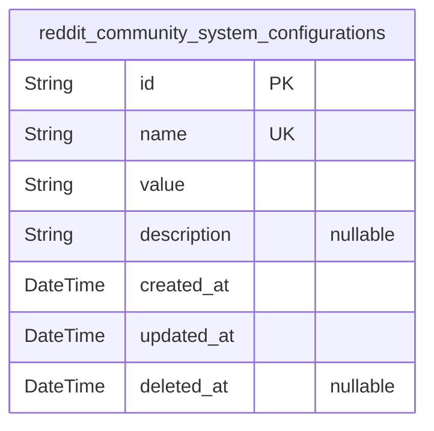
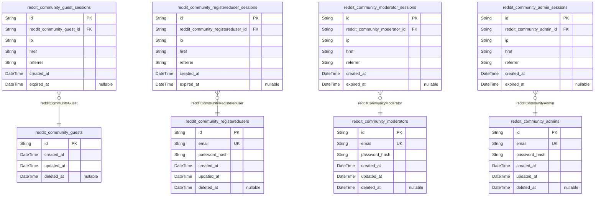
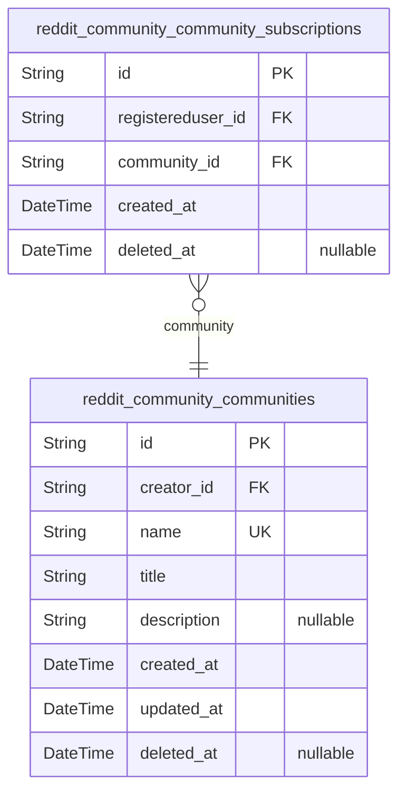
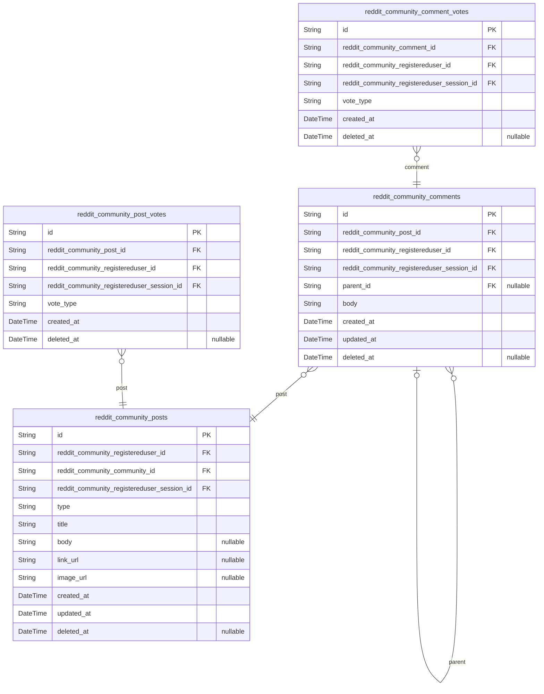
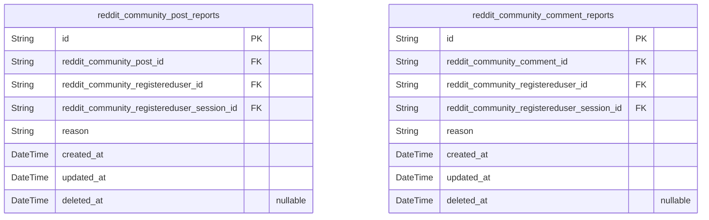

# Prisma Markdown

> Generated by [`prisma-markdown`](https://github.com/samchon/prisma-markdown)

- [Systematic](#systematic)
- [Actors](#actors)
- [Communities](#communities)
- [Content](#content)
- [Moderation](#moderation)

## Systematic

```mermaid
erDiagram
"reddit_community_system_configurations" {
  String id PK
  String name UK
  String value
  String description "nullable"
  DateTime created_at
  DateTime updated_at
  DateTime deleted_at "nullable"
}
```

### `reddit_community_system_configurations`

System configuration settings for the Reddit-like community platform.

Stores key-value pairs representing configurable options affecting system
behavior and performance.
Each configuration entry includes a unique name, string value, optional
description, and timestamps for auditing changes.
Soft deletion is supported to allow temporary disabling of configurations
without removal.

Properties as follows:

- `id`: Primary Key.
- `name`: Unique configuration key name identifying the setting.
- `value`: String value of the configuration setting.
- `description`
  > Optional detailed description of the configuration setting's purpose and
  > usage.
- `created_at`: Timestamp when the configuration entry was created.
- `updated_at`: Timestamp when the configuration entry was last updated.
- `deleted_at`
  > Timestamp marking soft deletion of the configuration entry. Null if
  > active.

## Actors

```mermaid
erDiagram
"reddit_community_guests" {
  String id PK
  DateTime created_at
  DateTime updated_at
  DateTime deleted_at "nullable"
}
"reddit_community_registeredusers" {
  String id PK
  String email UK
  String password_hash
  DateTime created_at
  DateTime updated_at
  DateTime deleted_at "nullable"
}
"reddit_community_moderators" {
  String id PK
  String email UK
  String password_hash
  DateTime created_at
  DateTime updated_at
  DateTime deleted_at "nullable"
}
"reddit_community_admins" {
  String id PK
  String email UK
  String password_hash
  DateTime created_at
  DateTime updated_at
  DateTime deleted_at "nullable"
}
"reddit_community_guest_sessions" {
  String id PK
  String reddit_community_guest_id FK
  String ip
  String href
  String referrer
  DateTime created_at
  DateTime expired_at "nullable"
}
"reddit_community_registereduser_sessions" {
  String id PK
  String reddit_community_registereduser_id FK
  String ip
  String href
  String referrer
  DateTime created_at
  DateTime expired_at "nullable"
}
"reddit_community_moderator_sessions" {
  String id PK
  String reddit_community_moderator_id FK
  String ip
  String href
  String referrer
  DateTime created_at
  DateTime expired_at "nullable"
}
"reddit_community_admin_sessions" {
  String id PK
  String reddit_community_admin_id FK
  String ip
  String href
  String referrer
  DateTime created_at
  DateTime expired_at "nullable"
}
"reddit_community_guest_sessions" }o--|| "reddit_community_guests" : redditCommunityGuest
"reddit_community_registereduser_sessions" }o--|| "reddit_community_registeredusers" : redditCommunityRegistereduser
"reddit_community_moderator_sessions" }o--|| "reddit_community_moderators" : redditCommunityModerator
"reddit_community_admin_sessions" }o--|| "reddit_community_admins" : redditCommunityAdmin
```

### `reddit_community_guests`

Guest users represent unauthenticated visitors with read-only access to
public content.

This table stores minimal identity data for guests primarily for auditing
and rate limiting purposes.
Guests have no login credentials but are tracked via session management.
Soft deletion is supported to exclude guests from processing when necessary.

Properties as follows:

- `id`: Primary Key.
- `created_at`: Record creation timestamp.
- `updated_at`: Record last update timestamp.
- `deleted_at`: Soft deletion timestamp; null if active.

### `reddit_community_registeredusers`

Registered users who can create communities, post content, comment, vote,
subscribe, and report.

Includes authentication related fields and user metadata. Passwords must
be stored securely (hashed).
Soft deletion supported for account deactivation.
Tracks timestamps for auditing and account history.

Properties as follows:

- `id`: Primary Key.
- `email`: Unique user email address for login and notifications.
- `password_hash`: Securely hashed password for authentication.
- `created_at`: Account creation timestamp.
- `updated_at`: Account last update timestamp.
- `deleted_at`: Soft deletion timestamp; null if active.

### `reddit_community_moderators`

Moderators are users with privileges to manage content and reports within
specific communities.

This table stores moderator identity and authentication info, linking
them to their moderation scope is handled outside.
Includes password hash and timestamps for audit and management.
Supports soft deletion for role revocation.

Properties as follows:

- `id`: Primary Key.
- `email`: Moderator's unique email address for login and notifications.
- `password_hash`: Secure password hash for authentication.
- `created_at`: Moderator account creation timestamp.
- `updated_at`: Moderator account last update timestamp.
- `deleted_at`: Soft deletion timestamp; null if active.

### `reddit_community_admins`

Administrators have full system-wide privileges including user and
content management.

This table stores admin user identities with authentication data.
Includes password hashes and timestamps for auditing and control.
Supports soft deletion for administrative account management.

Properties as follows:

- `id`: Primary Key.
- `email`: Admin's unique email address for login and notification purposes.
- `password_hash`: Hashed password for secure authentication.
- `created_at`: Timestamp when admin account was created.
- `updated_at`: Timestamp when admin account was last updated.
- `deleted_at`: Soft deletion timestamp marking account deactivation.

### `reddit_community_guest_sessions`

Sessions table for guest users, tracking connection context and session
lifecycle.

Stores IP address, accessed URL, referrer, creation and expiry timestamps.
Foreign key references guest user entity.
Supports indexing for efficient session lookup.

Properties as follows:

- `id`: Primary Key.
- `reddit_community_guest_id`: Guest user foreign key. [reddit_community_guests.id](#reddit_community_guests).
- `ip`: IP address of the guest connection.
- `href`: Connection URL requested by guest.
- `referrer`: Referrer URL from which the guest arrived.
- `created_at`: Session creation timestamp.
- `expired_at`: Session expiry timestamp; null if session is active.

### `reddit_community_registereduser_sessions`

Sessions table for registered users managing login sessions and
connection metadata.

Includes IP, connection URLs, creation and expiry timestamps.
References registered user foreign key.
Indexed for fast session lookups per user and creation timestamp.

Properties as follows:

- `id`: Primary Key.
- `reddit_community_registereduser_id`: Registered user foreign key. [reddit_community_registeredusers.id](#reddit_community_registeredusers).
- `ip`: IP address of the user session.
- `href`: Connection URL requested.
- `referrer`: Referrer URL for the session.
- `created_at`: Session creation timestamp.
- `expired_at`: Expiry timestamp of the session; null if active.

### `reddit_community_moderator_sessions`

Session records for moderator accounts, tracking connection details and
session lifecycle.

Foreign keys link to moderator entities.
Includes IP, connection href, referrer, creation and expiry timestamps.
Indexed by moderator and timestamp for efficient querying.

Properties as follows:

- `id`: Primary Key.
- `reddit_community_moderator_id`: Moderator foreign key. [reddit_community_moderators.id](#reddit_community_moderators).
- `ip`: Moderator session IP address.
- `href`: Moderator session connection URL.
- `referrer`: Moderator session referrer URL.
- `created_at`: Moderator session creation timestamp.
- `expired_at`: Moderator session expiry timestamp; null if active.

### `reddit_community_admin_sessions`

Session table for admin accounts handling authentication metadata and
connection context.

Links to admin actor table via foreign key.
Records IP, href, referrer, creation and expiry times.
Indexed for fast access by admin and session creation date.

Properties as follows:

- `id`: Primary Key.
- `reddit_community_admin_id`: Admin user foreign key. [reddit_community_admins.id](#reddit_community_admins).
- `ip`: IP address for the admin session.
- `href`: Connection URL for the admin session.
- `referrer`: Referrer URL for the session.
- `created_at`: Timestamp when session was created.
- `expired_at`: Timestamp when session expired; null if active.

## Communities

```mermaid
erDiagram
"reddit_community_communities" {
  String id PK
  String creator_id FK
  String name UK
  String title
  String description "nullable"
  DateTime created_at
  DateTime updated_at
  DateTime deleted_at "nullable"
}
"reddit_community_community_subscriptions" {
  String id PK
  String registereduser_id FK
  String community_id FK
  DateTime created_at
  DateTime deleted_at "nullable"
}
"reddit_community_community_subscriptions" }o--|| "reddit_community_communities" : community
```

### `reddit_community_communities`

Community metadata representing user-created communities within the
redditCommunity platform.

Each community has a unique name, descriptive information, and timestamps
for creation, update, and optional soft deletion. Communities serve as
containers for posts and discussions, and form the basis for subscription
and moderation.

The model references existing users as creators (owners) and enforces
unique community names for integrity.

Properties as follows:

- `id`: Primary Key.
- `creator_id`
  > Reference to the registered user who created (owns) the community. {@link
  > reddit_community_registeredusers.id}.
- `name`: Unique name of the community used as an identifier and in URLs.
- `title`: Human-readable title of the community.
- `description`
  > Optional textual description providing details about the community's
  > purpose and rules.
- `created_at`: Timestamp when the community was created.
- `updated_at`: Timestamp when the community was last updated.
- `deleted_at`: Soft deletion timestamp to allow recovery or audit trails.

### `reddit_community_community_subscriptions`

Subscription records linking registered users to communities they follow.

This junction table normalizes the many-to-many relationship between
users and communities, enabling users to subscribe or unsubscribe from
multiple communities.

Subscriptions include timestamps for creation and optional soft deletion
for audit and recovery purposes.

Properties as follows:

- `id`: Primary Key.
- `registereduser_id`
  > Reference to the registered user subscribing to the community. {@link
  > reddit_community_registeredusers.id}.
- `community_id`
  > Reference to the target community being subscribed to. {@link
  > reddit_community_communities.id}.
- `created_at`: Timestamp when the subscription was created.
- `deleted_at`: Soft deletion timestamp for subscription cancellation or audit.

## Content

```mermaid
erDiagram
"reddit_community_posts" {
  String id PK
  String reddit_community_registereduser_id FK
  String reddit_community_community_id FK
  String reddit_community_registereduser_session_id FK
  String type
  String title
  String body "nullable"
  String link_url "nullable"
  String image_url "nullable"
  DateTime created_at
  DateTime updated_at
  DateTime deleted_at "nullable"
}
"reddit_community_comments" {
  String id PK
  String reddit_community_post_id FK
  String reddit_community_registereduser_id FK
  String reddit_community_registereduser_session_id FK
  String parent_id FK "nullable"
  String body
  DateTime created_at
  DateTime updated_at
  DateTime deleted_at "nullable"
}
"reddit_community_post_votes" {
  String id PK
  String reddit_community_post_id FK
  String reddit_community_registereduser_id FK
  String reddit_community_registereduser_session_id FK
  String vote_type
  DateTime created_at
  DateTime deleted_at "nullable"
}
"reddit_community_comment_votes" {
  String id PK
  String reddit_community_comment_id FK
  String reddit_community_registereduser_id FK
  String reddit_community_registereduser_session_id FK
  String vote_type
  DateTime created_at
  DateTime deleted_at "nullable"
}
"reddit_community_comments" }o--|| "reddit_community_posts" : post
"reddit_community_comments" }o--o| "reddit_community_comments" : parent
"reddit_community_post_votes" }o--|| "reddit_community_posts" : post
"reddit_community_comment_votes" }o--|| "reddit_community_comments" : comment
```

### `reddit_community_posts`

Posts created by registered users within specific communities.

Each post is associated with its author and the community it belongs to.
Posts support text, link, or image content types.

Soft deletion is supported to allow moderation without data loss.
Temporal fields track creation and modification times.

Posts have unique identifiers and references to user sessions to support
audit trails and accountability.

Properties as follows:

- `id`: Primary Key.
- `reddit_community_registereduser_id`
  > Reference to the registered user who created the post. {@link
  > reddit_community_registeredusers.id}.
- `reddit_community_community_id`
  > Reference to the community in which the post was created. {@link
  > reddit_community_communities.id}.
- `reddit_community_registereduser_session_id`
  > Reference to the registered user's session during post creation. {@link
  > reddit_community_registereduser_sessions.id}.
- `type`: Type of the post content: text, link, or image.
- `title`: Title of the post.
- `body`: Body content for text posts; nullable for non-text posts.
- `link_url`: URL for link posts; nullable for non-link posts.
- `image_url`: URL for image posts; nullable for non-image posts.
- `created_at`: Post creation timestamp.
- `updated_at`: Post last update timestamp.
- `deleted_at`: Soft deletion timestamp for audit and moderation.

### `reddit_community_comments`

Comments and nested replies made by registered users on posts or other
comments.

Supports unlimited nesting depth through parent comment references.

Each comment is linked to its author, the post it belongs to, and user
session for audit.

Soft deletion enabled for moderation and audit purposes.

Allows rich interactions and supports hierarchical comment threads.

Properties as follows:

- `id`: Primary Key.
- `reddit_community_post_id`: Reference to the parent post. [reddit_community_posts.id](#reddit_community_posts).
- `reddit_community_registereduser_id`
  > Reference to the registered user who authored the comment. {@link
  > reddit_community_registeredusers.id}.
- `reddit_community_registereduser_session_id`
  > Reference to the registered user's session during comment creation.
  > [reddit_community_registereduser_sessions.id](#reddit_community_registereduser_sessions).
- `parent_id`
  > Reference to parent comment for nested replies; null for top-level
  > comments. [reddit_community_comments.id](#reddit_community_comments).
- `body`: Content of the comment.
- `created_at`: Comment creation timestamp.
- `updated_at`: Comment last update timestamp.
- `deleted_at`: Soft deletion timestamp for audit and moderation.

### `reddit_community_post_votes`

Votes cast by registered users on posts.

Each vote records the user who voted, their session, the post voted on,
and the type of vote (e.g., upvote or downvote).

Used to enforce single vote per user per post and support karma calculation.

Supports efficient querying and aggregation of post vote totals.

Soft deletion allows audit and moderation of vote records.

Properties as follows:

- `id`: Primary Key.
- `reddit_community_post_id`
  > Reference to the post receiving the vote. {@link
  > reddit_community_posts.id}.
- `reddit_community_registereduser_id`
  > Reference to the registered user who cast the vote. {@link
  > reddit_community_registeredusers.id}.
- `reddit_community_registereduser_session_id`
  > Reference to the registered user's session when voting. {@link
  > reddit_community_registereduser_sessions.id}.
- `vote_type`: Vote type indicating upvote or downvote.
- `created_at`: Vote creation timestamp.
- `deleted_at`: Soft deletion timestamp to invalidate votes for audit.

### `reddit_community_comment_votes`

Votes cast by registered users on comments.

Each vote records the user, their session, the comment voted on, and the
vote type (upvote or downvote).

Supports constraints to enforce one vote per user per comment.

Enables efficient aggregation and audit of comment votes.

Soft deletion supports vote invalidation and moderation.

Properties as follows:

- `id`: Primary Key.
- `reddit_community_comment_id`
  > Reference to the comment receiving the vote. {@link
  > reddit_community_comments.id}.
- `reddit_community_registereduser_id`
  > Reference to the registered user who cast the vote. {@link
  > reddit_community_registeredusers.id}.
- `reddit_community_registereduser_session_id`
  > Reference to the registered user's session when voting. {@link
  > reddit_community_registereduser_sessions.id}.
- `vote_type`: Vote type indicating upvote or downvote.
- `created_at`: Vote creation timestamp.
- `deleted_at`: Soft deletion timestamp to invalidate votes for audit.

## Moderation

```mermaid
erDiagram
"reddit_community_post_reports" {
  String id PK
  String reddit_community_post_id FK
  String reddit_community_registereduser_id FK
  String reddit_community_registereduser_session_id FK
  String reason
  DateTime created_at
  DateTime updated_at
  DateTime deleted_at "nullable"
}
"reddit_community_comment_reports" {
  String id PK
  String reddit_community_comment_id FK
  String reddit_community_registereduser_id FK
  String reddit_community_registereduser_session_id FK
  String reason
  DateTime created_at
  DateTime updated_at
  DateTime deleted_at "nullable"
}
```

### `reddit_community_post_reports`

Reports on posts within the redditCommunity platform.

Each report is submitted by a registered user regarding a specific post
and includes details such as report reason and timestamps. The reports
enable moderators to efficiently review and moderate content that users
flag as inappropriate or violating community standards.

Reports reference the post being reported, the registered user who
created the report, and the session from which the report was made for
audit traceability.

Soft deletion is supported to maintain historical audit trails while
allowing content moderation and recovery.

Properties as follows:

- `id`: Primary Key.
- `reddit_community_post_id`: Reference to the post being reported. [reddit_community_posts.id](#reddit_community_posts).
- `reddit_community_registereduser_id`: User who created the report. [reddit_community_registeredusers.id](#reddit_community_registeredusers).
- `reddit_community_registereduser_session_id`
  > Session during which the report was created. {@link
  > reddit_community_registereduser_sessions.id}.
- `reason`: Reason provided by the user for reporting the post.
- `created_at`: Timestamp when the report was created.
- `updated_at`: Timestamp when the report was last updated.
- `deleted_at`: Soft delete timestamp for moderation audit and recovery.

### `reddit_community_comment_reports`

Reports on comments within the redditCommunity platform.

Each report is submitted by a registered user regarding a specific
comment and includes details such as report reason and timestamps. The
reports enable moderators to efficiently review and moderate content that
users flag as inappropriate or violating community standards.

Reports reference the comment being reported, the registered user who
filed the report, and the session from which the report was created for
audit traceability.

Soft deletion is supported to maintain historical audit trails while
allowing content moderation and recovery.

Properties as follows:

- `id`: Primary Key.
- `reddit_community_comment_id`
  > Reference to the comment being reported. {@link
  > reddit_community_comments.id}.
- `reddit_community_registereduser_id`: User who created the report. [reddit_community_registeredusers.id](#reddit_community_registeredusers).
- `reddit_community_registereduser_session_id`
  > Session during which the report was created. {@link
  > reddit_community_registereduser_sessions.id}.
- `reason`: Reason provided by the user for reporting the comment.
- `created_at`: Timestamp when the report was created.
- `updated_at`: Timestamp when the report was last updated.
- `deleted_at`: Soft delete timestamp for moderation audit and recovery.
