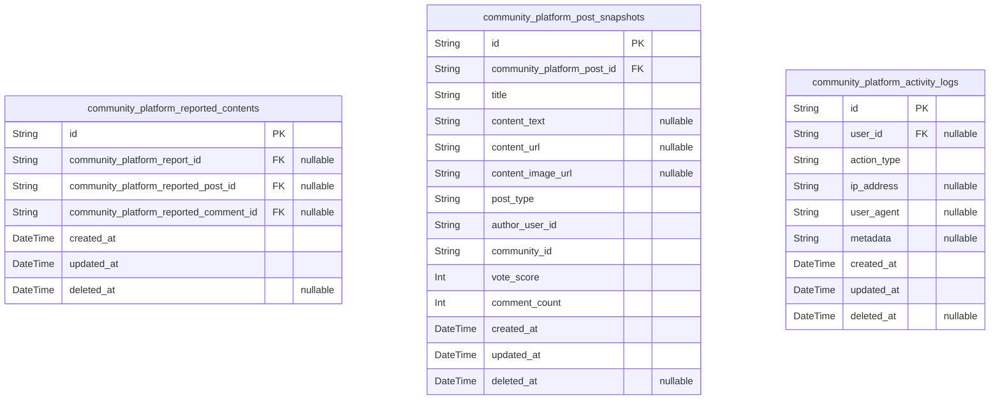
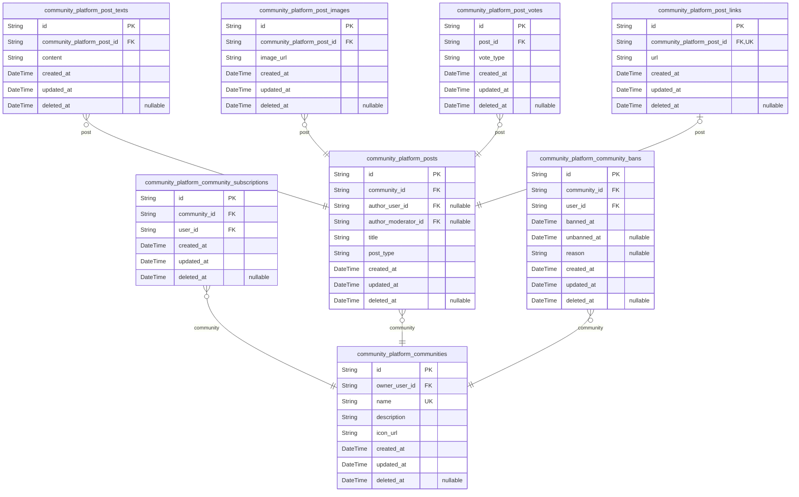
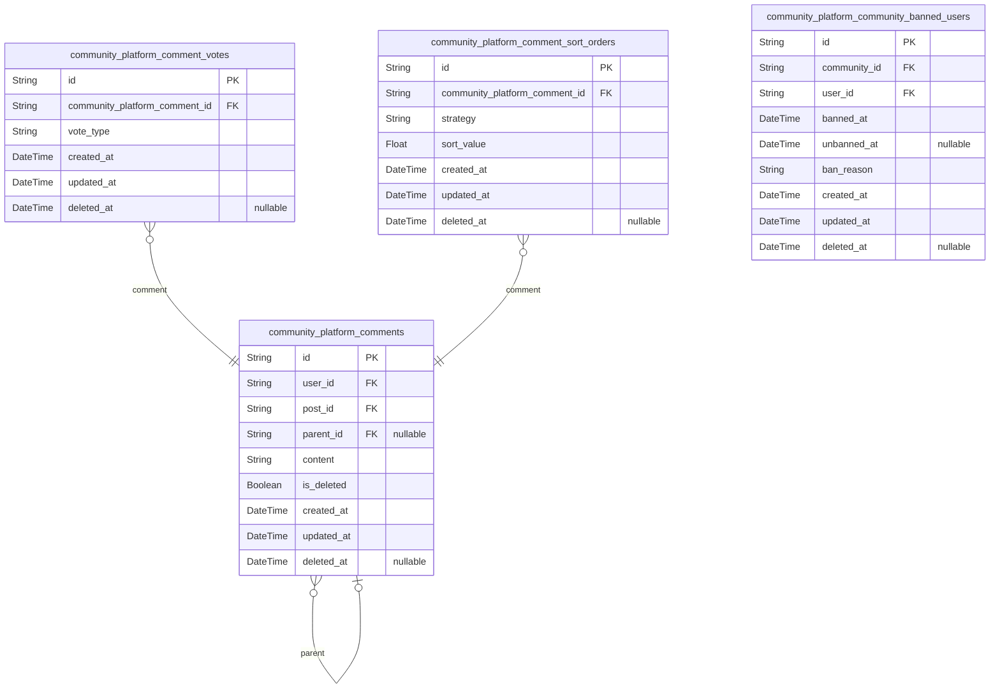
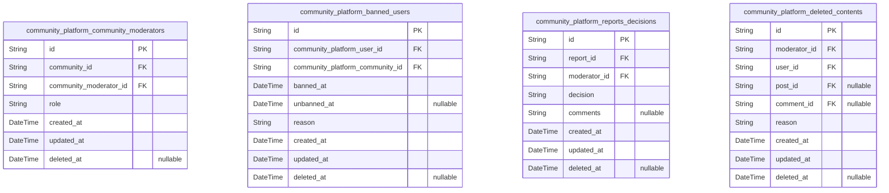
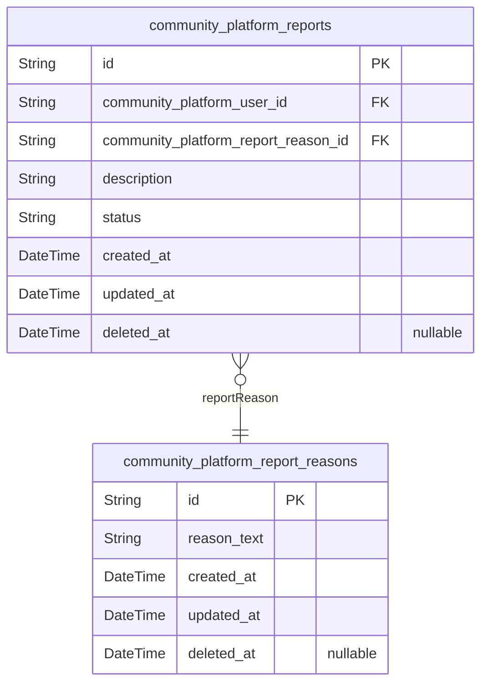

# Prisma Markdown

> Generated by [`prisma-markdown`](https://github.com/samchon/prisma-markdown)

- [Actors](#actors)
- [Systematic](#systematic)
- [Communities](#communities)
- [Posts](#posts)
- [Comments](#comments)
- [Moderation](#moderation)
- [Reporting](#reporting)

## Actors

```mermaid
erDiagram
"community_platform_guests" {
  String id PK
  String device_fingerprint UK
  DateTime created_at
  DateTime updated_at
  DateTime deleted_at "nullable"
}
"community_platform_guest_sessions" {
  String id PK
  String guest_id FK
  String ip
  String href
  String referrer
  DateTime expired_at
  DateTime created_at
  DateTime updated_at
  DateTime deleted_at "nullable"
}
"community_platform_users" {
  String id PK
  String email UK
  String password_hash
  String username UK
  String display_name
  String bio "nullable"
  String avatar_url "nullable"
  Int karma
  DateTime created_at
  DateTime updated_at
  DateTime deleted_at "nullable"
}
"community_platform_user_sessions" {
  String id PK
  String user_id FK
  String ip
  String href
  String referrer
  DateTime created_at
  DateTime expired_at
  DateTime deleted_at "nullable"
}
"community_platform_user_password_resets" {
  String id PK
  String community_platform_user_id FK
  String token UK
  DateTime expires_at
  Boolean used
  DateTime created_at
  DateTime updated_at
  DateTime deleted_at "nullable"
}
"community_platform_user_email_verifications" {
  String id PK
  String user_id FK
  String token UK
  Boolean is_verified
  DateTime expires_at
  DateTime created_at
  DateTime updated_at
  DateTime deleted_at "nullable"
}
"community_platform_moderators" {
  String id PK
  String email UK
  String password_hash
  String username UK
  String display_name "nullable"
  String bio "nullable"
  String avatar_url "nullable"
  Int karma
  DateTime created_at
  DateTime updated_at
  DateTime deleted_at "nullable"
}
"community_platform_moderator_sessions" {
  String id PK
  String community_platform_moderator_id FK
  String ip
  String href
  String referrer
  DateTime created_at
  DateTime expired_at
}
"community_platform_moderator_password_resets" {
  String id PK
  String community_platform_moderator_id FK
  String token UK
  DateTime expired_at
  DateTime created_at
  DateTime updated_at
  DateTime deleted_at "nullable"
}
"community_platform_moderator_email_verifications" {
  String id PK
  String community_platform_moderator_id FK
  String token UK
  String email
  String ip
  DateTime used_at "nullable"
  DateTime expired_at
  DateTime created_at
  DateTime updated_at
  DateTime deleted_at "nullable"
}
"community_platform_admins" {
  String id PK
  String email UK
  String password_hash
  String display_name
  String bio "nullable"
  String avatar_url "nullable"
  DateTime created_at
  DateTime updated_at
  DateTime deleted_at "nullable"
}
"community_platform_admin_sessions" {
  String id PK
  String admin_id FK
  String ip
  String href
  String referrer
  DateTime created_at
  DateTime expired_at
}
"community_platform_admin_password_resets" {
  String id PK
  String community_platform_admin_id FK
  String token UK
  DateTime expires_at
  Boolean used
  DateTime created_at
  DateTime updated_at
  DateTime deleted_at "nullable"
}
"community_platform_admin_email_verifications" {
  String id PK
  String admin_id FK
  String token UK
  DateTime expires_at
  DateTime created_at
  DateTime updated_at
  DateTime deleted_at "nullable"
}
"community_platform_guest_sessions" }o--|| "community_platform_guests" : guest
"community_platform_user_sessions" }o--|| "community_platform_users" : user
"community_platform_user_password_resets" }o--|| "community_platform_users" : user
"community_platform_user_email_verifications" }o--|| "community_platform_users" : user
"community_platform_moderator_sessions" }o--|| "community_platform_moderators" : moderator
"community_platform_moderator_password_resets" }o--|| "community_platform_moderators" : moderator
"community_platform_moderator_email_verifications" }o--|| "community_platform_moderators" : moderator
"community_platform_admin_sessions" }o--|| "community_platform_admins" : admin
"community_platform_admin_password_resets" }o--|| "community_platform_admins" : admin
"community_platform_admin_email_verifications" }o--|| "community_platform_admins" : admin
```

### `community_platform_guests`

Temporary guest accounts identified by device fingerprint for limited
public access without credentials. These accounts enable limited browsing
and access without user authentication, supporting session management
separately in guest sessions table.

Properties as follows:

- `id`: Primary Key.
- `device_fingerprint`
  > Device fingerprint used to uniquely identify guest users without
  > credentials.
- `created_at`: Timestamp when the guest account was created.
- `updated_at`: Timestamp when the guest account was last updated.
- `deleted_at`: Timestamp for soft deletion of the guest account, if applicable.

### `community_platform_guest_sessions`

Session tokens for guest users to manage temporary access. Each session
record represents a single login event, storing connection metadata
including guest IP address, accessed URL (href), referrer URL, and
expiration timestamp. Belongs to the guest actor in the
community_platform_guests table.

Properties as follows:

- `id`: Primary Key.
- `guest_id`
  > Foreign key referencing guest user associated with the session. Links to
  > community_platform_guests.id.
- `ip`: IP address of the guest user during the session.
- `href`: URL accessed by the guest user in this session.
- `referrer`: HTTP referrer URL for this session.
- `expired_at`: Timestamp indicating when the session expires.
- `created_at`: Timestamp when the session was created.
- `updated_at`: Timestamp when the session was last updated.
- `deleted_at`: Soft delete timestamp if the session is deleted.

### `community_platform_users`

Registered user accounts with email/password credentials, profile
information such as display name, bio, and avatar URL, and authentication
data. This table represents individual users who can log in to the
community platform, manage their profiles, and participate in posting,
commenting, voting, and subscribing. Uniqueness is enforced on username
and email to ensure distinct accounts. The karma score tracks the user's
reputation based on voting interactions. Soft deletion is supported via
the deleted_at field.

Properties as follows:

- `id`: Primary Key.
- `email`: User's unique email address used for login and communication.
- `password_hash`: Hashed password for secure authentication.
- `username`: Unique username chosen by the user for identification and display.
- `display_name`: User's display name for profile and public visibility.
- `bio`: User's biography text shown on profile pages.
- `avatar_url`: URL of the user's avatar image.
- `karma`: User's karma score representing reputation based on votes.
- `created_at`: Timestamp when the user account was created.
- `updated_at`: Timestamp when the user account information was last updated.
- `deleted_at`: Timestamp when the user account was soft deleted.

### `community_platform_user_sessions`

Session tokens for authenticated users managing JWT access and refresh
tokens. Records connection metadata such as IP address, URL visited,
referrer, and tracks session lifecycle with creation and expiration
timestamps. This table links to the main user actor table
community_platform_users.id and supports secure session management and
auditing.

Properties as follows:

- `id`: Primary Key.
- `user_id`: Referenced user's [community_platform_users.id](#community_platform_users).
- `ip`: IP address of the user's session connection.
- `href`: URL visited in the session.
- `referrer`: HTTP referrer header for the session.
- `created_at`: Timestamp when the session was created.
- `expired_at`: Timestamp when the session expires.
- `deleted_at`: Timestamp when the session was soft deleted; null if active.

### `community_platform_user_password_resets`

Password reset tokens for users with expiration and security controls,
used to securely manage credential recovery and reset workflows.

Properties as follows:

- `id`: Primary Key.
- `community_platform_user_id`
  > Referenced user's [community_platform_users.id](#community_platform_users) for whom the reset
  > token is issued.
- `token`: Unique reset token string used for password recovery verification.
- `expires_at`: Expiration date and time of the reset token.
- `used`: Indicates whether the token has already been used for password reset.
- `created_at`: Record creation timestamp.
- `updated_at`: Record last update timestamp.
- `deleted_at`: Soft delete timestamp.

### `community_platform_user_email_verifications`

Email verification tokens for user email confirmation during
registration. Stores unique token strings used to verify user emails,
their expiration times, verification status, and standard timestamps.
Connected to users table via a required foreign key to track ownership
and validity.

Properties as follows:

- `id`: Primary Key.
- `user_id`: Belonged user's [community_platform_users.id](#community_platform_users).
- `token`: Unique verification token string used for email confirmation.
- `is_verified`: Flag indicating whether the email token has been used to verify the user.
- `expires_at`: Timestamp when the token expires and becomes invalid.
- `created_at`: Record creation timestamp.
- `updated_at`: Record last update timestamp.
- `deleted_at`: Soft delete timestamp; if set, the record is considered deleted.

### `community_platform_moderators`

Registered moderator accounts with email/password credentials and profile
information including display name, bio, avatar URL, and karma score.
This table manages authenticated moderators who have elevated permissions
within communities for content moderation and user management.

Properties as follows:

- `id`: Primary Key.
- `email`: Unique email address used for login authentication.
- `password_hash`: Hashed password for secure authentication.
- `username`: Unique username chosen by the moderator.
- `display_name`: Moderator's display name shown publicly.
- `bio`: Short biography or profile description of the moderator.
- `avatar_url`: URL to the moderator's avatar image.
- `karma`
  > Aggregated karma score reflecting the moderator's contribution and
  > reputation.
- `created_at`: Record creation timestamp.
- `updated_at`: Record last update timestamp.
- `deleted_at`: Timestamp marking soft deletion; null if active.

### `community_platform_moderator_sessions`

Session tokens for moderators managing JWT access and refresh tokens.
Tracks connection metadata including IP address, request URL, and
referrer. Each session is uniquely assigned to a moderator account.

Properties as follows:

- `id`: Primary Key.
- `community_platform_moderator_id`: Belonged moderator's [community_platform_moderators.id](#community_platform_moderators).
- `ip`: IP address of the client that established the session.
- `href`: Request URL of the client that established the session.
- `referrer`: Referrer URL that led to the session creation.
- `created_at`: Timestamp when the session was created.
- `expired_at`: Timestamp when the session expires.

### `community_platform_moderator_password_resets`

Password reset tokens for moderators with expiration and security
controls. This table stores unique tokens used for password recovery
processes for moderator accounts, linking each token to a specific
moderator via foreign key. Ensures token uniqueness and tracks expiration
times to maintain security. Soft-deletion is supported for token
invalidation without data loss.

Properties as follows:

- `id`: Primary Key.
- `community_platform_moderator_id`
  > The moderator associated with this password reset token. {@link
  > community_platform_moderators.id}
- `token`: Unique password reset token string used for verification.
- `expired_at`
  > Expiration timestamp of the password reset token, after which the token
  > is invalid.
- `created_at`: Record creation timestamp.
- `updated_at`: Record last update timestamp.
- `deleted_at`: Soft deletion timestamp, null if the record is active.

### `community_platform_moderator_email_verifications`

Email verification tokens for moderator email confirmation during
registration. Stores unique token values and references the moderator
account. Used to verify email ownership during the registration or email
change process.

Properties as follows:

- `id`: Primary Key.
- `community_platform_moderator_id`: Belonged moderator's [community_platform_moderators.id](#community_platform_moderators).
- `token`: Unique token string used for email verification.
- `email`: The email address to verify.
- `ip`: IP address from which verification was requested.
- `used_at`: Timestamp when the token was used for verification.
- `expired_at`: Timestamp when the token expires and is no longer valid.
- `created_at`: Creation timestamp.
- `updated_at`: Last update timestamp.
- `deleted_at`: Soft deletion timestamp, if the record is logically deleted.

### `community_platform_admins`

Administrator accounts with elevated privileges and secure authentication
credentials. This table stores essential login information, profile data,
and timestamps for lifecycle management of admin users.

Properties as follows:

- `id`: Primary Key.
- `email`: Unique email address used for login authentication.
- `password_hash`: Hashed password for securing admin account credentials.
- `display_name`: The display name of the administrator shown publicly.
- `bio`: Optional biography text describing the administrator.
- `avatar_url`: Optional URL to the administrator's avatar image.
- `created_at`: Record creation timestamp.
- `updated_at`: Record last update timestamp.
- `deleted_at`: Soft deletion timestamp to mark record as deleted.

### `community_platform_admin_sessions`

Session tokens for administrators managing JWT access and refresh tokens.
Tracks connection metadata such as IP address, requested URL, referrer,
and session expiration timing. Supports authentication lifecycle and
access auditing.

Properties as follows:

- `id`: Primary Key.
- `admin_id`: Belonged administrator's [community_platform_admins.id](#community_platform_admins).
- `ip`: Client IP address of the session origin.
- `href`: Requested URL or resource identifier during the session.
- `referrer`: HTTP referrer header value for the session request.
- `created_at`: Timestamp when the session was created.
- `expired_at`: Timestamp when the session is set to expire.

### `community_platform_admin_password_resets`

Password reset tokens for administrators enabling secure credential
recovery. Each token is tied to an admin account with expiration and
usage status for security auditing.

Properties as follows:

- `id`: Primary Key.
- `community_platform_admin_id`: Belonged administrator's [community_platform_admins.id](#community_platform_admins).
- `token`: Secure unique password reset token.
- `expires_at`: Expiration timestamp after which the token is invalid.
- `used`: Indicates whether the token has been used.
- `created_at`: Record creation timestamp.
- `updated_at`: Record last update timestamp.
- `deleted_at`: Soft delete timestamp for record removal without actual deletion.

### `community_platform_admin_email_verifications`

Email verification tokens for administrators confirming email identity
and validity. Each record associates a unique token with an administrator
account and tracks token expiration and creation timestamps. This table
supports the email verification flow during account registration or
security updates.

Properties as follows:

- `id`: Primary Key.
- `admin_id`: Administrator's [community_platform_admins.id](#community_platform_admins).
- `token`: Unique token string used for verifying the administrator's email address.
- `expires_at`: Expiration datetime of the verification token after which it is invalid.
- `created_at`: Timestamp when this verification token was created.
- `updated_at`: Timestamp when this verification token was last updated.
- `deleted_at`: Timestamp of soft deletion; null if the record is active.

## Systematic

```mermaid
erDiagram
"community_platform_reported_contents" {
  String id PK
  String community_platform_report_id FK "nullable"
  String community_platform_reported_post_id FK "nullable"
  String community_platform_reported_comment_id FK "nullable"
  DateTime created_at
  DateTime updated_at
  DateTime deleted_at "nullable"
}
"community_platform_post_snapshots" {
  String id PK
  String community_platform_post_id FK
  String title
  String content_text "nullable"
  String content_url "nullable"
  String content_image_url "nullable"
  String post_type
  String author_user_id
  String community_id
  Int vote_score
  Int comment_count
  DateTime created_at
  DateTime updated_at
  DateTime deleted_at "nullable"
}
"community_platform_activity_logs" {
  String id PK
  String user_id FK "nullable"
  String action_type
  String ip_address "nullable"
  String user_agent "nullable"
  String metadata "nullable"
  DateTime created_at
  DateTime updated_at
  DateTime deleted_at "nullable"
}
```

### `community_platform_reported_contents`

Link table associating reports to the content (posts or comments) they
are about. This table stores the relationship between a report and the
reported entity, supporting efficient querying and management of reported
content in the community platform.

Properties as follows:

- `id`: Primary Key.
- `community_platform_report_id`: The report entity's [community_platform_reports.id](#community_platform_reports).
- `community_platform_reported_post_id`
  > The reported post entity's [community_platform_posts.id](#community_platform_posts) if the
  > report is about a post.
- `community_platform_reported_comment_id`
  > The reported comment entity's [community_platform_comments.id](#community_platform_comments) if
  > the report is about a comment.
- `created_at`: Record creation timestamp.
- `updated_at`: Record last update timestamp.
- `deleted_at`: Soft deletion timestamp, if the link is logically removed.

### `community_platform_post_snapshots`

Snapshot table storing historical versions of posts for auditing
purposes. Contains denormalized post data to preserve post state at
snapshot time. References the original post. Supports soft deletion and
auditing timestamps.

Properties as follows:

- `id`: Primary Key.
- `community_platform_post_id`: Referenced original post's [community_platform_posts.id](#community_platform_posts).
- `title`: Post title at the snapshot time.
- `content_text`: Text content for text-type posts at the snapshot time.
- `content_url`: URL for link-type posts at the snapshot time.
- `content_image_url`: Image URL or path for image-type posts at the snapshot time.
- `post_type`: Post type at the snapshot time (e.g., text, link, image).
- `author_user_id`: User ID of the post author.
- `community_id`: ID of the community where the post was created.
- `vote_score`: Net vote score (upvotes minus downvotes) at the snapshot time.
- `comment_count`: Number of comments at the snapshot time.
- `created_at`: Snapshot creation timestamp.
- `updated_at`: Snapshot update timestamp.
- `deleted_at`: Soft delete timestamp if the snapshot was soft deleted.

### `community_platform_activity_logs`

Activity logs recording system and user actions for monitoring and auditing.

Stores details such as action type, user origin, timestamp, IP address,
user agent, and related metadata for security auditing and operational
monitoring.

Properties as follows:

- `id`: Primary Key.
- `user_id`: Originating user's [community_platform_users.id](#community_platform_users), if applicable.
- `action_type`
  > Type of activity action performed, e.g., login, logout, post_create,
  > comment_delete.
- `ip_address`: IP address from which the action originated, if available.
- `user_agent`: User agent string of the client performing the action, if available.
- `metadata`: Additional JSON-formatted metadata related to the activity.
- `created_at`: Timestamp when the activity log entry was created.
- `updated_at`: Timestamp when the activity log entry was last updated.
- `deleted_at`: Timestamp for soft deletion of the activity log entry, if applicable.

## Communities

```mermaid
erDiagram
"community_platform_communities" {
  String id PK
  String owner_user_id FK
  String name UK
  String description
  String icon_url
  DateTime created_at
  DateTime updated_at
  DateTime deleted_at "nullable"
}
"community_platform_community_subscriptions" {
  String id PK
  String community_id FK
  String user_id FK
  DateTime created_at
  DateTime updated_at
  DateTime deleted_at "nullable"
}
"community_platform_posts" {
  String id PK
  String community_id FK
  String author_user_id FK "nullable"
  String author_moderator_id FK "nullable"
  String title
  String post_type
  DateTime created_at
  DateTime updated_at
  DateTime deleted_at "nullable"
}
"community_platform_post_texts" {
  String id PK
  String community_platform_post_id FK
  String content
  DateTime created_at
  DateTime updated_at
  DateTime deleted_at "nullable"
}
"community_platform_post_images" {
  String id PK
  String community_platform_post_id FK
  String image_url
  DateTime created_at
  DateTime updated_at
  DateTime deleted_at "nullable"
}
"community_platform_post_votes" {
  String id PK
  String post_id FK
  String vote_type
  DateTime created_at
  DateTime updated_at
  DateTime deleted_at "nullable"
}
"community_platform_community_bans" {
  String id PK
  String community_id FK
  String user_id FK
  DateTime banned_at
  DateTime unbanned_at "nullable"
  String reason "nullable"
  DateTime created_at
  DateTime updated_at
  DateTime deleted_at "nullable"
}
"community_platform_post_links" {
  String id PK
  String community_platform_post_id FK,UK
  String url
  DateTime created_at
  DateTime updated_at
  DateTime deleted_at "nullable"
}
"community_platform_community_subscriptions" }o--|| "community_platform_communities" : community
"community_platform_posts" }o--|| "community_platform_communities" : community
"community_platform_post_texts" }o--|| "community_platform_posts" : post
"community_platform_post_images" }o--|| "community_platform_posts" : post
"community_platform_post_votes" }o--|| "community_platform_posts" : post
"community_platform_community_bans" }o--|| "community_platform_communities" : community
"community_platform_post_links" |o--|| "community_platform_posts" : post
```

### `community_platform_communities`

Communities created by users with unique names, detailed descriptions,
icons, and linked ownership. This table manages core community attributes
including ownership linkage to users for browsing and subscription
features.

Properties as follows:

- `id`: Primary Key.
- `owner_user_id`: The user who owns this community. References community_platform_users.id.
- `name`: Unique name identifying the community.
- `description`: Detailed description of the community purpose and topics.
- `icon_url`: Icon image URL representing the community visually.
- `created_at`: Timestamp when the community was created.
- `updated_at`: Timestamp of the last community update.
- `deleted_at`: Nullable timestamp for soft deletion; null if active.

### `community_platform_community_subscriptions`

User subscriptions to communities for managing subscription state and
posting permissions. Each record links a user to a community and tracks
subscription lifecycle timestamps. Uniqueness of (community_id, user_id)
is enforced to prevent duplicate subscriptions.

Properties as follows:

- `id`: Primary Key.
- `community_id`: Subscribed community's [community_platform_communities.id](#community_platform_communities).
- `user_id`: Subscribing user's [community_platform_users.id](#community_platform_users).
- `created_at`: Timestamp when the subscription was created.
- `updated_at`: Timestamp when the subscription was last updated.
- `deleted_at`
  > Timestamp when the subscription was soft-deleted (nullable for active
  > subscriptions).

### `community_platform_posts`

Posts created in communities with references to authors and post types.
Each post belongs to exactly one community and one author (either a user
or a moderator). Supports three post types: text, link, and image. The
table stores core post metadata and timestamps. Content is stored in
child tables depending on the type. This table enables management of
posts including creation, editing, deletion, and association with
community and authors.

Properties as follows:

- `id`: Primary Key.
- `community_id`: Belonged community's [community_platform_communities.id](#community_platform_communities).
- `author_user_id`
  > Post author's user id. Null if author is a moderator. {@link
  > community_platform_users.id}.
- `author_moderator_id`
  > Post author's moderator id. Null if author is a user. {@link
  > community_platform_moderators.id}.
- `title`: Title of the post.
- `post_type`: Type of the post: text, link, or image.
- `created_at`: When the post was created.
- `updated_at`: When the post was last updated.
- `deleted_at`: Soft deletion timestamp. Null if not deleted.

### `community_platform_post_texts`

This table stores the full text content of posts that are of the 'text'
type. It maintains referential integrity by linking to the primary posts
table via a foreign key, allowing separation of textual content from
other post types for efficient management and search.

Properties as follows:

- `id`: Primary Key.
- `community_platform_post_id`: Belonged post's [community_platform_posts.id](#community_platform_posts) for this text content.
- `content`
  > The full text content of the post. This field stores the actual textual
  > data of posts of type text.
- `created_at`: Timestamp when this text content record was created.
- `updated_at`: Timestamp when this text content record was last updated.
- `deleted_at`
  > Timestamp when this text content record was deleted for soft delete; null
  > if not deleted.

### `community_platform_post_images`

Uploaded images associated with image-type posts. Each image record
includes a URL referencing the uploaded image file and is linked to a
post via foreign key to community_platform_posts. Supports posts with
multiple images. Includes standard timestamps for record lifecycle
tracking and soft deletion.

Properties as follows:

- `id`: Primary Key.
- `community_platform_post_id`
  > Foreign key referencing the parent post in community_platform_posts
  > (community_platform_posts.id).
- `image_url`: URL of the uploaded image file associated with the post.
- `created_at`: Timestamp when the image record was created.
- `updated_at`: Timestamp when the image record was last updated.
- `deleted_at`: Timestamp for soft deletion; null if the record is active.

### `community_platform_post_votes`

Votes cast by users and moderators on posts indicating upvotes or
downvotes. This table stores individual vote records linked to specific
posts. It enables the core voting functionality by tracking user and
moderator votes with temporal audit fields and soft deletion support.

Properties as follows:

- `id`: Primary Key.
- `post_id`: Target post's [community_platform_posts.id](#community_platform_posts).
- `vote_type`: Indicates whether the vote is an upvote or a downvote.
- `created_at`: Timestamp when the vote was created.
- `updated_at`: Timestamp when the vote was last updated.
- `deleted_at`: Timestamp when the vote was soft deleted (nullable).

### `community_platform_community_bans`

Records users banned from communities, forbidding posting or commenting
while permitting read access. Supports ban period tracking, reasons, and
references to both user and community entities for moderation control.

Properties as follows:

- `id`: Primary Key.
- `community_id`: Belongs to community's [community_platform_communities.id](#community_platform_communities).
- `user_id`: Belongs to banned user's [community_platform_users.id](#community_platform_users).
- `banned_at`: Timestamp when the ban was applied.
- `unbanned_at`: Timestamp when the ban was lifted; null if still banned.
- `reason`: Optional reason for the ban, provided by a moderator.
- `created_at`: Record creation timestamp.
- `updated_at`: Record last update timestamp.
- `deleted_at`: Soft delete timestamp for ban records.

### `community_platform_post_links`

Detailed link content with URL for link-type posts. Represents URL
destination for posts of type link. References the main post entity
[community_platform_posts.id](#community_platform_posts) for association.

Properties as follows:

- `id`: Primary Key.
- `community_platform_post_id`: Referenced post's [community_platform_posts.id](#community_platform_posts).
- `url`: URL destination for the link post, must be valid URL.
- `created_at`: Record creation timestamp.
- `updated_at`: Record last update timestamp.
- `deleted_at`: Soft deletion timestamp, null if not deleted.

## Posts

```mermaid
erDiagram
"community_platform_post_vote_of_users" {
  String id PK
  String post_vote_id FK
  String user_id FK
  String vote_type
  DateTime created_at
  DateTime updated_at
  DateTime deleted_at "nullable"
}
"community_platform_post_vote_of_moderators" {
  String id PK
  String community_platform_moderator_id FK
  String community_platform_post_vote_id FK
  String vote_type
  DateTime created_at
  DateTime updated_at
  DateTime deleted_at "nullable"
}
"community_platform_post_comments" {
  String id PK
  String post_id FK
  String user_id FK
  String parent_comment_id FK "nullable"
  String content_text
  DateTime created_at
  DateTime updated_at
  DateTime deleted_at "nullable"
}
"community_platform_comment_vote_of_users" {
  String id PK
  String community_platform_comment_id FK
  String community_platform_user_id FK
  String vote_type
  DateTime created_at
  DateTime updated_at
  DateTime deleted_at "nullable"
}
"community_platform_comment_vote_of_moderators" {
  String id PK
  String comment_vote_id FK
  String moderator_id FK
  Int vote
  DateTime created_at
  DateTime updated_at
  DateTime deleted_at "nullable"
}
"community_platform_post_reports" {
  String id PK
  String community_platform_user_id FK
  String community_platform_post_id FK
  String reason
  String status
  DateTime created_at
  DateTime updated_at
  DateTime deleted_at "nullable"
}
"community_platform_comment_reports" {
  String id PK
  String comment_id FK
  String reporter_user_id FK
  String report_reason_id FK "nullable"
  String status
  String description "nullable"
  DateTime created_at
  DateTime updated_at
  DateTime deleted_at "nullable"
}
"community_platform_moderation_logs" {
  String id PK
  String moderator_id FK
  String post_id FK "nullable"
  String comment_id FK "nullable"
  String action_type
  String action_details "nullable"
  DateTime created_at
  DateTime updated_at
  DateTime deleted_at "nullable"
}
"community_platform_post_comments" }o--o| "community_platform_post_comments" : parentComment
```

### `community_platform_post_vote_of_users`

Stores votes cast by registered users on posts. Each record links a user
vote to a post vote entity for detailed vote tracking and analytics.

Properties as follows:

- `id`: Primary Key.
- `post_vote_id`
  > The associated post vote entity's id. {@link
  > community_platform_post_votes.id}
- `user_id`: Voting user's id. [community_platform_users.id](#community_platform_users)
- `vote_type`: Type of vote cast (e.g., 'upvote' or 'downvote').
- `created_at`: Timestamp when the vote was created.
- `updated_at`: Timestamp when the vote was last updated.
- `deleted_at`: Timestamp when the vote was soft deleted, null if not deleted.

### `community_platform_post_vote_of_moderators`

Stores moderator votes on posts linked to the main post vote entity. Each
record represents a vote cast by a moderator on a specific post vote,
capturing whether it is an upvote or downvote, with timestamps and soft
deletion support.

Properties as follows:

- `id`: Primary Key.
- `community_platform_moderator_id`: Moderator casting the vote, referencing community_platform_moderators.id.
- `community_platform_post_vote_id`
  > Reference to the main post vote entity, linking this moderator vote to
  > the overall post vote record.
- `vote_type`: Type of vote cast by the moderator; either upvote or downvote.
- `created_at`: Timestamp when this vote was created.
- `updated_at`: Timestamp when this vote was last updated.
- `deleted_at`: Soft delete timestamp; null if not deleted.

### `community_platform_post_comments`

Stores user comments on posts including nested structure via parent
comment relationship. Each comment belongs to a post and an author user.
Supports unlimited nested replies through the parent_comment_id foreign
key referencing other comments in the same table. Includes soft delete
via deleted_at.

Properties as follows:

- `id`: Primary Key.
- `post_id`: Belonged post's [community_platform_posts.id](#community_platform_posts).
- `user_id`: Authoring user's [community_platform_users.id](#community_platform_users).
- `parent_comment_id`
  > Parent comment's [community_platform_post_comments.id](#community_platform_post_comments) for nested
  > replies. Nullable for top-level comments.
- `content_text`: The textual content of the comment.
- `created_at`: Timestamp of comment creation.
- `updated_at`: Timestamp of last update to the comment.
- `deleted_at`: Timestamp of comment deletion for soft delete.

### `community_platform_comment_vote_of_users`

Stores individual votes made by users on comments within the platform.
Each record represents a single user's vote (upvote or downvote) on a
specific comment. This entity supports the comment voting system and
helps calculate vote scores and user karma.

Properties as follows:

- `id`: Primary Key.
- `community_platform_comment_id`: Reference to the comment voted on. [community_platform_comments.id](#community_platform_comments)
- `community_platform_user_id`
  > Reference to the user who cast the vote. {@link
  > community_platform_users.id}
- `vote_type`
  > Type of vote cast by the user, e.g., 'upvote' or 'downvote'. Used for
  > calculating vote scores and karma adjustments.
- `created_at`: Timestamp when the vote was created.
- `updated_at`: Timestamp when the vote was last updated.
- `deleted_at`: Timestamp for soft deletion; null if vote is active.

### `community_platform_comment_vote_of_moderators`

Stores moderator votes on comments linked to the main comment vote
entity, capturing moderators' upvote or downvote actions on specific
comments. Ensures each moderator can vote once per comment vote entity.

Properties as follows:

- `id`: Primary Key.
- `comment_vote_id`
  > Referenced comment vote entity's {@link
  > community_platform_comment_votes.id}.
- `moderator_id`: Voter moderator's [community_platform_moderators.id](#community_platform_moderators).
- `vote`: Vote value: +1 for upvote, -1 for downvote.
- `created_at`: Timestamp when the vote was cast.
- `updated_at`: Timestamp when the vote was last updated.
- `deleted_at`: Soft delete timestamp, null if active.

### `community_platform_post_reports`

Stores reports made by users on posts, including reporting user, target
post, reason for report, current status, and timestamps for tracking
lifecycle and moderation actions.

Properties as follows:

- `id`: Primary Key.
- `community_platform_user_id`
  > Reporting user. References the reporter's {@link
  > community_platform_users.id}.
- `community_platform_post_id`
  > Reported post. References the reported post's {@link
  > community_platform_posts.id}.
- `reason`
  > Detailed reason text provided by the reporting user for submitting this
  > report.
- `status`
  > Current status of the report indicating moderation progress or
  > resolution. Possible values: "pending", "approved", "dismissed".
- `created_at`: Timestamp when the report was created.
- `updated_at`: Timestamp of the last update to the report.
- `deleted_at`: Timestamp marking soft deletion of the report record, if applicable.

### `community_platform_comment_reports`

Records reports for comments submitted by users with reason and status.
Enables moderators to track, review, and manage user-submitted reports on
comment content. Links to reporting user, target comment, and report
reason data. Supports moderation workflows for community content quality
assurance.

Properties as follows:

- `id`: Primary Key.
- `comment_id`: Target comment being reported. [community_platform_comments.id](#community_platform_comments)
- `reporter_user_id`: User who submitted the report. [community_platform_users.id](#community_platform_users)
- `report_reason_id`
  > Optional reference to a predefined report reason. {@link
  > community_platform_report_reasons.id}
- `status`: Current report status e.g. pending, approved, dismissed.
- `description`: Additional textual details about the report provided by the user.
- `created_at`: Timestamp when the report was created.
- `updated_at`: Timestamp when the report was last updated.
- `deleted_at`: Timestamp when the report was soft-deleted, if applicable.

### `community_platform_moderation_logs`

Logs of moderator actions performed on posts and comments for auditing
and community management, including metadata on action type, moderator,
target content, timestamps, and details.

Properties as follows:

- `id`: Primary Key.
- `moderator_id`
  > Moderator who performed the action. {@link
  > community_platform_moderators.id}
- `post_id`
  > Post on which the moderation action was performed. {@link
  > community_platform_posts.id}
- `comment_id`
  > Comment on which the moderation action was performed. {@link
  > community_platform_comments.id}
- `action_type`
  > Type of moderator action (e.g., delete_post, delete_comment, ban_user,
  > unban_user, approve_report, dismiss_report).
- `action_details`
  > Additional details about the moderation action, such as reason or
  > comments.
- `created_at`: Timestamp when the moderation action was recorded.
- `updated_at`: Timestamp when the moderation log was last updated.
- `deleted_at`: Soft delete timestamp to mark the log as deleted without physical removal.

## Comments

```mermaid
erDiagram
"community_platform_comments" {
  String id PK
  String user_id FK
  String post_id FK
  String parent_id FK "nullable"
  String content
  Boolean is_deleted
  DateTime created_at
  DateTime updated_at
  DateTime deleted_at "nullable"
}
"community_platform_comment_votes" {
  String id PK
  String community_platform_comment_id FK
  String vote_type
  DateTime created_at
  DateTime updated_at
  DateTime deleted_at "nullable"
}
"community_platform_comment_sort_orders" {
  String id PK
  String community_platform_comment_id FK
  String strategy
  Float sort_value
  DateTime created_at
  DateTime updated_at
  DateTime deleted_at "nullable"
}
"community_platform_community_banned_users" {
  String id PK
  String community_id FK
  String user_id FK
  DateTime banned_at
  DateTime unbanned_at "nullable"
  String ban_reason
  DateTime created_at
  DateTime updated_at
  DateTime deleted_at "nullable"
}
"community_platform_comments" }o--o| "community_platform_comments" : parent
"community_platform_comment_votes" }o--|| "community_platform_comments" : comment
"community_platform_comment_sort_orders" }o--|| "community_platform_comments" : comment
```

### `community_platform_comments`

Stores all comments and nested replies within the platform, supporting
unlimited depth through a self-referential parent_id field. Each comment
is linked to its author user and the post where it belongs. This table
supports editing, deletion (soft delete), and efficient querying via
indexes on foreign keys and timestamps.

Properties as follows:

- `id`: Primary Key.
- `user_id`: Author user of the comment. References community_platform_users.id.
- `post_id`
  > Post to which this comment belongs. References
  > community_platform_posts.id.
- `parent_id`
  > Parent comment for nested replies. Nullable for top-level comments.
  > References community_platform_comments.id.
- `content`: The textual content of the comment.
- `is_deleted`: Flag indicating whether the comment has been deleted (soft delete).
- `created_at`: Timestamp when the comment was created.
- `updated_at`: Timestamp when the comment was last updated.
- `deleted_at`: Timestamp when the comment was deleted. Null if not deleted.

### `community_platform_comment_votes`

Stores vote records on comments, enabling users or moderators to upvote
or downvote each comment once. The main table links individual votes to
comments, separating voter types via subtype child tables for users and
moderators.

Properties as follows:

- `id`: Primary Key.
- `community_platform_comment_id`
  > The comment that this vote is associated with. {@link
  > community_platform_comments.id}
- `vote_type`: The type of vote, either upvote or downvote.
- `created_at`: Timestamp when the vote was created.
- `updated_at`: Timestamp when the vote was last updated.
- `deleted_at`: Timestamp when the vote was soft deleted, null if active.

### `community_platform_comment_sort_orders`

Stores sorting metadata for comments in the community platform to support
various comment sorting strategies such as best, new, and controversial.
Each record links to a specific comment and stores the strategy type and
its corresponding sort value to enable efficient sorting and filtering of
comments based on user-selected criteria.

Properties as follows:

- `id`: Primary Key.
- `community_platform_comment_id`
  > Reference to the comment this sorting metadata applies to. Points to
  > community_platform_comments.id.
- `strategy`
  > Sorting strategy type (e.g., best, new, controversial) applied to this
  > comment.
- `sort_value`
  > Numeric value representing the sorting score for this comment according
  > to the chosen strategy.
- `created_at`: Record creation timestamp.
- `updated_at`: Record last updated timestamp.
- `deleted_at`: Soft delete timestamp, null if not deleted.

### `community_platform_community_banned_users`

Stores information about users banned in each community, preventing
posting or commenting privileges while allowing read-only access. Tracks
ban and unban timestamps with reasons to support community moderation
workflows.

Properties as follows:

- `id`: Primary Key.
- `community_id`: The associated community's [community_platform_communities.id](#community_platform_communities).
- `user_id`: The banned user's [community_platform_users.id](#community_platform_users).
- `banned_at`: Timestamp when the user was banned from the community.
- `unbanned_at`: Timestamp when the user was unbanned, if applicable.
- `ban_reason`: Reason provided for banning the user.
- `created_at`: Record creation timestamp.
- `updated_at`: Record last update timestamp.
- `deleted_at`: Record soft deletion timestamp if the ban record is soft-deleted.

## Moderation

```mermaid
erDiagram
"community_platform_community_moderators" {
  String id PK
  String community_id FK
  String community_moderator_id FK
  String role
  DateTime created_at
  DateTime updated_at
  DateTime deleted_at "nullable"
}
"community_platform_banned_users" {
  String id PK
  String community_platform_user_id FK
  String community_platform_community_id FK
  DateTime banned_at
  DateTime unbanned_at "nullable"
  String reason
  DateTime created_at
  DateTime updated_at
  DateTime deleted_at "nullable"
}
"community_platform_reports_decisions" {
  String id PK
  String report_id FK
  String moderator_id FK
  String decision
  String comments "nullable"
  DateTime created_at
  DateTime updated_at
  DateTime deleted_at "nullable"
}
"community_platform_deleted_contents" {
  String id PK
  String moderator_id FK
  String user_id FK
  String post_id FK "nullable"
  String comment_id FK "nullable"
  String reason
  DateTime created_at
  DateTime updated_at
  DateTime deleted_at "nullable"
}
```

### `community_platform_community_moderators`

Community-level moderation roles and assignments, distinguishing owners
and moderators. Each record represents a moderator or owner assigned to a
specific community with role information and timestamps for auditing.
Ensures only one owner per community and supports multiple moderators.

Properties as follows:

- `id`: Primary Key.
- `community_id`: The related community's [community_platform_communities.id](#community_platform_communities).
- `community_moderator_id`: The assigned moderator's [community_platform_moderators.id](#community_platform_moderators).
- `role`
  > Role type indicating whether the assigned user is 'owner' or 'moderator'
  > for the community.
- `created_at`: Timestamp when the role assignment was created.
- `updated_at`: Timestamp when the role assignment was last updated.
- `deleted_at`: Timestamp when the role assignment was soft deleted, if applicable.

### `community_platform_banned_users`

List of users banned in specific communities, including ban and unban
timestamps and reasons. Maintains references to users and communities
with auditing timestamps for creation, updates, and soft deletion.

Properties as follows:

- `id`: Primary Key.
- `community_platform_user_id`: Reference to the banned user's [community_platform_users.id](#community_platform_users).
- `community_platform_community_id`
  > Reference to the community's [community_platform_communities.id](#community_platform_communities)
  > where the ban applies.
- `banned_at`: Timestamp when the user was banned from the community.
- `unbanned_at`
  > Timestamp when the user was unbanned. Null if the user is currently
  > banned.
- `reason`: Reason text explaining why the user was banned.
- `created_at`: Record creation timestamp.
- `updated_at`: Record last update timestamp.
- `deleted_at`: Soft delete timestamp. Null if the ban record is active.

### `community_platform_reports_decisions`

Table capturing community moderators' decision actions on user reports,
including approval or dismissal status, comments, and timestamps for
auditing moderation workflows. Links to the original report and
responsible moderator.

Properties as follows:

- `id`: Primary Key.
- `report_id`: The linked user report's [community_platform_reports.id](#community_platform_reports).
- `moderator_id`
  > The moderator who made the decision's {@link
  > community_platform_moderators.id}.
- `decision`: The decision on the report: either 'approved' or 'dismissed'.
- `comments`: Optional comments provided by the moderator regarding the decision.
- `created_at`: Timestamp when the decision was created.
- `updated_at`: Timestamp when the decision was last updated.
- `deleted_at`: Timestamp when the decision was soft deleted, if applicable.

### `community_platform_deleted_contents`

Log of deleted posts or comments by moderators, capturing who deleted
what content and the reason, with timestamps for audit and accountability
purposes.

Properties as follows:

- `id`: Primary Key.
- `moderator_id`
  > Moderator who performed the delete action. {@link
  > community_platform_moderators.id}
- `user_id`: Owner user of the deleted content. [community_platform_users.id](#community_platform_users)
- `post_id`
  > The post that was deleted, if applicable. {@link
  > community_platform_posts.id}
- `comment_id`
  > The comment that was deleted, if applicable. {@link
  > community_platform_comments.id}
- `reason`: Reason for deletion provided by the moderator.
- `created_at`: Timestamp when the deletion record was created.
- `updated_at`: Timestamp when the deletion record was last updated.
- `deleted_at`: Soft deletion timestamp.

## Reporting

```mermaid
erDiagram
"community_platform_reports" {
  String id PK
  String community_platform_user_id FK
  String community_platform_report_reason_id FK
  String description
  String status
  DateTime created_at
  DateTime updated_at
  DateTime deleted_at "nullable"
}
"community_platform_report_reasons" {
  String id PK
  String reason_text
  DateTime created_at
  DateTime updated_at
  DateTime deleted_at "nullable"
}
"community_platform_reports" }o--|| "community_platform_report_reasons" : reportReason
```

### `community_platform_reports`

User reports on posts or comments capturing the report origin, target,
and status.

This primary table stores reports submitted by users regarding posts or
comments, including the reporter identity, the reported content
reference, the reason for reporting linked to predefined report reasons,
and the current status of the report process.

Related entities include community_platform_reported_contents for content
reference and community_platform_report_reasons for reasons.

Supports moderation workflows for content review and action.

Properties as follows:

- `id`: Primary Key.
- `community_platform_user_id`: Reporting user. [community_platform_users.id](#community_platform_users).
- `community_platform_report_reason_id`: Report reason. [community_platform_report_reasons.id](#community_platform_report_reasons).
- `description`: Description detail provided by the reporting user.
- `status`: Status of the report in moderation workflow.
- `created_at`: Creation timestamp.
- `updated_at`: Last update timestamp.
- `deleted_at`: Soft delete timestamp, null if not deleted.

### `community_platform_report_reasons`

Textual reasons and details provided by users for reporting content.
Linked to user reports to capture the rationale behind content reporting,
enabling moderators to review and act upon reported issues.

Properties as follows:

- `id`: Primary Key.
- `reason_text`
  > The textual reason provided by the user explaining why the content was
  > reported.
- `created_at`: Timestamp when the reason was created.
- `updated_at`: Timestamp when the reason was last updated.
- `deleted_at`: Timestamp when the reason was deleted, for soft delete.
