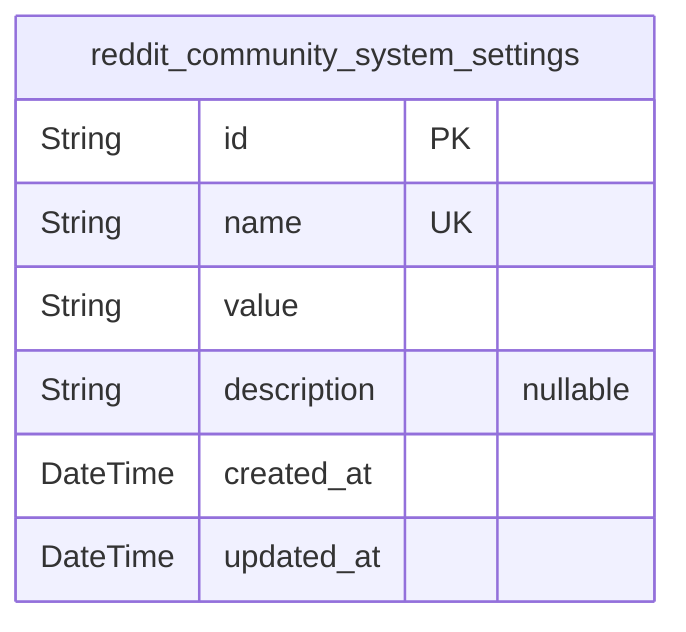
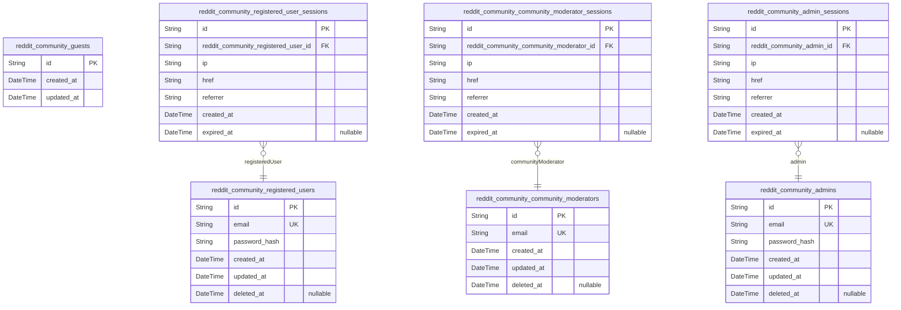
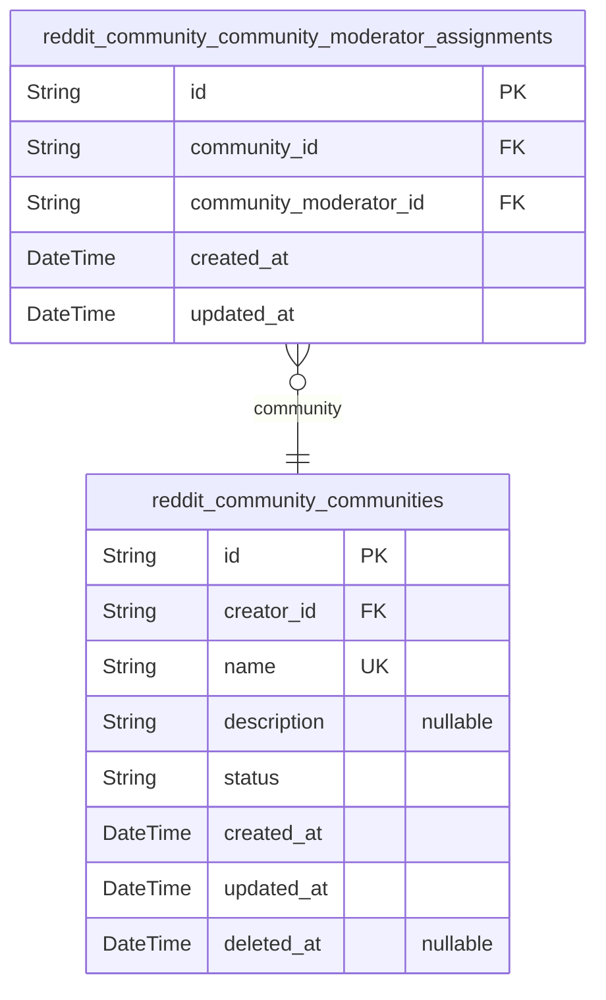
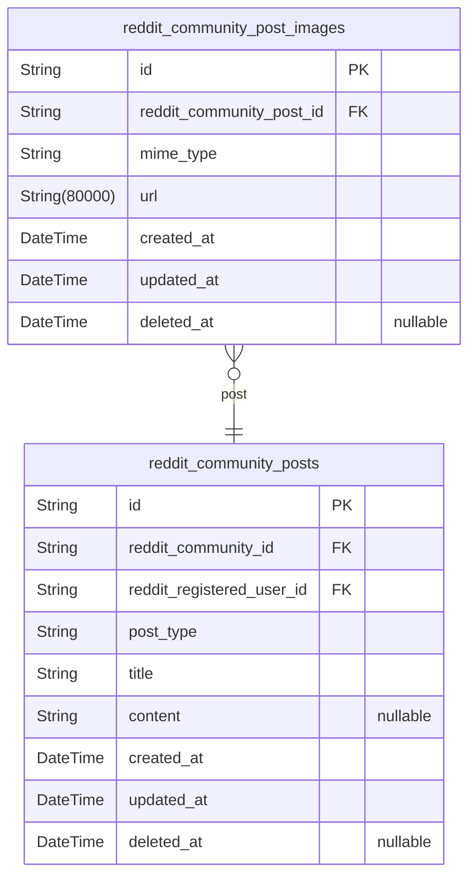
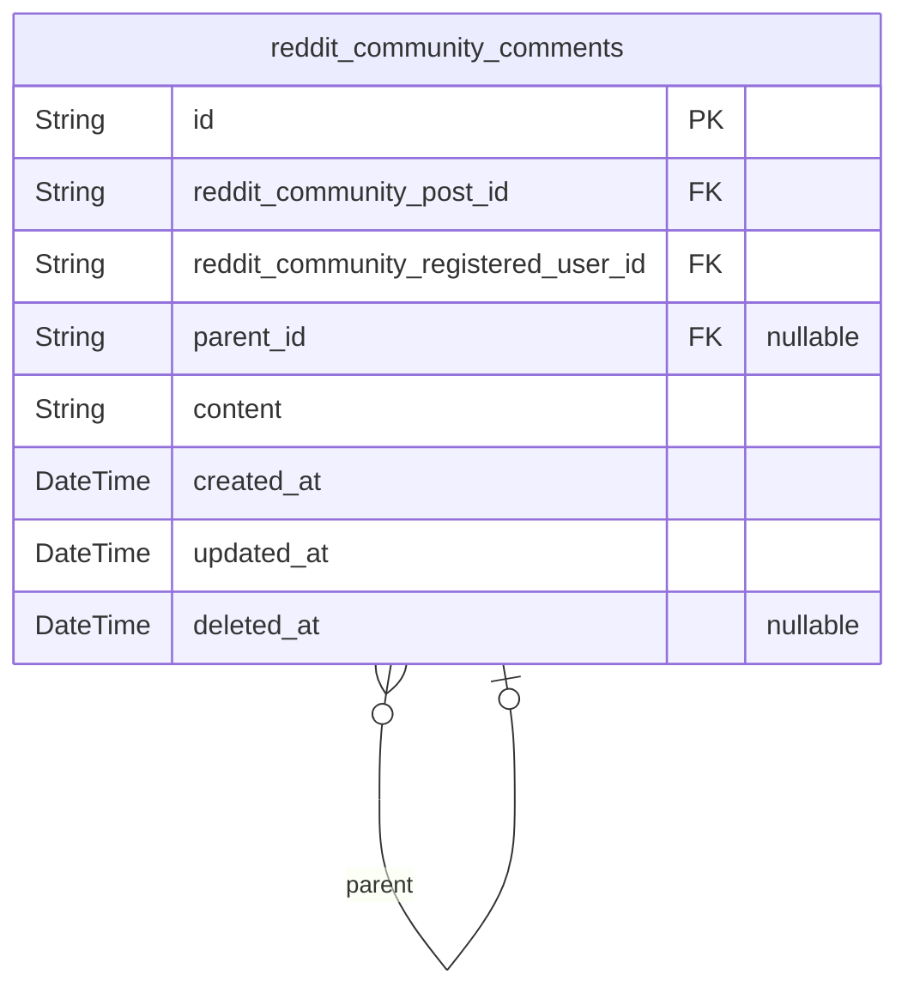
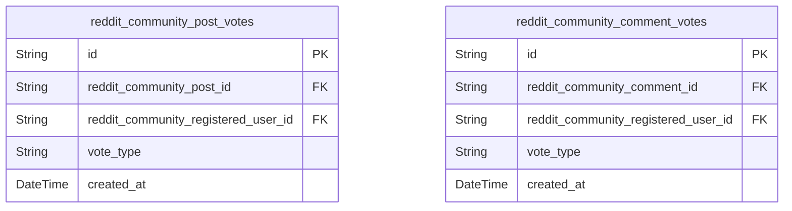
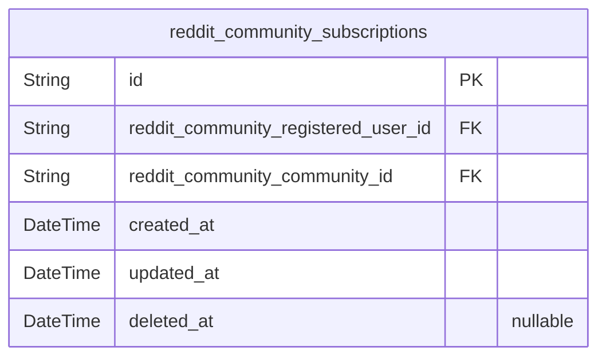
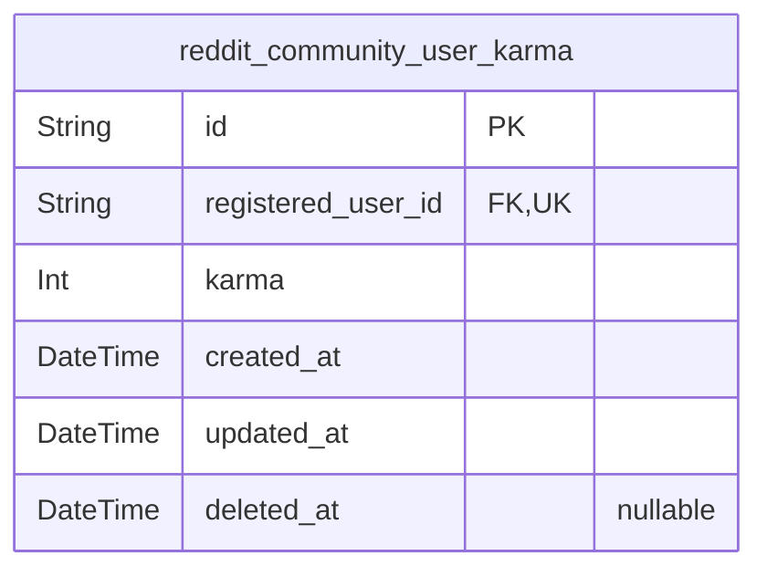
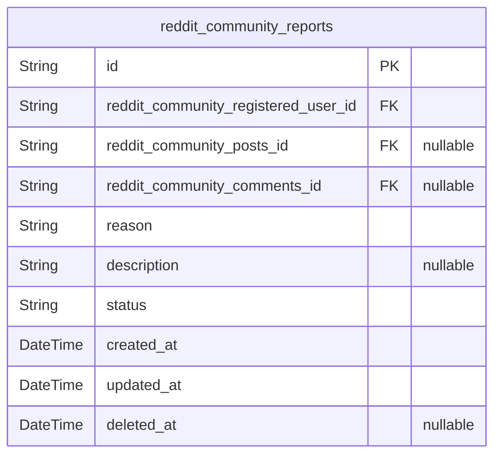

# Prisma Markdown

> Generated by [`prisma-markdown`](https://github.com/samchon/prisma-markdown)

- [Systematic](#systematic)
- [Actors](#actors)
- [Communities](#communities)
- [Posts](#posts)
- [Comments](#comments)
- [Votes](#votes)
- [Subscriptions](#subscriptions)
- [Karma](#karma)
- [Inquiries](#inquiries)

## Systematic

```mermaid
erDiagram
"reddit_community_system_settings" {
  String id PK
  String name UK
  String value
  String description "nullable"
  DateTime created_at
  DateTime updated_at
}
```

### `reddit_community_system_settings`

System-wide configuration settings for the redditCommunity platform.

This table stores individual configuration entries that govern
platform-wide behaviors and parameters. Each setting is uniquely
identified by a name and holds a string value representing the
configuration. Optional description provides human-readable explanation.

These settings are used by backend services to customize behavior without
hardcoding values. While typically few in number, enforcing uniqueness on
setting names prevents duplication.

Timestamps track creation and update times for auditability and change
tracking. No soft deletion is supported as settings are expected to be
actively maintained.

This model has a primary stance as a main business entity for platform
configuration management and API access.

Properties as follows:

- `id`: Primary Key.
- `name`: Unique name identifying the system setting. Used as a configuration key.
- `value`: String value associated with the system setting.
- `description`: Optional human-readable explanation of the setting's purpose or usage.
- `created_at`: Creation timestamp of the configuration record.
- `updated_at`: Last update timestamp of the configuration record.

## Actors

```mermaid
erDiagram
"reddit_community_guests" {
  String id PK
  DateTime created_at
  DateTime updated_at
}
"reddit_community_registered_users" {
  String id PK
  String email UK
  String password_hash
  DateTime created_at
  DateTime updated_at
  DateTime deleted_at "nullable"
}
"reddit_community_community_moderators" {
  String id PK
  String email UK
  DateTime created_at
  DateTime updated_at
  DateTime deleted_at "nullable"
}
"reddit_community_admins" {
  String id PK
  String email UK
  String password_hash
  DateTime created_at
  DateTime updated_at
  DateTime deleted_at "nullable"
}
"reddit_community_registered_user_sessions" {
  String id PK
  String reddit_community_registered_user_id FK
  String ip
  String href
  String referrer
  DateTime created_at
  DateTime expired_at "nullable"
}
"reddit_community_community_moderator_sessions" {
  String id PK
  String reddit_community_community_moderator_id FK
  String ip
  String href
  String referrer
  DateTime created_at
  DateTime expired_at "nullable"
}
"reddit_community_admin_sessions" {
  String id PK
  String reddit_community_admin_id FK
  String ip
  String href
  String referrer
  DateTime created_at
  DateTime expired_at "nullable"
}
"reddit_community_registered_user_sessions" }o--|| "reddit_community_registered_users" : registeredUser
"reddit_community_community_moderator_sessions" }o--|| "reddit_community_community_moderators" : communityModerator
"reddit_community_admin_sessions" }o--|| "reddit_community_admins" : admin
```

### `reddit_community_guests`

Guest user records representing unauthenticated visitors browsing the
platform.

Guests can only read public content and have no posting or voting
privileges. This table stores basic metadata about guest connections and
sessions for tracking purposes.

Properties as follows:

- `id`: Primary Key.
- `created_at`: Record creation timestamp.
- `updated_at`: Record last update timestamp.

### `reddit_community_registered_users`

Registered user accounts enabling platform participation including
posting, voting, commenting, and community creation.

Registered users have unique email addresses and securely stored password
hashes. They verify their emails before full access is granted. Soft
deletion allows account deactivation without physical removal.

Properties as follows:

- `id`: Primary Key.
- `email`: Unique email address used for authentication and notification.
- `password_hash`: Hashed password for secure authentication.
- `created_at`: Record creation timestamp.
- `updated_at`: Record last update timestamp.
- `deleted_at`: Timestamp marking soft deletion (account deactivation). Null if active.

### `reddit_community_community_moderators`

Community moderator accounts authorized to manage content and enforce
rules within assigned communities.

Moderators can moderate posts and comments, manage settings, and ban
users within their communities. Each moderator has a unique identifier
and associated email for authentication.

Properties as follows:

- `id`: Primary Key.
- `email`: Unique email address for moderator authentication and notifications.
- `created_at`: Record creation timestamp.
- `updated_at`: Record last update timestamp.
- `deleted_at`: Timestamp marking soft deletion. Null if moderator is active.

### `reddit_community_admins`

Administrative user accounts with full platform privileges for managing
users, content, and system settings.

Admins have unique emails and secure password hashes for authentication.
Soft delete functionality supports deactivation without data loss.

Properties as follows:

- `id`: Primary Key.
- `email`: Unique email address used for admin authentication and communication.
- `password_hash`: Hashed password for secure admin authentication.
- `created_at`: Record creation timestamp.
- `updated_at`: Record last update timestamp.
- `deleted_at`: Soft deletion timestamp indicating deactivation state.

### `reddit_community_registered_user_sessions`

Session records for registered users to track login sessions and
connection metadata.

Sessions maintain IP address, request URL, and referrer headers along
with creation and optional expiry timestamps.

Properties as follows:

- `id`: Primary Key.
- `reddit_community_registered_user_id`
  > Registered user associated with this session. {@link
  > reddit_community_registered_users.id}.
- `ip`: IP address of the user connection.
- `href`: URL accessed during the session.
- `referrer`: Referrer URL for the session.
- `created_at`: Session creation timestamp.
- `expired_at`: Session expiration timestamp. Null indicates active session.

### `reddit_community_community_moderator_sessions`

Session records for community moderators tracking login metadata and
activity.

Includes IP, URL, referrer, creation, and optional expiry to manage
active sessions securely.

Properties as follows:

- `id`: Primary Key.
- `reddit_community_community_moderator_id`
  > Community moderator associated with this session. {@link
  > reddit_community_community_moderators.id}.
- `ip`: IP address of the moderator session.
- `href`: URL accessed during the session.
- `referrer`: Referrer URL during the session.
- `created_at`: Session creation timestamp.
- `expired_at`: Optional expiration timestamp for session validity.

### `reddit_community_admin_sessions`

Session information for admin users to manage authentication state and
activity details.

Session records track IP, URL, referrer, creation, and optional
expiration timestamps to allow secure and manageable logins.

Properties as follows:

- `id`: Primary Key.
- `reddit_community_admin_id`
  > Admin user associated with this session. {@link
  > reddit_community_admins.id}.
- `ip`: IP address of the admin session.
- `href`: URL accessed during the session.
- `referrer`: Referrer URL tracked during the session.
- `created_at`: Session creation timestamp.
- `expired_at`: Optional expiration timestamp indicating session end.

## Communities

```mermaid
erDiagram
"reddit_community_communities" {
  String id PK
  String creator_id FK
  String name UK
  String description "nullable"
  String status
  DateTime created_at
  DateTime updated_at
  DateTime deleted_at "nullable"
}
"reddit_community_community_moderator_assignments" {
  String id PK
  String community_id FK
  String community_moderator_id FK
  DateTime created_at
  DateTime updated_at
}
"reddit_community_community_moderator_assignments" }o--|| "reddit_community_communities" : community
```

### `reddit_community_communities`

Communities represent thematic groups created by registered users to
organize discussions and content postings.

Each community has a unique and immutable name serving as its primary
business identifier. Communities track creation and update timestamps,
support soft deletion for audit trails, and have a status to reflect if
they are active or inactive.

Community moderators are assigned separately via the community moderator
assignments table, enabling flexible governance.

Users interact with communities by subscribing, posting, commenting, and
voting within the community scope.

Properties as follows:

- `id`: Primary Key.
- `creator_id`
  > The registered user who created the community. {@link
  > reddit_community_registered_users.id}.
- `name`: Unique community name, immutable after creation.
- `description`
  > Optional detailed description to inform users about the community's
  > purpose and rules.
- `status`
  > Current status of the community (e.g., 'active', 'inactive') indicating
  > availability or suspension.
- `created_at`: Community creation timestamp.
- `updated_at`: Timestamp of last update to the community.
- `deleted_at`: Soft deletion timestamp to allow recovery and audit trails.

### `reddit_community_community_moderator_assignments`

Links registered community moderators to the communities they manage,
establishing governance and administration relationships.

Each assignment associates one moderator with one community, supporting
multiple moderators per community and multiple community assignments per
moderator.

This table enforces referential integrity and supports auditing with
timestamps for assignment creation and update.

Assignments are managed indirectly through community and moderator
management functions.

Properties as follows:

- `id`: Primary Key.
- `community_id`
  > Reference to the community managed. {@link
  > reddit_community_communities.id}.
- `community_moderator_id`
  > Reference to the moderator assigned. {@link
  > reddit_community_community_moderators.id}.
- `created_at`: Assignment creation timestamp.
- `updated_at`: Timestamp of last update to the assignment.

## Posts

```mermaid
erDiagram
"reddit_community_posts" {
  String id PK
  String reddit_community_id FK
  String reddit_registered_user_id FK
  String post_type
  String title
  String content "nullable"
  DateTime created_at
  DateTime updated_at
  DateTime deleted_at "nullable"
}
"reddit_community_post_images" {
  String id PK
  String reddit_community_post_id FK
  String mime_type
  String(80000) url
  DateTime created_at
  DateTime updated_at
  DateTime deleted_at "nullable"
}
"reddit_community_post_images" }o--|| "reddit_community_posts" : post
```

### `reddit_community_posts`

Community posts containing text, link, or image content contributed by
registered users.

Each post belongs to a subreddit community and attributed to an author
(registered user). Posts support soft deletion for moderation and include
timestamps to support audit trails and user activity tracking.

Posts are core content entities within the redditCommunity platform,
referenced by comments, votes, subscriptions, and reports.

Properties as follows:

- `id`: Primary Key.
- `reddit_community_id`
  > Reference to the community this post belongs. {@link
  > reddit_community_communities.id}.
- `reddit_registered_user_id`
  > Reference to the registered user who authored the post. {@link
  > reddit_community_registered_users.id}.
- `post_type`: Type of the post content: text, link, or image.
- `title`: Title of the post.
- `content`: Optional content for text or link posts; nullable for image-only posts.
- `created_at`: Timestamp when the post was created.
- `updated_at`: Timestamp when the post was last updated.
- `deleted_at`: Timestamp when the post was soft deleted; null if active.

### `reddit_community_post_images`

Images associated with posts, supporting multiple images per post.

This table supports media handling separate from textual post content,
maintaining data normalization and compliance with size and format
constraints.

Each image record links to a post and includes the MIME type and URL for
retrieving the image. Soft deletion and timestamp tracking ensure audit
and moderation capabilities.

Properties as follows:

- `id`: Primary Key.
- `reddit_community_post_id`
  > Reference to the post owning this image. {@link
  > reddit_community_posts.id}.
- `mime_type`: MIME type of the image (e.g., image/jpeg, image/png).
- `url`: URL where the image is stored and accessible.
- `created_at`: Timestamp when the image was uploaded.
- `updated_at`: Timestamp when the image metadata was last updated.
- `deleted_at`: Timestamp when the image was soft deleted; null if active.

## Comments

```mermaid
erDiagram
"reddit_community_comments" {
  String id PK
  String reddit_community_post_id FK
  String reddit_community_registered_user_id FK
  String parent_id FK "nullable"
  String content
  DateTime created_at
  DateTime updated_at
  DateTime deleted_at "nullable"
}
"reddit_community_comments" }o--o| "reddit_community_comments" : parent
```

### `reddit_community_comments`

User comments on posts within communities, supporting nested replies up
to 5 levels.

This model stores text comments made by registered users on posts.
Comments support optional parent comment nesting to allow threaded
discussion up to 5 levels deep.

Comments belong to a single post and a single registered user, with
temporal tracking for creation, update, and soft delete capabilities.

Content length is limited to 1000 characters to ensure concise
communication.

The model enforces referential integrity with the posts and registered
users already defined in other components, and self-referential integrity
for comment nesting.

Properties as follows:

- `id`: Primary Key.
- `reddit_community_post_id`
  > Reference to the post that this comment belongs to. {@link
  > reddit_community_posts.id}.
- `reddit_community_registered_user_id`
  > Reference to the registered user who authored the comment. {@link
  > reddit_community_registered_users.id}.
- `parent_id`
  > Optional reference to a parent comment for nested replies, supporting up
  > to 5 levels. [reddit_community_comments.id](#reddit_community_comments).
- `content`
  > The text content of the comment, limited to 1000 characters for concise
  > replies.
- `created_at`: Timestamp when the comment was created.
- `updated_at`: Timestamp when the comment was last updated.
- `deleted_at`
  > Soft delete timestamp to mark comments as deleted without permanently
  > removing them.

## Votes

```mermaid
erDiagram
"reddit_community_post_votes" {
  String id PK
  String reddit_community_post_id FK
  String reddit_community_registered_user_id FK
  String vote_type
  DateTime created_at
}
"reddit_community_comment_votes" {
  String id PK
  String reddit_community_comment_id FK
  String reddit_community_registered_user_id FK
  String vote_type
  DateTime created_at
}
```

### `reddit_community_post_votes`

Post votes represent the upvote or downvote cast by registered users on
posts within communities.

Each vote references a specific post and the registered user who cast the
vote, along with the creation timestamp.

The unique constraint ensures a user can vote on a post only once.

This model supports the calculation of vote counts and user karma updates
based on post votes.

Properties as follows:

- `id`: Primary Key.
- `reddit_community_post_id`: The post that received the vote. [reddit_community_posts.id](#reddit_community_posts).
- `reddit_community_registered_user_id`
  > The registered user who cast the vote. {@link
  > reddit_community_registered_users.id}.
- `vote_type`: Type of vote, either upvote or downvote, indicating vote direction.
- `created_at`: Timestamp when the vote was created.

### `reddit_community_comment_votes`

Comment votes represent the upvote or downvote cast by registered users
on comments within communities.

Each vote references a specific comment and the registered user who cast
the vote, along with the creation timestamp.

The unique constraint prevents multiple votes by the same user on the
same comment.

This model supports community engagement tracking and karma calculation
based on comment votes.

Properties as follows:

- `id`: Primary Key.
- `reddit_community_comment_id`: The comment that received the vote. [reddit_community_comments.id](#reddit_community_comments).
- `reddit_community_registered_user_id`
  > The registered user who cast the vote. {@link
  > reddit_community_registered_users.id}.
- `vote_type`: Type of vote, either upvote or downvote, indicating vote direction.
- `created_at`: Timestamp when the vote was created.

## Subscriptions

```mermaid
erDiagram
"reddit_community_subscriptions" {
  String id PK
  String reddit_community_registered_user_id FK
  String reddit_community_community_id FK
  DateTime created_at
  DateTime updated_at
  DateTime deleted_at "nullable"
}
```

### `reddit_community_subscriptions`

Subscription records linking registered users to communities they have
subscribed to.

This table manages the many-to-many relationship between users and
communities, enabling personalized content delivery based on
subscriptions.
Each record associates one user with one community and tracks
subscription timing and deletion status for soft delete and auditing
purposes.

Subscriptions allow users to curate their feeds and receive content
updates from selected communities.

A unique composite constraint on user and community enforces that each
subscription is unique per user-community pair.

Properties as follows:

- `id`: Primary Key.
- `reddit_community_registered_user_id`
  > Reference to the registered user who subscribes. {@link
  > reddit_community_registered_users.id}.
- `reddit_community_community_id`
  > Reference to the subscribed community. {@link
  > reddit_community_communities.id}.
- `created_at`: Record creation timestamp.
- `updated_at`: Record last update timestamp.
- `deleted_at`: Soft delete timestamp; null if active.

## Karma

```mermaid
erDiagram
"reddit_community_user_karma" {
  String id PK
  String registered_user_id FK,UK
  Int karma
  DateTime created_at
  DateTime updated_at
  DateTime deleted_at "nullable"
}
```

### `reddit_community_user_karma`

User karma tracking for registered users within the reddit community
platform.

This table stores the aggregated karma score representing the reputation
of each registered user based on votes received on their posts and
comments.

Each record is associated with exactly one registered user and maintains
timestamps for creation, updates, and soft deletion to support audit
trails and business logic related to user reputation management.

Karma values reflect the net total of upvotes minus downvotes and
influence user privileges such as community creation eligibility.

Properties as follows:

- `id`: Primary Key.
- `registered_user_id`
  > Reference to the registered user. {@link
  > reddit_community_registered_users.id}.
- `karma`
  > Aggregated karma points representing the user's reputation calculated
  > from votes on posts and comments.
- `created_at`: Timestamp when this karma record was created.
- `updated_at`: Timestamp when this karma record was last updated.
- `deleted_at`
  > Soft deletion timestamp allows marking records as deleted without
  > physical removal, supporting audit trails.

## Inquiries

```mermaid
erDiagram
"reddit_community_reports" {
  String id PK
  String reddit_community_registered_user_id FK
  String reddit_community_posts_id FK "nullable"
  String reddit_community_comments_id FK "nullable"
  String reason
  String description "nullable"
  String status
  DateTime created_at
  DateTime updated_at
  DateTime deleted_at "nullable"
}
```

### `reddit_community_reports`

Reports submitted by users to flag inappropriate or rule-violating
content within communities.

Each report identifies the reporting user, the target content (either a
post or a comment), and includes metadata such as reason, detailed
description, current status in the moderation workflow, and timestamps.
Soft deletion is supported to allow audit and recovery of reports.

This table enables focused auditing and complaint handling without
polluting primary content tables, supporting robust moderation and
platform integrity.

Properties as follows:

- `id`: Primary Key.
- `reddit_community_registered_user_id`
  > The registered user who submitted the report. {@link
  > reddit_community_registered_users.id}.
- `reddit_community_posts_id`
  > The post reported as inappropriate. Nullable if the report targets a
  > comment. [reddit_community_posts.id](#reddit_community_posts).
- `reddit_community_comments_id`
  > The comment reported as inappropriate. Nullable if the report targets a
  > post. [reddit_community_comments.id](#reddit_community_comments).
- `reason`
  > Short coded reason for reporting, e.g., spam, harassment, or rule
  > violation.
- `description`: Detailed explanation or additional context provided by the reporter.
- `status`
  > Current moderation status of the report, e.g., pending, reviewed,
  > resolved.
- `created_at`: Report creation date and time.
- `updated_at`: Date and time of last report update.
- `deleted_at`: Soft delete timestamp; null if active.
