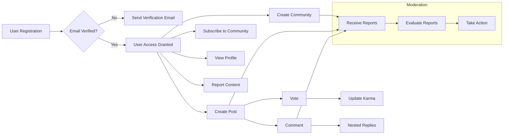

# Reddit-like Community Platform Requirements Analysis

## 1. Introduction

The redditCommunity platform provides a scalable and user-driven online community space where users can create and join topic-based communities to share text, links, or images. It supports interactive features such as voting, commenting with nested replies, user karma computation, content reporting, and content sorting based on dynamic criteria. The platform enables personalized subscription feeds and user profile management.

## 2. User Roles and Authentication

### 2.1 User Roles

| Role                | Description                                                                                   |
|---------------------|-----------------------------------------------------------------------------------------------|
| Guest               | Unauthenticated user with read-only access to public content and registration/login pages. |
| Member              | Registered and authenticated user who can create content, vote, comment, subscribe, and manage own profile. |
| Community Moderator | Member assigned to moderate specific communities; can manage posts, comments, and reports within those communities. |
| Admin               | System administrator with full system privilege, including user management, community oversight, and escalation handling.

### 2.2 Authentication Flows

- WHEN a user submits registration data (email and password), THE system SHALL validate input format and uniqueness.
- WHEN registration is successful, THE system SHALL send an email verification link.
- WHEN the user clicks the verification link, THE system SHALL activate the account.
- WHEN a registered user logs in with valid credentials, THE system SHALL generate access and refresh tokens.
- WHEN login fails due to invalid credentials or unverified email, THE system SHALL return appropriate error messages.
- THE system SHALL expire sessions after 30 days of inactivity.
- Users SHALL be able to reset their password via email link.

### 2.3 Permission Matrix

| Action                          | Guest | Member | Community Moderator | Admin |
|--------------------------------|-------|--------|--------------------|-------|
| View communities and posts     | ✅    | ✅     | ✅                 | ✅    |
| Register / Login               | N/A   | ✅     | ✅                 | ✅    |
| Create communities             | ❌    | ✅     | ❌                 | ✅    |
| Create/edit/delete own posts  | ❌    | ✅     | ✅ (community posts only) | ✅    |
| Vote on posts/comments        | ❌    | ✅     | ✅                 | ✅    |
| Comment and reply             | ❌    | ✅     | ✅                 | ✅    |
| Moderate content in communities | ❌    | ❌     | ✅                 | ✅    |
| Manage reports                | ❌    | ❌     | ✅ (local), ✅ (escalated) | ✅    |
| Manage system settings        | ❌    | ❌     | ❌                 | ✅    |

## 3. Functional Requirements

### 3.1 Community Management
- WHEN a member creates a community, THE system SHALL validate the community name for uniqueness and format (3-50 characters, alphanumeric and underscores).
- THE system SHALL allow all users to browse and search public communities.
- THE system SHALL allow members to subscribe/unsubscribe to communities.
- Community moderators SHALL be assigned upon community creation and be able to manage posts, comments, and reports within their communities.
- Only admins SHALL delete communities.

### 3.2 Post Management
- Members SHALL be able to create posts with text, a link, or a single image.
- THE system SHALL validate input: text posts (max 10,000 chars), link posts (valid URL), image posts (single image ≤10MB, jpg/png/gif).
- Posts SHALL be editable and deletable by authors within 24 hours.
- Community moderators and admins SHALL be able to delete any posts within their scope.
- Posts SHALL include metadata: creation time, last edited time, vote counts, comment count.

### 3.3 Voting System
- Members SHALL be able to upvote (+1), downvote (-1), or remove their vote on posts and comments.
- THE system SHALL enforce single active vote per user per content.
- Vote counts SHALL be publicly visible.
- Users SHALL be able to change votes at any time.

### 3.4 Comment System
- Members SHALL be able to comment on posts and reply to comments with unlimited nesting depth.
- Comments SHALL be limited to 2,000 characters.
- Comments SHALL be editable and deletable by authors within 24 hours.
- Moderators and admins SHALL have deletion privileges.
- Comments SHALL track vote counts like posts.

### 3.5 Subscription Features
- Members SHALL subscribe and unsubscribe to communities.
- Subscriptions SHALL influence personalized feeds displaying posts from subscribed communities.

### 3.6 User Profiles
- Profiles SHALL display posts, comments, total karma, join date, and editable bio.
- Profiles SHALL be publicly viewable.

### 3.7 Content Reporting
- Members SHALL be able to report posts, comments, or users.
- Reports SHALL include reporter ID (nullable for guests), reported content ID, category, and description.
- Community moderators SHALL handle reports within their communities.
- Admins SHALL handle escalated reports.
- Report resolution SHALL be tracked with statuses: pending, reviewed, action taken.

### 3.8 Post Sorting
- Posts SHALL be sortable by hot (votes + recency), new, top (vote count), and controversial (vote variance).
- The default sort method SHALL be hot.

## 4. User Scenarios

### 4.1 User Registration and Login
- WHEN a guest registers, THE system SHALL validate input, create inactive account, send verification email.
- WHEN user verifies email, THE system SHALL activate account.
- WHEN login attempts occur, THE system SHALL validate credentials and issue tokens.
- Failed logins SHALL produce descriptive errors.

### 4.2 Community Creation and Subscription
- WHEN a member creates a community, THE system SHALL validate uniqueness and assign them as moderator.
- Members SHALL be able to subscribe or unsubscribe from communities.

### 4.3 Posting and Voting
- Members SHALL create posts specifying post type with valid content.
- Vote actions SHALL update post/comment scores and user karma.
- Users SHALL be able to change or remove votes.

### 4.4 Commenting
- Comments and nested replies SHALL be created with validation on content length.
- Authors SHALL be able to edit or delete comments within 24 hours.

### 4.5 Profile Management
- Members SHALL view and edit their profiles, updating bio.

### 4.6 Reporting Content
- Members and guests SHALL submit reports with relevant details.
- Moderators and admins SHALL review and act on reports.
- Users SHALL be notified of report outcomes.

## 5. Business Rules and Validation

- Karma SHALL be calculated as: posts upvote (+10), posts downvote (-2), comments upvote (+5), comments downvote (-1).
- WHEN votes change or are removed, karma SHALL adjust accordingly.
- Posts limited to one media item; text body max 10,000 chars.
- Comments max 2,000 characters.
- Community names 3-50 characters, alphanumeric and underscores.
- User emails unique and validated.

## 6. Error Handling and Recovery

### 6.1 Authentication
- Invalid credentials SHALL return errors within 2 seconds.
- Exceeded login attempts SHALL trigger account lock for 15 minutes.
- Unverified emails SHALL block login with prompt.

### 6.2 Content Submission
- Invalid or missing fields SHALL provide descriptive validation errors.
- Unauthorized edits or deletions SHALL be denied.

### 6.3 Voting and Commenting Errors
- Votes or comments on non-existent content SHALL be rejected.
- Unauthenticated vote attempts SHALL prompt login.

### 6.4 Reporting and Moderation
- Invalid reports SHALL be rejected.
- Moderation actions on missing content SHALL return errors.

### 6.5 System Recovery
- Transient failures SHALL retry up to 3 times before error.
- Conflicts in vote counts SHALL resolve by last-write-wins.
- Clear user-friendly error messages SHALL be provided.

## 7. Performance and Scalability

- Registration SHALL complete within 3 seconds.
- Login SHALL respond within 2 seconds.
- Content lists SHALL paginate 20 items per page responding within 2 seconds.
- Voting and commenting SHALL update within 1 second.
- Reporting acknowledgement SHALL be under 1 second.
- System SHALL scale to 1 million users and 100,000 concurrent users.
- Rate limiting SHALL protect critical operations.

## 8. Security and Compliance

- Passwords SHALL be hashed securely.
- JWT tokens SHALL be used with 30-minute access token expiry and 14-day refresh token expiry.
- Role-based access control SHALL enforce permissions.
- Sensitive data SHALL be encrypted at rest and in transit.
- Access logs SHALL record personal data access.
- Retention and deletion policies SHALL comply with regulations.
- Audit logs SHALL record security events for at least 1 year.
- System SHALL detect suspicious activities and notify admins.

## 9. Glossary

| Term                 | Definition                                                      |
|----------------------|-----------------------------------------------------------------|
| Community            | A user-created group with a unique name containing posts.       |
| Post                 | Content created by users within communities.                    |
| Comment              | Nested replies on posts or other comments.                      |
| Karma                | Reputation score based on votes on user content.                |
| Moderator            | Member with privileges to manage community content and reports. |
| Admin                | System-wide administrator with full access.                     |
| Subscription         | User's following of communities to receive content feeds.       |
| Voting               | User action expressing approval or disapproval of content.     |
| Reporting            | Flagging inappropriate content for moderation review.          |

## 10. Developer Autonomy Note

This document defines business requirements only for the redditCommunity platform. All technical implementation details such as database design, API construction, and architecture are at the discretion of the development team. The document describes WHAT the system must do, not HOW to build it.

---

## Mermaid Diagrams

This represents the complete, detailed, and unambiguous set of business requirements ready for backend implementation.