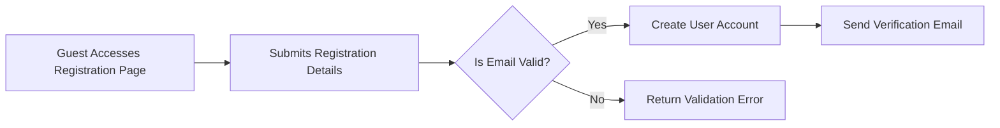
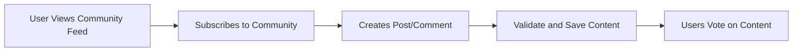
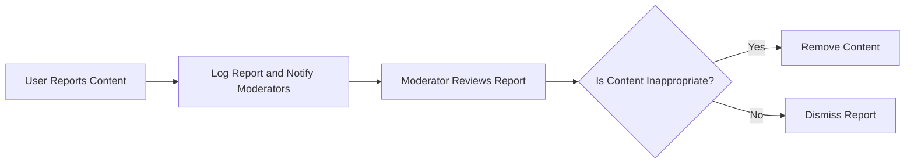
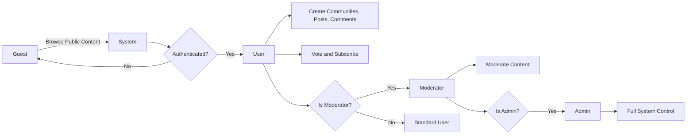

# Reddit-like Community Platform Requirements Analysis Report

## 1. Introduction
This document specifies the comprehensive business requirements for the redditCommunity platform, which aims to provide a scalable, user-driven environment for thematic communities similar to Reddit. It establishes the business context, user roles, and detailed functional expectations required for backend development.

## 2. Business Model
### 2.1 Business Justification
The redditCommunity platform enables users to create, discover, and participate in communities based on common interests. It satisfies market demand for moderated, topic-centric discussion forums, fostering user engagement through content sharing, voting, and moderation. Key differentiators include user-created communities, rich media posting, nested comments, and a robust karma system.

### 2.2 Revenue Strategy
Revenue will be generated through advertising opportunities within communities, premium subscriptions offering enhanced moderation tools, and sponsored content. Initial growth focuses on organic user acquisition through community creation and viral sharing.

### 2.3 Business Operations
Core business operations include user registration and authentication, community creation and management, content posting and moderation, voting and karma calculations, subscription management, user profiling, and content reporting with moderation workflows.

## 3. User Actors
### 3.1 Actors Defined
- Guest: Unauthenticated visitors who can browse public communities and view posts without interaction capabilities.
- User: Registered and authenticated members capable of creating communities, posting content, commenting, voting, subscribing, and reporting.
- Moderator: Community-appointed users with authority to moderate posts, comments, and user behavior within their communities.
- Admin: System administrators with full platform-wide permissions to manage users, communities, and content moderation globally.

### 3.2 Role-Based Access Control
A permission matrix governs actions such as content creation, voting, commenting, subscription management, reporting, and moderation powers. Guests have read-only access; users have full participation rights; moderators have elevated permissions in assigned communities; admins possess all management capabilities.

## 4. Functional Requirements
### 4.1 User Registration and Login
- WHEN a visitor provides registration details, THE system SHALL validate inputs, create an account, and require email verification before enabling full access.
- WHEN a registered user submits login credentials, THE system SHALL authenticate and start a user session.
- IF authentication fails, THEN THE system SHALL respond with specific error messages indicating invalid credentials.
- THE system SHALL support password reset flows via verified email links.
- THE system SHALL provide secure logout functionality that terminates user sessions promptly.

### 4.2 Community Management
- WHEN a user requests creation of a new community, THE system SHALL ensure the community name is unique and permissible per naming policies.
- THE system SHALL assign community moderators and allow them to update community settings.
- THE system SHALL prevent unauthorized users from modifying communities.

### 4.3 Content Posting
- WHEN a user submits a post (text, link, or image), THE system SHALL validate content type, size, and format constraints.
- THE system SHALL associate the post with the user and relevant community.
- IF content fails validation, THEN THE system SHALL reject the submission with clear error messages.

### 4.4 Voting System
- WHEN a user votes on a post or comment, THE system SHALL record the vote and update aggregate counts.
- THE system SHALL prevent multiple votes by the same user on the same content.
- Vote changes from upvote to downvote or vice versa SHALL be permitted once.

### 4.5 Commenting System
- WHEN a user comments on a post, THE system SHALL record the comment and allow nested replies.
- Nested comment levels SHALL be supported up to at least 5 layers for readability.
- THE system SHALL validate comment length and content compliance.

### 4.6 User Karma System
- THE system SHALL calculate user karma based on votes received on posts and comments.
- Karma updates SHALL be reflected in near real-time to encourage engagement.

### 4.7 Post Sorting
- THE system SHALL provide sorting options by hot, new, top, and controversial.
- Sorting algorithms SHALL use voting data and recency metrics.

### 4.8 Subscription System
- WHEN a user subscribes or unsubscribes to a community, THE system SHALL update subscription lists promptly.
- Subscription data SHALL impact personalized content feeds.

### 4.9 User Profiles
- THE system SHALL expose user profiles listing their posts and comments.
- Profiles SHALL display karma scores and subscription overview.

### 4.10 Content Reporting
- WHEN a user reports inappropriate content, THE system SHALL log the report with user details and content reference.
- THE system SHALL notify moderators and admins for review.
- THE system SHALL maintain report status until resolution.

## 5. Business Rules
- Community names SHALL be unique, alphanumeric with underscores or hyphens, and 3-21 characters in length.
- Users MUST authenticate before posting, commenting, voting, or reporting.
- Moderators SHALL only moderate assigned communities.
- Posts exceeding size or content guidelines SHALL be rejected.
- Voting SHALL be limited to one vote per user per content item.
- Karma SHALL increment or decrement reflecting valid votes.
- Comment nesting SHALL be limited to prevent excessive depth.
- Reports SHALL include reporter ID, content ID, reason, and timestamp.
- Moderators and admins SHALL resolve reports within a defined timeframe.

## 6. Error Handling
- IF authentication fails, THEN provide clear error messages within 2 seconds.
- IF content submissions are invalid, THEN reject with detailed validation errors.
- Voting conflicts or permission violations SHALL result in informative errors.
- Content reporting SHALL validate input and inform users of success or failure.

## 7. Performance Requirements
- User actions including login, posting, and voting SHALL respond within 2 seconds under normal conditions.
- Data retrieval for posts, comments, and profiles SHALL complete within 3 seconds.
- Sorting and pagination SHALL be optimized for response times under typical loads.

## 8. Security and Privacy
- User passwords SHALL be stored securely using best practices.
- JWT SHALL be used for session tokens with appropriate expiration.
- User data SHALL be access-controlled based on roles.

## 9. External Integrations
- Image hosting services SHALL be used for storing user images.
- Spam detection services SHALL flag suspicious content for moderation.
- Notification services SHALL alert users and moderators about relevant events.

## 10. Data Lifecycle and Event Processing
- Events such as user registration, post creation, voting, and reporting SHALL trigger asynchronous workflows.
- Data retention policies SHALL comply with privacy regulations.

## 11. Diagrams
### User Registration Flow

```mermaid
graph LR
  A["Guest Accesses Registration Page"] --> B["Submits Registration Details"]
  B --> C{"Is Email Valid?"}
  C -->|"Yes"| D["Create User Account"]
  C -->|"No"| E["Return Validation Error"]
  D --> F["Send Verification Email"]
```

### Community Interaction

```mermaid
graph LR
  G["User Views Community Feed"] --> H["Subscribes to Community"]
  H --> I["Creates Post/Comment"]
  I --> J["Validate and Save Content"]
  J --> K["Users Vote on Content"]
```

### Moderation and Reporting

```mermaid
graph LR
  L["User Reports Content"] --> M["Log Report and Notify Moderators"]
  M --> N["Moderator Reviews Report"]
  N --> O{"Is Content Inappropriate?"}
  O -->|"Yes"| P["Remove Content"]
  O -->|"No"| Q["Dismiss Report"]
```

### Authentication and Authorization Overview

```mermaid
graph LR
  R["Guest"] -->|"Browse Public Content"| S["System"]
  S --> T{"Authenticated?"}
  T -->|"No"| R
  T -->|"Yes"| U["User"]
  U --> V["Create Communities, Posts, Comments"]
  U --> W["Vote and Subscribe"]
  U --> X{"Is Moderator?"}
  X -->|"Yes"| Y["Moderator"]
  Y --> Z["Moderate Content"]
  X -->|"No"| AA["Standard User"]
  Y --> AB{"Is Admin?"}
  AB -->|"Yes"| AC["Admin"]
  AC --> AD["Full System Control"]
```

---

> This document contains the complete and detailed business requirements for the redditCommunity platform backend.
> Implementation details such as architecture, API design, or database schema are outside the scope and left to the development team.
> All requirements are specified in clear, testable natural language with full coverage of user roles, business logic, and error handling.