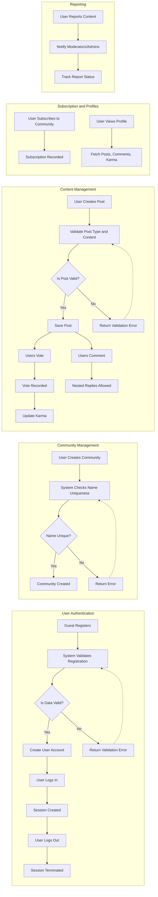

# Requirements Analysis Report for Reddit-like Community Platform

## 1. Introduction

The Reddit-like community platform aims to provide a scalable and user-friendly environment where users can create communities (subreddits), post varied content, interact through voting and commenting, build reputation through karma, and manage subscriptions and profiles. The platform also supports robust reporting and moderation to maintain community standards.

### 1.1 User Actors

- **Guest**: Can browse public communities and view posts and comments without authentication. Cannot interact beyond viewing.
- **Registered User**: Can register, log in, create communities, post text, links, and images, comment with nested replies, vote, subscribe, report inappropriate content, and view profiles.
- **Moderator**: Assigned to specific communities, with permissions to manage content and handle reports within those communities.
- **Admin**: Has system-wide privileges, including user and content management across all communities.

## 2. Functional Requirements

### 2.1 User Registration and Login
- WHEN a guest submits a valid registration request (including unique email and strong password), THE system SHALL create a registered user account.
- WHEN a registered user submits login credentials, THE system SHALL authenticate and establish a secure session.
- IF login fails due to invalid credentials, THEN THE system SHALL return an authentication error with clear messaging.
- WHEN a user logs out, THE system SHALL terminate the session promptly.

### 2.2 Community Creation and Management
- WHEN a registered user requests creation of a community with a unique name and description, THE system SHALL validate uniqueness and create the new community.
- THE creator of a community SHALL be assigned as its owner and default moderator.
- Moderators and admins SHALL have permissions to update community details and manage content.

### 2.3 Posting Content
- WHEN a registered user submits a post within a community, THE system SHALL accept text, link, or image posts.
- THE system SHALL validate content type, size, and format appropriately.
- Posts SHALL be linked to their authors and belonging communities.

### 2.4 Voting System
- WHEN a registered user upvotes or downvotes a post or comment, THE system SHALL record the vote, enforcing one vote per user per item.
- THE system SHALL allow users to change or remove their vote.
- Votes SHALL influence post and comment scores and user karma accordingly.

### 2.5 Commenting and Nested Replies
- WHEN a registered user comments or replies on a post or comment, THE system SHALL store the comment with the appropriate parent reference.
- The system SHALL support unlimited or configurable nesting of replies.
- Comments SHALL be validated for content length and sanitization.

### 2.6 User Karma System
- THE system SHALL calculate and update user karma dynamically based on votes received on posts and comments.
- Karma calculations SHALL assign weighted points (e.g., upvote on post = +10 karma, downvote = -2).

### 2.7 Post Sorting
- THE system SHALL provide sorting options: hot, new, top, and controversial.
- Sorting SHALL consider vote scores, age, and engagement metrics.

### 2.8 Community Subscription
- WHEN a registered user subscribes or unsubscribes from a community, THE system SHALL update the subscription status accordingly.
- Subscribed communities SHALL be surfaced preferentially in user feeds.

### 2.9 User Profiles
- THE system SHALL maintain user profiles showcasing their posts, comments, karma, and subscribed communities.
- Profiles SHALL be viewable by other users, respecting privacy configurations.

### 2.10 Reporting Inappropriate Content
- WHEN a registered user reports a post or comment, THE system SHALL log the report and notify relevant moderators promptly.
- Moderators and admins SHALL have interfaces to review reports and take actions such as dismissal, deletion, or escalating to admins.

## 3. Business Rules

- Community names MUST be unique and meet naming constraints.
- Posts and comments MUST adhere to size and content validation rules.
- Voting MUST enforce single vote per user per content item.
- Karma points SHALL be calculated and updated in real-time.
- Reported content SHALL be hidden from public view pending moderator review.

## 4. Authentication and Permissions

- Actors include guest, registeredUser, moderator, and admin.
- Permission matrix outlines access rights for each actor type across all features.
- Authentication flows SHALL secure user sessions and enforce password policies.

## 5. Error Handling and Performance

- System SHALL respond with descriptive errors on input validation failures or unauthorized actions.
- Typical system responses SHALL complete within 2 seconds.
- Pagination SHALL be used for posts and comments to ensure performance.

## 6. Mermaid Diagrams

```mermaid
graph LR
  subgraph "User Authentication"
    A["Guest Registers"] --> B["System Validates Registration"]
    B --> C{"Is Data Valid?"}
    C -->|"Yes"| D["Create User Account"]
    C -->|"No"| E["Return Validation Error"]
    D --> F["User Logs In"]
    F --> G["Session Created"]
    G --> H["User Logs Out"]
    H --> I["Session Terminated"]
  end

  subgraph "Community Management"
    J["User Creates Community"] --> K["System Checks Name Uniqueness"]
    K --> L{"Name Unique?"}
    L -->|"Yes"| M["Community Created"]
    L -->|"No"| N["Return Error"]
  end

  subgraph "Content Management"
    O["User Creates Post"] --> P["Validate Post Type and Content"]
    P --> Q{"Is Post Valid?"}
    Q -->|"Yes"| R["Save Post"]
    Q -->|"No"| S["Return Validation Error"]
    R --> T["Users Vote"]
    T --> U["Vote Recorded"]
    U --> V["Update Karma"]
    R --> W["Users Comment"]
    W --> X["Nested Replies Allowed"]
  end

  subgraph "Subscription and Profiles"
    Y["User Subscribes to Community"] --> Z["Subscription Recorded"]
    AA["User Views Profile"] --> AB["Fetch Posts, Comments, Karma"]
  end

  subgraph "Reporting"
    AC["User Reports Content"] --> AD["Notify Moderators/Admins"]
    AD --> AE["Track Report Status"]
  end

  E -.-> B
  N -.-> K
  S -.-> P
```

## 7. Summary

These requirements provide comprehensive business specifications to guide backend development. They establish clear, testable criteria and workflows for user registration, community management, content posting, voting, commenting, karma calculation, subscription management, user profiles, and content reporting/moderation. All requirements are expressed using natural language with precise event-action-response formats to ensure unambiguous implementation.

All technical decisions on architecture, data stores, and API design remain at developers' discretion. This report specifies WHAT the system must do, not HOW to build it.