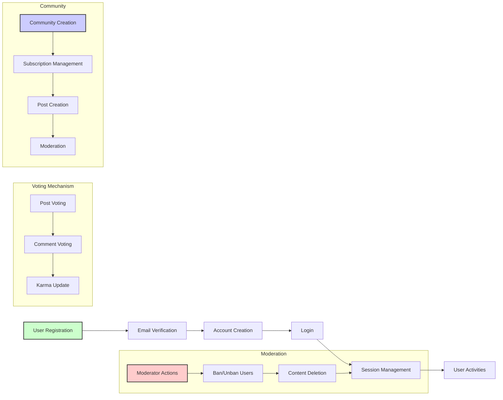

# Reddit-like Community Platform

## User Account Management

Users shall be able to register with a unique username and email, providing a secure password. The system shall verify uniqueness of username and email to prevent duplicates.

Users shall log in with their email and password. Invalid login attempts shall return an authentication error.

Users shall be able to change their password securely when authenticated.

Users shall be able to delete their accounts. Deletion shall remove the user profile, all posts, and comments authored by the user.

## User Profiles

Each user shall have a profile consisting of display name, bio, and avatar image URL.

Users shall be able to edit their own display name, bio, and avatar image.

A user's profile page shall display the public data: display name, bio, avatar image, total karma score, a list of posts authored, and a list of comments authored.

## Karma System

Each user shall have a karma score that increments by 1 when their posts or comments receive upvotes and decrements by 1 when they receive downvotes, including adjustments when votes are removed. Karma may be negative.

## Communities

Any user can create a community with a unique name, description, and icon image.

The creator of a community shall be the owner.

Users shall be able to browse all communities in a paginated list and search communities by name.

Each community shall show its subscriber count.

## Subscriptions

Users shall be able to subscribe and unsubscribe to communities.

Only subscribed users may create posts in a community.

Users shall be able to view their subscribed communities.

## Posts

Subscribed users shall be able to create posts in communities. Posts shall have a required title.

Posts shall be one of three types: text with content, link with valid URL, or image with uploaded image.

Users shall be able to edit and delete their posts.

Post views shall display title, full content, author, community, vote score, comment count, and posted timestamp.

## Post Voting

Users shall be able to upvote or downvote posts. Each user may vote once per post, change vote, or remove vote.

Vote score is total upvotes minus downvotes.

## Post Feeds

The platform shall provide Home Feed for subscribed communities (logged-in users only), Popular Feed for all posts (public), and Community Feed for single community posts (public).

All feeds support sorting: Hot, New, Top (with time filters), and Controversial.

Feeds shall be paginated.

## Post List Display

Posts in feeds shall show title, author username, community name, vote score, comment count, time since posted, and content preview (text, image thumbnail, or link domain).

## Comments

Users may comment on posts and reply to comments without limit on depth.

Users may edit and delete their own comments.

Comments shall display author, content, vote score, posting time, and nested replies.

## Comment Voting

Voting rules mirror post voting: one vote per user per comment, with ability to change or remove vote.

## Comment Sorting

Comments shall be sortable by Best, New, and Controversial.

## Community Moderation

Owner controls community, can add/remove moderators.

Moderators can add moderators but cannot remove owner or other moderators.

Moderators can delete posts and comments in their community.

Moderators can ban and unban users; banned users cannot post or comment in the community but can view content.

## Reporting

Users can report posts or comments by providing a reason.

Moderators see reports with reported content, reporter, and reason.

Moderators can approve reports (delete content) or dismiss reports (keep content).

Dismissed reports are removed from the report list.

## Authentication and Authorization

The platform secures authentication via email/password with JWT session management.

Authorization is enforced based on user roles and community-level permissions.

## Error Handling

Authentication failures return errors with clear messages.

Unauthorized actions return access denied errors.

Editing/deleting non-owned content returns errors.

Uploading images with failures returns appropriate error responses.

## Performance

Feed and browsing operations respond within 2 seconds.

Posting, commenting, voting, and subscribing operations respond within 1 second.

Pagination limits to 20 items per page.

## Mermaid Diagram

```mermaid
graph LR
  A["User Registration"] --> B["Email Verification"]
  B --> C["Account Creation"]
  C --> D["Login"]
  D --> E["Session Management"]
  E --> F["User Activities"]

  subgraph Voting Mechanism
    V1["Post Voting"] --> V2["Comment Voting"]
    V2 --> V3["Karma Update"]
  end

  subgraph Community
    COM1["Community Creation"] --> COM2["Subscription Management"]
    COM2 --> COM3["Post Creation"]
    COM3 --> COM4["Moderation"]
  end

  subgraph Moderation
    M1["Moderator Actions"] --> M2["Ban/Unban Users"]
    M2 --> M3["Content Deletion"]
    M3 --> E
  end

  style A fill:#cfc,stroke:#333,stroke-width:2px
  style M1 fill:#fcc,stroke:#333,stroke-width:2px
  style COM1 fill:#ccf,stroke:#333,stroke-width:2px
```
