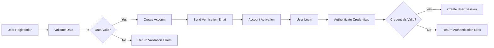
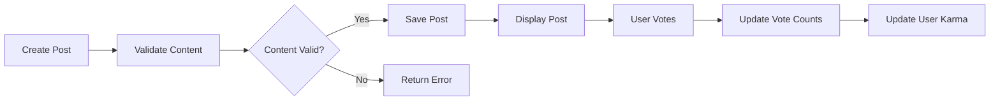

# Requirements Analysis Report for Reddit-like Community Platform

## 1. Introduction

The redditCommunity platform is designed to offer a dynamic, scalable, and user-driven environment where users create and participate in thematic communities. This platform enables sharing of diverse content types (text, links, images), fosters engagement via voting and nested commenting, and includes reputation mechanics through a user karma system. This report details comprehensive business requirements, user roles, workflows, and system behaviors essential for backend development.

## 2. Business Model

### 2.1 Purpose and Justification

The platform exists to fill market demand for open, decentralized, interest-driven online communities. It supports self-organized groups with democratic content visibility determined by voting, sorting, and moderated discussion. The service aims to empower users to create niche and broad-topic communities, fostering dynamic interaction.

### 2.2 Revenue and Growth Strategy

Initial revenue focuses on advertising, premium feature subscriptions, and partnership opportunities. Viral user acquisition, community creation enablement, and retention through rewarding systems like karma underpin growth plans. Success is measured by active user numbers, engagement metrics, creation rates, and moderation efficiency.

## 3. User Actors and Authentication

### 3.1 User Roles

- **Guest**: Unauthenticated users permitted to browse public communities and read posts and comments but restricted from posting, voting, and commenting.
- **Registered User**: Authenticated members who can register, verify their email, create/join communities, post content, vote, comment with nested replies, subscribe to communities, view their profiles, and report inappropriate content.
- **Community Moderator**: Registered users with additional permissions within assigned communities to moderate posts/comments, enforce community rules, and manage community settings.
- **Admin**: Platform administrators with full access to manage all users, communities, content moderation, reports, bans, and platform settings.

### 3.2 Authentication Requirements

- WHEN a new user registers with a valid unique email and password, THEN the system SHALL create an account and send a verification email.
- User accounts SHALL remain inactive until email verification is completed.
- WHEN a registered user submits login credentials, THEN the system SHALL authenticate and create a secure user session.
- Users SHALL be able to reset passwords through secure, token-based email links.
- Sessions SHALL expire after set inactivity periods, requiring reauthentication.

### 3.3 Permission Matrix

| Action                                | Guest | Registered User | Community Moderator | Admin |
|-------------------------------------|-------|-----------------|---------------------|-------|
| Browse public content                | ✅    | ✅              | ✅                  | ✅    |
| Register and verify account         | N/A   | ✅              | N/A                 | N/A   |
| Create community                    | ❌    | ✅              | N/A                 | ✅    |
| Post content                       | ❌    | ✅              | ✅                  | ✅    |
| Vote on posts/comments              | ❌    | ✅              | ✅                  | ✅    |
| Comment on posts with nested replies| ❌    | ✅              | ✅                  | ✅    |
| Subscribe/unsubscribe communities   | ❌    | ✅              | ✅                  | ✅    |
| View and edit user profile          | N/A   | ✅              | N/A                 | N/A   |
| Report inappropriate content        | ❌    | ✅              | ✅                  | ✅    |
| Moderate content                    | ❌    | ❌              | ✅                  | ✅    |
| Manage platform settings            | ❌    | ❌              | ❌                  | ✅    |

## 4. Functional Requirements

### 4.1 User Registration and Login
- WHEN a visitor submits registration data including unique email and secure password, THEN the system SHALL validate data and create a user account in inactive state.
- WHEN registration is successful, THEN the system SHALL send a verification email with a unique token.
- WHEN the user verifies email, THEN THE account SHALL be activated.
- WHEN a user submits login credentials, THEN the system SHALL authenticate and establish a secure session.
- IF login credentials are invalid, THEN the system SHALL respond with an authentication failure message.
- Users SHALL have the ability to log out and invalidate their active sessions.
- Password reset requests SHALL trigger a secure, token-authenticated email to the user.

### 4.2 Community Management
- WHEN a registered user requests community creation, THEN the system SHALL validate uniqueness of the community name and create the community associated with the creator.
- Community moderators SHALL be assignable upon community creation.
- Moderators SHALL be able to edit community information and manage posts and comments.
- Users SHALL be able to subscribe and unsubscribe to/from communities.

### 4.3 Posting Content
- WHEN a registered user submits a post of type text, link, or image, THEN the system SHALL validate content type, size, and associate it to the chosen community.
- Supported image formats SHALL include JPEG and PNG with a maximum size of 5MB.
- The system SHALL allow post editing by the author within 24 hours of creation.

### 4.4 Voting System
- USERS SHALL be able to cast a single upvote or downvote on each post or comment.
- THE system SHALL prevent duplicate votes from the same user on the same content.
- Users SHALL be able to change or remove their vote.
- Vote totals SHALL be updated in near real-time.

### 4.5 Commenting System
- USERS SHALL be able to comment on posts and reply to comments with nested threading.
- Comment nesting SHALL be limited to 5 levels.
- Comment text length SHALL be limited to 1000 characters.

### 4.6 User Karma System
- THE system SHALL calculate user karma as the aggregated net of votes received on the user’s posts and comments.
- Karma SHALL update immediately upon votes.
- The system SHALL prevent manipulation of the karma system through voting fraud.

### 4.7 Post Sorting
- POSTS SHALL be sortable by "hot" (algorithmic ranking), "new" (creation time descending), "top" (highest score), and "controversial" (highly divisive votes).
- Sorting SHALL update dynamically based on voting and posting activity.

### 4.8 Subscription Management
- WHEN a user subscribes or unsubscribes to a community, THEN the system SHALL update the user’s subscription list accordingly.
- Subscriptions SHALL influence personalized content feeds.

### 4.9 User Profiles
- WHEN a user profile is viewed, THEN the system SHALL display the user’s posts, comments, karma, and subscription summary.

### 4.10 Reporting Inappropriate Content
- USERS SHALL be able to report posts or comments they find inappropriate, specifying a reason.
- REPORTS SHALL be recorded and notified to moderators and admins.
- Moderators/admins SHALL act upon reports by removing content, issuing warnings, or banning users as appropriate.

## 5. Business Rules

- Community names SHALL be unique and immutable after creation.
- Emails must be verified before users can post.
- Votes SHALL be limited to one per user per content, with changes allowed.
- Karma SHALL reflect vote totals with positive and negative values.
- Moderators have permissions only within assigned communities.
- Posting rates and content length SHALL be limited to prevent spam.

## 6. Error Handling and Validation

- IF registration data is invalid, then the system SHALL return detailed validation error messages.
- IF users attempt unauthorized actions, THEN the system SHALL return authorization errors.
- Posts and comments exceeding allowed size or invalid formats SHALL be rejected.
- Duplicate votes SHALL be prevented with appropriate system feedback.

## 7. Performance Requirements

- Login response time SHALL be within 2 seconds under normal load.
- Post and comment listings SHALL paginate with 20 items per page and respond within 1 second.
- Vote counts and karma updates SHALL reflect within 5 seconds of action.

## 8. Summary

The requirements lay a comprehensive foundation for the redditCommunity backend, delineating clear user roles, permissions, data flows, and system behaviors required for implementation. All requirements follow natural language business conventions and EARS templates to aid clarity and testability.

---

## Appendix: Mermaid Diagrams

### User Registration and Login Process

```mermaid
graph LR
  A["User Registration"] --> B["Validate Data"]
  B --> C{"Data Valid?"}
  C -->|"Yes"| D["Create Account"]
  C -->|"No"| E["Return Validation Errors"]
  D --> F["Send Verification Email"]
  F --> G["Account Activation"]
  G --> H["User Login"]
  H --> I["Authenticate Credentials"]
  I --> J{"Credentials Valid?"}
  J -->|"Yes"| K["Create User Session"]
  J -->|"No"| L["Return Authentication Error"]
```

### Posting and Voting Workflow

```mermaid
graph LR
  A["Create Post"] --> B["Validate Content"]
  B --> C{"Content Valid?"}
  C -->|"Yes"| D["Save Post"]
  C -->|"No"| E["Return Error"]
  D --> F["Display Post"]
  F --> G["User Votes"]
  G --> H["Update Vote Counts"]
  H --> I["Update User Karma"]
```

This completes the enhanced and comprehensive business requirements for the redditCommunity platform backend, ready for developer implementation guidance.