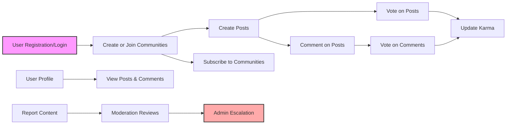

# Functional Requirements Analysis for redditCommunity Platform

This document provides comprehensive business and functional requirements for the development of a Reddit-like community platform named "redditCommunity". It covers all essential functionality to guide backend developers in building the system.

> This document provides business requirements only. All technical implementation decisions belong to developers. Developers have full autonomy over architecture, APIs, and database design. The document describes WHAT the system should do, not HOW to build it.

## 1. Community Management

### 1.1 Community Creation
- WHEN a member submits a request to create a new community, THE system SHALL verify that the community name is unique and meets naming rules (minimum 3 characters, maximum 50 characters, alphanumeric and underscores only).
- THE system SHALL allow any authenticated member to create new communities.
- THE system SHALL assign the creating member as the initial communityModerator for that community.
- WHEN a community is created, THE system SHALL store metadata including community name, description, creation date, and creator user ID.
- THE system SHALL support updating community information (name limited; description editable) by communityModerators.

### 1.2 Community Visibility
- THE system SHALL allow all users, including guests, to browse and view public communities and their posts.
- THE system SHALL make private communities (if implemented in future) accessible only to subscribed members (not currently required).

### 1.3 Moderation
- CommunityModerators SHALL be able to delete or approve posts and comments within their community.
- CommunityModerators SHALL be able to manage reports related to content within their community.
- Admins SHALL have full moderation permissions across all communities.

## 2. Post Management

### 2.1 Post Creation
- WHEN a member wants to create a post within a community, THE system SHALL accept posts in three types:
  - Text only
  - Link only
  - Single image (one image file attachment)
- THE system SHALL enforce input validation:
  - Text posts: must have non-empty body with a max length of 10,000 characters.
  - Link posts: must have a valid URL.
  - Image posts: must have only one image file attached; size limits enforced per system policy.
- THE system SHALL associate posts with the creator, creation timestamp, and target community.

### 2.2 Post Editing and Deletion
- WHEN a member edits their own post, THE system SHALL allow editing within 24 hours of creation.
- THE system SHALL record edit timestamps and maintain version history as applicable.
- Members SHALL be able to delete their own posts, removing them from public view.
- CommunityModerators and Admins SHALL be able to delete any post within their jurisdiction.

### 2.3 Post Metadata
- THE system SHALL track and expose publicly:
  - Number of upvotes and downvotes
  - Number of comments
  - Creation and last edited timestamps

## 3. Voting System

### 3.1 Voting on Posts
- WHEN a member votes on a post, THE system SHALL allow upvote (+1), downvote (-1), or vote removal.
- THE system SHALL restrict to one active vote per user per post.
- Users SHALL be able to change their vote at any time.
- THE system SHALL update and display real-time total vote counts.

### 3.2 Voting on Comments
- THE same voting rules SHALL apply to comments (upvote, downvote, vote removal, single active vote, vote changing).

### 3.3 Vote Visibility
- THE system SHALL display the current vote tally publicly (visible to all users including guests).

## 4. Comment System

### 4.1 Commenting on Posts
- WHEN a member adds a comment to a post, THE system SHALL allow unlimited nesting (comments can have replies to any depth).
- Comments SHALL have a maximum length of 2000 characters.

### 4.2 Comment Editing and Deletion
- Members SHALL be able to edit their own comments within 24 hours after posting.
- Members SHALL be able to delete their own comments.
- CommunityModerators and Admins SHALL be able to delete any comment within their jurisdiction.

### 4.3 Comment Metadata
- THE system SHALL track vote counts on comments identically to posts.
- THE system SHALL store creation and edit timestamps for comments.

## 5. Subscription Features

### 5.1 Subscribing to Communities
- WHEN a member subscribes to a community, THE system SHALL add the community to the user's list of subscriptions.
- Subscribed communities SHALL appear in the user's personalized feed.
- THE system SHALL allow members to unsubscribe at any time.

### 5.2 Subscription Visibility
- THE system SHALL allow all users to view public community subscription counts.

## 6. User Profile Features

### 6.1 Profile Content
- THE system SHALL provide publicly accessible user profiles displaying:
  - User's posts
  - User's comments
  - User's total karma
  - Join date
  - Optional bio text

### 6.2 Profile Management
- Members SHALL be able to edit their bio and visibility settings.

## 7. Content Reporting

### 7.1 Reporting Mechanism
- WHEN a member or guest reports a post, comment, or user, THE system SHALL record the report including reporter ID (nullable if guest), reported content ID, category (spam, abuse, other), and timestamp.

### 7.2 Report Handling
- CommunityModerators SHALL review and take actions on reports within their communities.
- Admins SHALL be able to review and manage all reports.
- THE system SHALL support report resolution states (pending, reviewed, action taken).

## Role-Based Permission Summary

| Action                         | Guest | Member | CommunityModerator | Admin |
|--------------------------------|-------|--------|--------------------|-------|
| View public communities/posts  | ✅    | ✅     | ✅                 | ✅    |
| Register/Login                 | ❌    | ✅     | ✅                 | ✅    |
| Create communities             | ❌    | ✅     | ✅ (per community)  | ✅    |
| Create/Edit/Delete own posts  | ❌    | ✅     | ✅ (all in community)| ✅    |
| Vote on posts/comments        | ❌    | ✅     | ✅                 | ✅    |
| Comment and reply             | ❌    | ✅     | ✅                 | ✅    |
| Subscribe communities         | ❌    | ✅     | ✅                 | ✅    |
| Moderate content              | ❌    | ❌     | ✅                 | ✅    |
| Manage reports                | ❌    | ❌     | ✅                 | ✅    |

## Karma System (Summary)
- Karma is calculated based on the sum of votes received on a user's posts and comments.
- More detailed business rules for karma calculations are defined in a separate business rules document.

## Post Sorting
- THE system SHALL support sorting posts within communities and feeds by:
  - Hot (combining votes and recency)
  - New (most recent first)
  - Top (highest votes)
  - Controversial (high vote variance)

---

## Mermaid Diagram: High-Level Workflow

---

This document enumerates and specifies the exact functional requirements for the redditCommunity backend, ready for implementation by development teams.