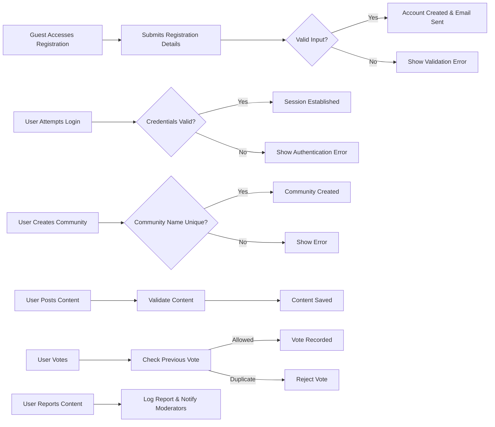

# redditCommunity Requirements Analysis Report

## 1. Introduction
redditCommunity is a Reddit-like community platform designed to enable users to create and engage in topic-specific communities, share content, and interact through voting and comments. The platform's goal is to provide a robust, scalable, and user-friendly backend system supporting rich user interactions and community autonomy.

## 2. Business Model

### 2.1 Purpose
The platform exists to provide users with a decentralized space to form communities based on shared interests, facilitating content sharing and discussions in a moderated environment.

### 2.2 Revenue Strategy
Monetization will be achieved via targeted advertising, premium subscription services offering enhanced moderation capabilities, and brand partnerships within popular communities.

### 2.3 Growth Plan
Focus will be on organic growth driven by ease of community creation, viral sharing of engaging posts, and gamification elements like karma to incentivize participation.

### 2.4 Success Metrics
Key indicators include monthly active users, number of active communities, daily posts and comments volume, average karma per user, and moderation resolution times.

## 3. User Actors and Permissions

The system defines four primary user roles:

- **Guest**: Can browse public communities and view posts but cannot interact or create content.
- **User**: Authenticated user capable of creating communities, posting content, voting, commenting, subscribing, and reporting.
- **Moderator**: Users with elevated permissions to moderate content within assigned communities, including removing posts and managing reports.
- **Admin**: System-wide administrators managing users, communities, and platform-wide settings.

### 3.1 Permissions Matrix

| Action                        | Guest | User | Moderator | Admin |
|-------------------------------|-------|------|-----------|-------|
| Browse content                | ✅    | ✅   | ✅        | ✅    |
| Register and login            | ❌    | ✅   | ✅        | ✅    |
| Create communities           | ❌    | ✅   | ✅        | ✅    |
| Post content (text/link/image) | ❌    | ✅   | ✅        | ✅    |
| Comment with nested replies   | ❌    | ✅   | ✅        | ✅    |
| Upvote/downvote content       | ❌    | ✅   | ✅        | ✅    |
| Subscribe/unsubscribe to communities | ❌    | ✅   | ✅        | ✅    |
| Report content                | ❌    | ✅   | ✅        | ✅    |
| Moderate content              | ❌    | ❌   | ✅        | ✅    |
| Manage users and communities  | ❌    | ❌   | ❌        | ✅    |

## 4. Functional Requirements

### 4.1 User Registration and Login
WHEN a guest submits registration details, THE system SHALL validate the email and password, send a verification email, and create a user account after confirmation.
WHEN a user attempts to log in, THE system SHALL authenticate the credentials and establish a secure session using JWT tokens.
Login failures due to invalid credentials SHALL result in immediate error responses.

### 4.2 Community Creation and Management
Authenticated users SHALL be able to create communities with unique names following naming conventions. Moderators and admins SHALL have management permissions including content approval and removal.

### 4.3 Content Posting
Users SHALL post text, links, or images within communities. Posts SHALL be validated for type, size, and community compliance. Images are restricted to common formats (JPEG, PNG) and size limits.

### 4.4 Voting System
Users SHALL upvote or downvote posts and comments once per item. Vote changes SHALL be allowed but duplicates SHALL be prevented.

### 4.5 Commenting System
Comments SHALL support nested replies up to a depth of 5 levels to balance readability and user interaction.

### 4.6 User Karma System
Karma SHALL be calculated from votes on user posts and comments and updated in near real-time.

### 4.7 Post Sorting
Posts SHALL be sortable by hot, new, top, and controversial leveraging vote counts and timestamps.

### 4.8 Subscription System
Users SHALL subscribe or unsubscribe from communities to customize their content feed.

### 4.9 User Profiles
Profiles SHALL display user posts, comments, and cumulative karma.

### 4.10 Content Reporting
Users SHALL report inappropriate content. Reports SHALL be logged with detailed metadata and routed to moderators/admins for review.

## 5. Business Rules

- Community names SHALL be unique and adhere to allowed character sets.
- Posts and comments SHALL comply with content guidelines and size limits.
- Voting SHALL be limited to one per user per content item with vote change allowed once.
- Moderators SHALL have content removal authority within their communities.
- Reports SHALL be traceable with status updates for resolution tracking.

## 6. Error Handling and Recovery

Authentication failures SHALL return precise error messages.
Content violations SHALL prevent submission with detailed feedback.
Duplicate voting SHALL be rejected gracefully.
Unauthorized actions SHALL be denied with clear authorization errors.

## 7. Performance and Scalability

System SHALL respond to user requests such as posting, voting, and commenting within 2 seconds under standard loads.
Pagination SHALL be used for content listings, returning results within 3 seconds.
System SHALL be designed to scale horizontally with consistent data integrity.

## 8. Security and Compliance

User passwords SHALL be stored securely with best practices.
JWT SHALL manage user authentication with timely token expiration and refresh.
Access controls SHALL enforce role-based permissions consistently.
User data SHALL be protected in compliance with privacy laws.

## 9. External Integrations

Image uploads MAY utilize third-party hosting with validation for format and size.
Spam and abuse detection integrations SHALL flag suspicious content for moderator review.
Notification systems SHALL alert users and moderators about relevant events.

## 10. Data Lifecycle and Event Processing

Data related to posts, votes, comments, and reports SHALL be captured accurately.
Event-driven mechanisms SHALL handle asynchronous notifications and updates.
Data retention policies SHALL comply with legal and operational requirements.

## 11. Appendices

### Glossary
- Karma: User reputation score based on votes received.
- Community: User-created thematic group.
- Moderator: User with content governance privileges.

### References
All referenced documents are part of the project documentation suite.

## 12. Mermaid Diagrams

```mermaid
graph LR
  A["Guest Accesses Registration"] --> B["Submits Registration Details"]
  B --> C{"Valid Input?"}
  C -->|"Yes"| D["Account Created & Email Sent"]
  C -->|"No"| E["Show Validation Error"]

  F["User Attempts Login"] --> G{"Credentials Valid?"}
  G -->|"Yes"| H["Session Established"]
  G -->|"No"| I["Show Authentication Error"]

  J["User Creates Community"] --> K{"Community Name Unique?"}
  K -->|"Yes"| L["Community Created"]
  K -->|"No"| M["Show Error"]

  N["User Posts Content"] --> O["Validate Content"]
  O --> P["Content Saved"]

  Q["User Votes"] --> R["Check Previous Vote"]
  R -->|"Allowed"| S["Vote Recorded"]
  R -->|"Duplicate"| T["Reject Vote"]

  U["User Reports Content"] --> V["Log Report & Notify Moderators"]
```