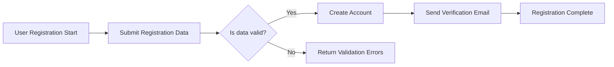
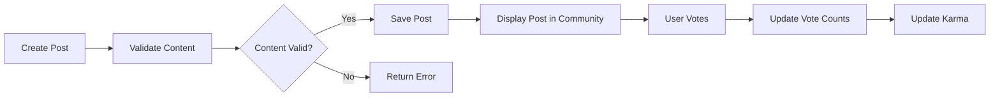

# Requirements Analysis Report for a Reddit-like Community Platform

## Introduction
This document sets forth the comprehensive business and functional requirements for the backend implementation of a Reddit-like community platform. It outlines the service vision, involved user actors, core functional requirements, business rules, error handling, and performance expectations. This report is intended to guide backend developers in building a production-ready system that fulfills the needs and expectations of its users.

## 1. Service Vision
The Reddit-like community platform is designed to offer a dynamic, scalable environment where users explore, create, and participate in communities organized around topics of interest. The platform encourages content sharing in various media formats with democratic evaluation through voting, commentary, and moderation. It aims to foster community engagement, content discoverability, and participatory governance.

## 2. User Actors

### 2.1 Guest
Guests are unauthenticated users with minimal access; they can browse public communities and read existing posts and comments but cannot create content or participate in voting or commenting.

### 2.2 Registered User
These authenticated users can register, log in, create communities, post text, links, or images, upvote/downvote, comment with nested replies, subscribe to communities, view profiles, and report inappropriate content.

### 2.3 Community Moderator
Moderators are registered users with jurisdiction over specific communities. They can moderate posts and comments, manage community settings, enforce posting rules, and handle reports.

### 2.4 Admin
Admins maintain the overall platform, having full access to manage all communities, users, content moderation, resolve reports, and enforce bans or restrictions system-wide.

## 3. Functional Requirements

### 3.1 User Registration and Login
- WHEN a user attempts to register, THE system SHALL validate the registration data, ensure uniqueness of email, securely store credentials, and send verification instructions.
- WHEN a registered user submits login credentials, THE system SHALL authenticate the user and create a session.
- IF authentication fails, THEN THE system SHALL respond with a clear error message indicating invalid credentials.
- THE system SHALL allow users to log out and terminate their sessions.

### 3.2 Community Management
- WHEN a registered user creates a community, THE system SHALL require a unique community name and optional description.
- THE system SHALL store community metadata including creation date and creator ID.
- THE system SHALL allow moderators to update community settings and remove or approve content.
- THE system SHALL allow users to subscribe to existing communities.

### 3.3 Content Posting
- WHEN a registered user submits a post with text, link, or image, THE system SHALL validate content and associate it with the target community.
- THE system SHALL restrict image uploads to accepted formats (JPEG, PNG) and a maximum size of 5MB.
- THE system SHALL allow post editing by the post author within 24 hours.

### 3.4 Voting System
- WHEN a user votes (upvote or downvote) a post or comment, THE system SHALL record the vote and update totals.
- THE system SHALL prevent multiple votes by the same user on the same content.

### 3.5 Commenting System
- WHEN a user submits a comment on a post, THE system SHALL associate the comment correctly and support nesting for replies.
- THE system SHALL limit comment nesting depth to 5 levels.
- THE system SHALL limit comment text to 1000 characters.

### 3.6 User Karma System
- THE system SHALL calculate user karma based on votes received on posts and comments.
- WHEN a vote is cast, THE system SHALL update the karma scores of the content author.
- THE system SHALL handle karma increases and decreases appropriately.

### 3.7 Post Sorting
- THE system SHALL provide post listings sortable by "hot", "new", "top", and "controversial" metrics.
- THE system SHALL refresh sorting data in real-time or near real-time based on voting and posting activity.

### 3.8 Subscription Management
- WHEN a user subscribes or unsubscribes to a community, THE system SHALL update their subscription list.
- THE system SHALL allow retrieval of all subscribed communities for a user.

### 3.9 User Profiles
- WHEN a user profile is requested, THE system SHALL return user posts, comments, karma, and subscription summaries.

### 3.10 Reporting Inappropriate Content
- WHEN a user reports content, THE system SHALL record the report and notify moderators and admins.
- THE system SHALL provide status tracking of report handling.

## 4. Business Rules
- Posts and comments must pass moderation checks before visibility when flagged.
- Users may be restricted or banned based on moderation outcomes.
- Karma thresholds may unlock privileges (e.g., creating communities).
- Limit post and comment rates to prevent spam.

## 5. Error Handling and Validation
- IF user input during registration is invalid (e.g., invalid email, weak password), THEN THE system SHALL return descriptive validation errors.
- IF users attempt actions without appropriate permissions, THEN THE system SHALL deny the action with an authorization error.
- IF content violates size or format constraints, THEN THE system SHALL reject the content upload.

## 6. Performance Requirements
- THE system SHALL respond to user login attempts within 2 seconds.
- THE system SHALL load post listings in pages of 20 items, responding within 1 second.
- THE system SHALL update vote counts and karma scores within 5 seconds of voting.

## 7. Summary
This document details the comprehensive business and functional requirements for the Reddit-like community platform. All requirements are stated clearly with measurable and actionable criteria ensuring backend developers have precise guidance to implement the system. Business models, actor roles, workflows, and validation are described to maintain clarity and completeness.

---

## Appendix: Mermaid Diagram Examples

### User Registration and Login Flow

```mermaid
graph LR
  A["User Registration Start"] --> B["Submit Registration Data"]
  B --> C{"Is data valid?"}
  C -->|"Yes"| D["Create Account"]
  C -->|"No"| E["Return Validation Errors"]
  D --> F["Send Verification Email"]
  F --> G["Registration Complete"]
```

### Posting and Voting Flow

```mermaid
graph LR
  A["Create Post"] --> B["Validate Content"]
  B --> C{"Content Valid?"}
  C -->|"Yes"| D["Save Post"]
  C -->|"No"| E["Return Error"]
  D --> F["Display Post in Community"]
  F --> G["User Votes"]
  G --> H["Update Vote Counts"]
  H --> I["Update Karma"]
```

## Business Requirements Only

This document provides business and functional requirements only. All technical decisions including architecture, APIs, and database schema design are at the developers' discretion. The goal is to describe WHAT the system must do, not HOW it should be implemented.