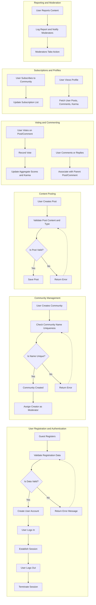

# Functional Requirements

## 1. User Registration and Login
- WHEN a guest submits a registration request with a unique email and a password that meets complexity requirements, THE system SHALL create a new user account linked to the email.
- WHEN a registered user submits valid login credentials, THE system SHALL authenticate and establish a secure session.
- IF login credentials are invalid, THEN THE system SHALL reject the login attempt and provide a clear error message.
- WHEN a logged-in user logs out, THE system SHALL terminate their session immediately.
- THE system SHALL enforce password complexity rules such as minimum length, use of uppercase letters, numbers, and special characters.
- THE system SHALL enforce uniqueness of user emails and validate email format.

## 2. Community Management
- WHEN a registered user requests to create a community with a unique name and description, THE system SHALL create the community and assign the creator as the initial moderator.
- THE system SHALL prevent creation of communities with duplicate names.
- THE system SHALL allow community owners and moderators to edit the community description and settings.
- THE system SHALL allow community moderators to manage posts and comments within their communities.

## 3. Posting Content
- WHEN a registered user creates a post of type text, link, or image in a community they belong to or is public, THE system SHALL validate and save the post.
- THE system SHALL verify that posts have valid content formats and enforce content length and file size limits.
- THE system SHALL associate the post with the user and community metadata.

## 4. Voting System
- WHEN a registered user casts an upvote or downvote on a post or comment, THE system SHALL record the vote, ensuring only one vote per user per item.
- THE system SHALL allow users to change or remove their votes.
- THE system SHALL update the aggregate score for posts and comments based on votes.

## 5. Commenting and Nested Replies
- WHEN a registered user comments or replies to a comment, THE system SHALL associate it with the relevant post or comment and maintain nesting without arbitrary depth limits.
- THE system SHALL enforce maximum comment length and sanitize input.
- THE system SHALL allow comment editing by comment authors within defined time limits.

## 6. User Karma System
- THE system SHALL calculate user karma based on received votes on posts and comments.
- Karma points SHALL be updated in real time.
- THE system SHALL expose karma information in user profiles.

## 7. Post Sorting
- THE system SHALL provide sorting options for posts by hot, new, top, and controversial.
- WHEN a user selects a sorting option, THE system SHALL return posts ordered accordingly.
- THE system SHALL paginate post lists with a default page size.

## 8. Community Subscription
- WHEN a registered user subscribes or unsubscribes from a community, THE system SHALL update their subscription list promptly.
- THE system SHALL use subscriptions to customize user feeds.

## 9. User Profiles
- THE system SHALL maintain profiles showing users’ posts, comments, karma, and subscription lists.
- WHEN a user requests a profile, THE system SHALL return aggregated content and statistics.

## 10. Reporting System
- WHEN a registered user reports inappropriate content, THE system SHALL record the report with all relevant details and notify community moderators.
- THE system SHALL prevent duplicate reports from the same user on the same content.
- THE system SHALL provide an interface for moderators and admins to review reports and take appropriate action.

## 11. Business Rules and Validation
- Community names SHALL be unique and follow allowed format restrictions.
- Posts and comments SHALL meet length, format, and content restrictions.
- Users SHALL only vote once per post or comment.
- Karma SHALL be calculated accurately based on votes with clear rules.
- Reports SHALL trigger moderation workflows.

## 12. Error Handling and Recovery
- IF input validation fails at any step, THEN THE system SHALL return clear, specific error messages.
- IF a user attempts unauthorized actions, THE system SHALL deny access with appropriate explanations.
- THE system SHALL handle session expiry gracefully and prompt users to reauthenticate.

## 13. Performance Expectations
- THE system SHALL respond to login, posting, voting, commenting, and subscription actions within 2 seconds under typical load.
- Pagination SHALL be applied consistently to content listings.
- Vote and karma updates SHALL propagate within 2 seconds.
- Moderation notifications SHALL deliver within 1 minute.

## 14. System Behavior Mermaid Diagram

```mermaid
graph LR
  subgraph "User Registration and Authentication"
    A["Guest Registers"] --> B["Validate Registration Data"]
    B --> C{"Is Data Valid?"}
    C -->|"Yes"| D["Create User Account"]
    C -->|"No"| E["Return Error Message"]
    D --> F["User Logs In"]
    F --> G["Establish Session"]
    G --> H["User Logs Out"]
    H --> I["Terminate Session"]
  end
  subgraph "Community Management"
    J["User Creates Community"] --> K["Check Community Name Uniqueness"]
    K --> L{"Is Name Unique?"}
    L -->|"Yes"| M["Community Created"]
    L -->|"No"| N["Return Error"]
    M --> O["Assign Creator as Moderator"]
  end
  subgraph "Content Posting"
    P["User Creates Post"] --> Q["Validate Post Content and Type"]
    Q --> R{"Is Post Valid?"}
    R -->|"Yes"| S["Save Post"]
    R -->|"No"| T["Return Error"]
  end
  subgraph "Voting and Commenting"
    U["User Votes on Post/Comment"] --> V["Record Vote"]
    V --> W["Update Aggregate Scores and Karma"]
    X["User Comments or Replies"] --> Y["Associate with Parent Post/Comment"]
  end
  subgraph "Subscriptions and Profiles"
    Z["User Subscribes to Community"] --> AA["Update Subscription List"]
    AB["User Views Profile"] --> AC["Fetch User Posts, Comments, Karma"]
  end
  subgraph "Reporting and Moderation"
    AD["User Reports Content"] --> AE["Log Report and Notify Moderators"]
    AE --> AF["Moderators Take Action"]
  end
  E -.-> B
  N -.-> K
  T -.-> Q
```