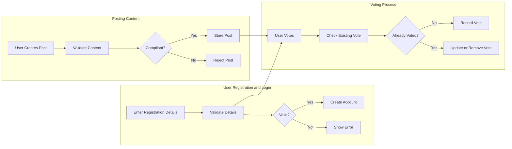

# Functional Requirements Specification for redditCommunity Platform

## Introduction
This document defines the explicit functional and relevant non-functional requirements for redditCommunity, a Reddit-like community platform. It provides backend developers detailed, actionable requirements to implement user registration, community and content management, voting, commenting, karma calculations, sorting, subscriptions, user profiles, and moderation reporting.

## User Actors and Permissions
The system recognizes four user actors:

- **Guest**: Unauthenticated users with read-only access to public communities, posts, and comments.
- **Registered User**: Authenticated users capable of creating accounts, communities, posts, votes, comments, subscriptions, and reporting content.
- **Community Moderator**: Registered users with specific community administration powers: managing posts, comments, community settings, and rule enforcement.
- **Admin**: Full platform administrators managing all users, content, communities, reports, and site-wide settings.

## 1. User Registration and Authentication

- WHEN a visitor submits registration data including unique username, email, and password, THE system SHALL create an account and send an email verification.
- WHEN a registered user submits valid login credentials, THE system SHALL establish a secure session.
- IF login credentials are invalid, THEN THE system SHALL reject access and inform the user.
- WHEN a user requests password reset, THE system SHALL send a tokenized link via email.
- THE system SHALL allow users to logout and terminate sessions.

## 2. Community Management

- WHEN a registered user submits a new community request with a unique name and description, THE system SHALL validate and create the community.
- THE system SHALL support browsing and searching communities.
- WHERE a user is a community moderator, THE system SHALL permit management of posts, comments, and community settings.

## 3. Content Creation

- WHEN a registered user creates a post inside a community, THE system SHALL accept text, link, or image content.
- THE system SHALL validate post content for compliance with content policies.
- WHEN a user edits or deletes own posts, THE system SHALL allow changes within 24 hours of posting.

## 4. Voting System

- THE system SHALL display total votes on posts and comments.
- WHEN a registered user votes, THE system SHALL record one vote per item.
- Users SHALL be able to change or remove their votes.

## 5. Commenting System

- WHEN a user adds a comment on a post, THE system SHALL support nested replies.
- THE system SHALL permit comment editing and deletion within 24 hours by the author.

## 6. Karma System

- THE system SHALL calculate karma points based on votes received on user posts and comments.
- Karma SHALL be updated and reflected in the user profile in near real-time.

## 7. Post Sorting

- THE system SHALL support sorting posts by hot, new, top, and controversial.
- THE system SHALL apply correct algorithms to determine each sorting order.

## 8. Subscription Management

- WHEN a user subscribes or unsubscribes to a community, THE system SHALL update the subscription list.
- THE user SHALL be able to view aggregated posts from subscribed communities.

## 9. User Profiles

- THE user profile page SHALL display user details, posts, comments, and karma.
- THE system SHALL allow users to update profile information excluding username.

## 10. Reporting and Moderation

- WHEN a content item is reported by a user, THE system SHALL notify corresponding moderators and admins.
- Moderators SHALL be able to review, dismiss, or act on reports.
- Admins SHALL have the ability to ban or restrict users violating policies.

## 11. Performance Requirements

- THE system SHALL respond to user requests such as login, posting, voting within 2 seconds under normal load.
- THE platform SHALL support scaling to thousands of concurrent users.

## 12. Security and Compliance

- THE system SHALL store passwords securely and protect user data in compliance with data privacy regulations.
- THE system SHALL maintain audit logs for content changes and moderation actions.

## Mermaid Diagrams

> This document provides business requirements only. All technical implementation decisions belong to developers. Developers have full autonomy over architecture, APIs, and database design. This document describes WHAT the system should do, not HOW to build it.