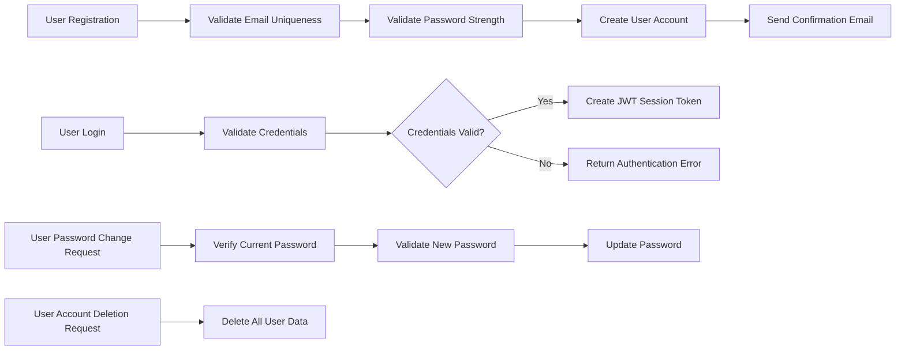

# Reddit-like Community Platform

## User Account

- WHEN a user signs up with email and password, THE system SHALL validate that the email is unique and that the password meets strength requirements before creating the account.
- WHEN a user signs up, THE system SHALL require a unique username that cannot be changed later.
- WHEN a user logs in with email and password, THE system SHALL authenticate the credentials and create a secure session.
- WHEN a user requests a password change, THE system SHALL verify the current password and validate the new password for strength before updating.
- WHEN a user deletes their account, THE system SHALL delete all their posts, comments, and related data permanently and terminate their sessions.

## User Profile

- EACH user SHALL have a profile containing: display name, bio text, and avatar image.
- WHEN a user edits their profile, THE system SHALL allow updating the display name, bio, and avatar image.
- ANY user SHALL be able to view another user's profile publicly.
- A user's profile page SHALL display the user's display name, bio, avatar, total karma score, all posts by the user, and all comments written by the user.

## Karma

- EACH user SHALL have a single karma score that can be positive or negative.
- WHEN someone upvotes a user's post or comment, THE system SHALL increment that user's karma score by 1.
- WHEN someone downvotes a user's post or comment, THE system SHALL decrement that user's karma score by 1.
- WHEN a vote is removed from a post or comment, THE system SHALL adjust the user's karma score by reversing the appropriate increment or decrement.

## Communities

- ANY authenticated user SHALL be able to create a community with a unique name, description text, and an icon image.
- THE user who creates a community SHALL become its owner with highest permissions.
- ALL communities SHALL allow public browsing in a list with subscriber counts displayed.
- USERS SHALL be able to search communities by their unique name.

## Subscribing

- USERS SHALL be able to subscribe and unsubscribe from any community.
- USERS SHALL be able to view a list of all communities to which they are subscribed.
- USERS MUST be subscribed to a community to be allowed to create posts within it.

## Posts

- USERS SHALL be able to create posts in communities they are subscribed to.
- EACH post SHALL have a required title and be exactly one of the following types:
  - Text post with text content
  - Link post with a URL
  - Image post with an uploaded image
- USERS SHALL be able to edit and delete their own posts.
- WHEN viewing a single post, USERS SHALL see: title, full content, author username, community name, vote score, comment count, and timestamp.

## Post Voting

- USERS SHALL be able to upvote or downvote any post, but only once per post.
- USERS SHALL be able to change their vote from upvote to downvote or vice versa.
- USERS SHALL be able to remove their vote entirely.
- THE vote score SHALL be calculated as total upvotes minus total downvotes.

## Post Feeds

- Home Feed SHALL show posts only from communities the user is subscribed to.
- Home Feed SHALL be accessible only to authenticated users.
- Popular Feed SHALL show posts from all communities platform-wide for all users, including guests.
- Community Feed SHALL show posts from a specified community to all users.
- ALL feeds SHALL offer sorting options: Hot, New, Top (with time filters: today, week, month, year, all time), and Controversial.
- ALL feeds SHALL be paginated.

## Post List Display

- EACH post in any feed SHALL display title, author username, community name, vote score, comment count, and time since posting.
- Text posts SHALL show first 200 characters of content.
- Image posts SHALL show a thumbnail of the image.
- Link posts SHALL show the domain name of the URL.

## Comments

- USERS SHALL be able to write comments on any post.
- COMMENTS SHALL support nested replies with unlimited depth.
- USERS SHALL be able to edit and delete their own comments.
- EACH comment SHALL display author username, content, vote score, time since posting, and nested replies.

## Comment Voting

- Voting rules on comments SHALL be same as posts: one vote per user, changeable and removable.

## Comment Sorting

- COMMENTS SHALL be sortable by Best (highest score), New (most recent), and Controversial (many votes but score near zero).

## Community Moderation

### Moderator Roles

- THE community owner SHALL have highest moderation authority.
- THE owner SHALL be able to add and remove moderators.
- MODERATORS SHALL be able to add other moderators but cannot remove the owner or other moderators.
- MODERATORS SHALL not remove each other; only the owner can.

### Moderator Actions

- MODERATORS SHALL be able to delete any post or comment within their community.
- MODERATORS SHALL be able to ban and unban users within their community.
- BANNED users SHALL be prevented from posting or commenting but can still view content.
- MODERATORS SHALL be able to view lists of banned users.

## Reporting

- USERS SHALL be able to report any post or comment with a required reason.
- MODERATORS SHALL be able to view all reports for their community.
- EACH report SHALL show the reported content, reporting user, and reason.
- MODERATORS SHALL be able to approve reports, resulting in deletion of the content.
- MODERATORS SHALL be able to dismiss reports, keeping the content and removing the report from the list.

